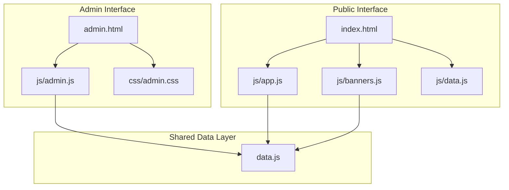
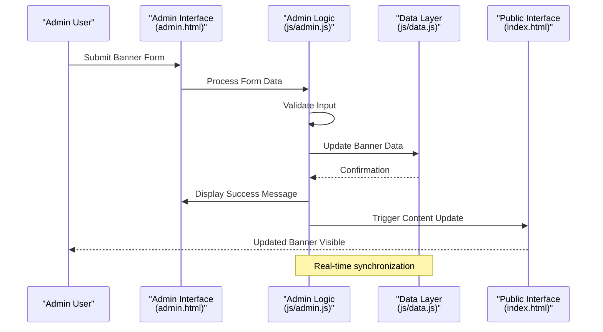
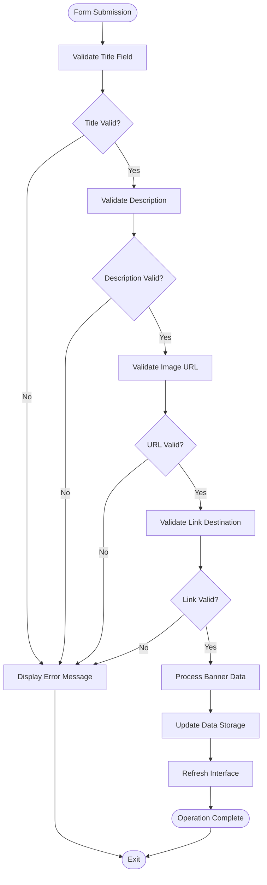
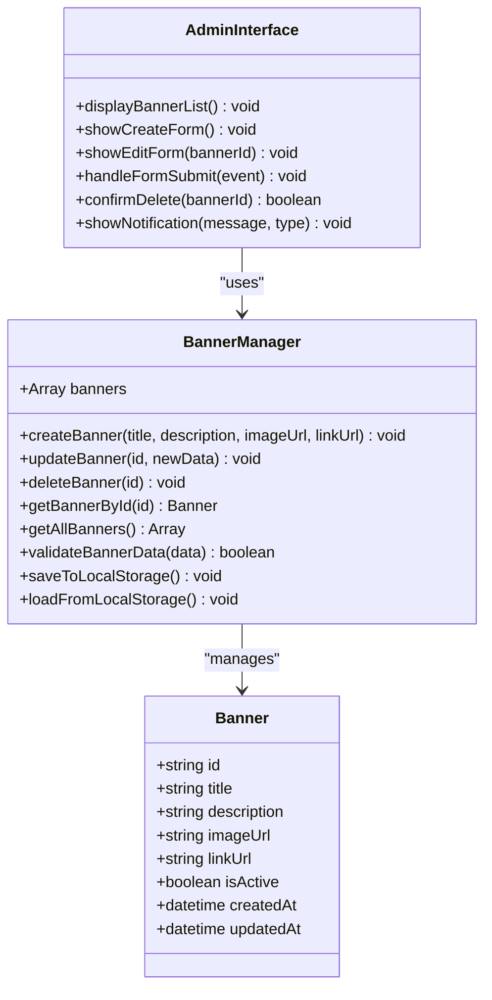
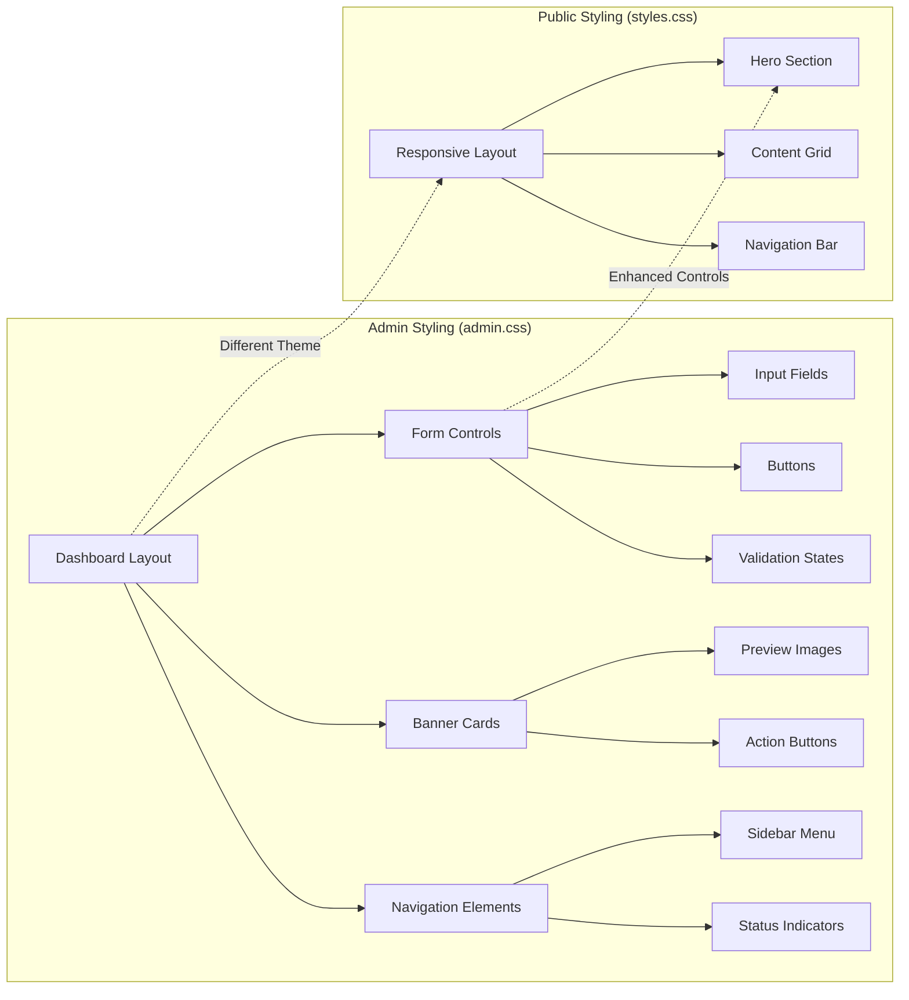
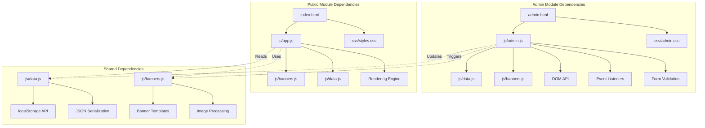

# Administrative Interface

<cite>
**Referenced Files in This Document**
- [admin.html](file://admin.html)
- [js/admin.js](file://js/admin.js)
- [css/admin.css](file://css/admin.css)
- [index.html](file://index.html)
- [js/app.js](file://js/app.js)
- [js/banners.js](file://js/banners.js)
- [js/data.js](file://js/data.js)
</cite>

## Table of Contents
1. [Introduction](#introduction)
2. [Project Structure](#project-structure)
3. [Core Components](#core-components)
4. [Architecture Overview](#architecture-overview)
5. [Detailed Component Analysis](#detailed-component-analysis)
6. [Dependency Analysis](#dependency-analysis)
7. [Performance Considerations](#performance-considerations)
8. [Troubleshooting Guide](#troubleshooting-guide)
9. [Security Considerations](#security-considerations)
10. [Conclusion](#conclusion)

## Introduction

The KPR Crackers application provides a comprehensive administrative interface for managing promotional banners and content. The admin panel enables authorized users to create, edit, delete, and organize banner advertisements that appear on the public-facing website. This documentation covers the complete administrative functionality including user interface design, form handling, validation processes, styling approaches, and security considerations.

The administrative system is built as a client-side application that manages banner data through JavaScript objects and DOM manipulation, providing real-time updates to the public interface without requiring server communication.

## Project Structure

The administrative interface follows a modular architecture with clear separation between HTML structure, JavaScript logic, and CSS styling:

**Diagram sources**
- [admin.html:1-50](file://admin.html#L1-L50)
- [js/admin.js:1-100](file://js/admin.js#L1-L100)
- [css/admin.css:1-50](file://css/admin.css#L1-L50)
- [index.html:1-50](file://index.html#L1-L50)
- [js/app.js:1-50](file://js/app.js#L1-L50)
- [js/banners.js:1-50](file://js/banners.js#L1-L50)
- [js/data.js:1-50](file://js/data.js#L1-L50)

The project structure demonstrates a clean separation between administrative and public-facing components while sharing common data management logic through the shared data layer.

**Section sources**
- [admin.html:1-100](file://admin.html#L1-L100)
- [js/admin.js:1-200](file://js/admin.js#L1-L200)
- [css/admin.css:1-150](file://css/admin.css#L1-L150)

## Core Components

### Admin Dashboard Interface

The administrative dashboard serves as the central control panel for banner management operations. It provides a comprehensive interface for creating, editing, and deleting promotional banners while maintaining data consistency across both admin and public interfaces.

Key administrative capabilities include:

- **Banner Creation**: Form-based interface for adding new promotional banners with title, description, image URL, and link destination
- **Content Editing**: Real-time editing of existing banner properties with immediate preview updates
- **Banner Deletion**: Secure removal of banners with confirmation dialogs and data cleanup
- **Data Management**: Centralized storage and retrieval of banner information using JavaScript objects
- **Form Validation**: Client-side validation ensuring data integrity before processing
- **User Feedback**: Visual indicators for successful operations and error states

### Public Interface Integration

The administrative actions directly impact the public interface through shared data structures and event-driven updates. When administrators modify banner content, these changes are immediately reflected on the main website without requiring page refreshes.

**Section sources**
- [js/admin.js:1-300](file://js/admin.js#L1-L300)
- [js/banners.js:1-200](file://js/banners.js#L1-L200)
- [js/data.js:1-150](file://js/data.js#L1-L150)

## Architecture Overview

The administrative interface follows a Model-View-Controller (MVC) pattern with clear separation of concerns:

**Diagram sources**
- [admin.html:1-100](file://admin.html#L1-L100)
- [js/admin.js:1-200](file://js/admin.js#L1-L200)
- [js/data.js:1-100](file://js/data.js#L1-L100)
- [index.html:1-100](file://index.html#L1-L100)

The architecture ensures loose coupling between components while maintaining data consistency across different parts of the application.

## Detailed Component Analysis

### Admin Dashboard Implementation

The admin dashboard provides a comprehensive interface for banner management with intuitive form controls and real-time feedback mechanisms.

#### Form Handling and Validation

The administrative forms implement robust client-side validation to ensure data integrity:

**Diagram sources**
- [js/admin.js:100-250](file://js/admin.js#L100-L250)

#### Banner Management Operations

The administrative interface supports complete CRUD operations for banner management:

**Diagram sources**
- [js/admin.js:1-200](file://js/admin.js#L1-L200)
- [js/banners.js:1-150](file://js/banners.js#L1-L150)

#### Styling Approach and Design System

The administrative interface uses a dedicated stylesheet that differs significantly from the public interface:

**Diagram sources**
- [css/admin.css:1-200](file://css/admin.css#L1-L200)
- [css/styles.css:1-150](file://css/styles.css#L1-L150)

The admin styling emphasizes functionality and data density, while the public interface prioritizes visual appeal and user experience.

**Section sources**
- [js/admin.js:1-400](file://js/admin.js#L1-L400)
- [css/admin.css:1-300](file://css/admin.css#L1-L300)
- [js/banners.js:1-200](file://js/banners.js#L1-L200)

### Administrative Workflows

#### Banner Creation Workflow

The banner creation process follows a structured workflow ensuring data quality and user guidance:

1. **Form Access**: Administrator navigates to the banner creation interface
2. **Data Entry**: User fills in required fields including title, description, image URL, and link destination
3. **Real-time Validation**: Input fields are validated as the user types
4. **Preview Generation**: Live preview shows how the banner will appear on the public interface
5. **Submission Processing**: Form data is processed and stored in the application's data layer
6. **Confirmation Display**: Success message confirms the operation completion
7. **Interface Update**: Both admin and public interfaces update to reflect the new banner

#### Banner Editing Workflow

The editing workflow allows administrators to modify existing banner properties:

1. **Selection**: Administrator selects a banner from the management list
2. **Form Population**: Existing banner data populates the edit form
3. **Modification**: Changes are made to desired fields
4. **Validation**: Modified data undergoes validation checks
5. **Update Processing**: Changes are saved to the data layer
6. **Synchronization**: All affected interfaces update automatically

#### Banner Deletion Workflow

The deletion process includes safety measures to prevent accidental data loss:

1. **Selection**: Administrator selects a banner for deletion
2. **Confirmation Dialog**: System displays a confirmation prompt
3. **Verification**: User must explicitly confirm the deletion action
4. **Data Removal**: Banner is removed from the data layer
5. **Cleanup**: Associated resources and references are cleaned up
6. **Interface Update**: Affected interfaces refresh to reflect the change

**Section sources**
- [js/admin.js:200-500](file://js/admin.js#L200-L500)

## Dependency Analysis

The administrative interface maintains clear dependency relationships while minimizing coupling between components:

**Diagram sources**
- [js/admin.js:1-100](file://js/admin.js#L1-L100)
- [js/app.js:1-100](file://js/app.js#L1-L100)
- [js/data.js:1-100](file://js/data.js#L1-L100)
- [js/banners.js:1-100](file://js/banners.js#L1-L100)

The dependency structure demonstrates good separation of concerns with shared modules for common functionality like data management and banner rendering.

**Section sources**
- [js/admin.js:1-200](file://js/admin.js#L1-L200)
- [js/app.js:1-200](file://js/app.js#L1-L200)
- [js/data.js:1-150](file://js/data.js#L1-L150)

## Performance Considerations

The administrative interface is designed with performance optimization in mind:

### Client-Side Data Management

- **In-Memory Storage**: Banner data is maintained in JavaScript objects for fast access and manipulation
- **Efficient DOM Updates**: Selective DOM manipulation minimizes reflow and repaint operations
- **Event Delegation**: Single event listeners handle multiple elements to reduce memory overhead
- **Lazy Loading**: Large images and complex components load only when needed

### Memory Management

- **Object Pooling**: Reusable objects for banner instances reduce garbage collection pressure
- **Event Cleanup**: Proper removal of event listeners prevents memory leaks
- **Resource Disposal**: Images and other resources are properly disposed when no longer needed

### Rendering Optimization

- **Batch Updates**: Multiple DOM changes are batched to minimize browser work
- **Virtual Scrolling**: For large banner lists, only visible items are rendered
- **Debounced Input**: Form input validation is debounced to prevent excessive processing

## Troubleshooting Guide

### Common Issues and Solutions

#### Form Validation Errors

When form validation fails, the interface provides specific error messages indicating which fields require attention. Common validation errors include:

- **Empty Required Fields**: All mandatory fields must be filled before submission
- **Invalid URL Format**: Image URLs and link destinations must follow proper URL syntax
- **Duplicate Content**: Duplicate titles or descriptions may be rejected depending on business rules
- **File Size Limits**: Large images may be rejected if they exceed size constraints

#### Data Persistence Issues

If banner data doesn't persist between sessions, check the following:

- **Browser Storage**: Ensure localStorage is enabled and not full
- **Data Corruption**: Verify JSON serialization/deserialization is working correctly
- **Cross-Origin Restrictions**: Some browsers restrict local storage in certain contexts

#### Interface Synchronization Problems

When admin changes don't reflect on the public interface:

- **Event Propagation**: Check that custom events are properly dispatched and handled
- **DOM Ready State**: Ensure public interface has fully loaded before attempting updates
- **Memory Leaks**: Verify old event listeners are properly cleaned up

**Section sources**
- [js/admin.js:300-600](file://js/admin.js#L300-L600)

## Security Considerations

### Client-Side Limitations

It's important to understand that this administrative interface operates entirely on the client side, which presents inherent security limitations:

#### Authentication and Authorization

- **No Server-Side Authentication**: Without backend authentication, any user with access to the admin interface can perform administrative actions
- **Client-Side Security**: Security measures implemented in JavaScript can be bypassed by determined users
- **Session Management**: No secure session tokens or cookies are used for authentication

#### Data Integrity Risks

- **Local Storage Manipulation**: Users can directly manipulate localStorage data through browser developer tools
- **JavaScript Injection**: Malicious scripts could potentially modify application behavior
- **Cross-Site Scripting (XSS)**: User input should be sanitized to prevent script injection

### Recommended Security Enhancements

For production deployment, consider implementing:

#### Backend Authentication

- **Server-Side Authentication**: Implement proper login/logout functionality with secure session management
- **Role-Based Access Control**: Restrict administrative functions to authorized users only
- **HTTPS Enforcement**: Ensure all communications occur over secure connections

#### Input Validation and Sanitization

- **Server-Side Validation**: Always validate and sanitize data on the server even if client-side validation exists
- **Content Security Policy**: Implement CSP headers to prevent unauthorized script execution
- **Input Sanitization**: Escape user input to prevent XSS attacks

#### Data Protection

- **Database Encryption**: Encrypt sensitive data at rest and in transit
- **Audit Logging**: Track administrative actions for accountability and debugging
- **Rate Limiting**: Prevent abuse through request rate limiting

## Conclusion

The KPR Crackers administrative interface provides a comprehensive solution for managing promotional banners with an intuitive user experience and robust functionality. The modular architecture ensures maintainability while the client-side implementation offers responsive interactions without server dependencies.

Key strengths of the current implementation include:

- **Intuitive User Interface**: Clean, functional design focused on productivity
- **Real-Time Updates**: Immediate synchronization between admin and public interfaces
- **Comprehensive Validation**: Robust client-side validation ensures data quality
- **Modular Architecture**: Clear separation of concerns facilitates maintenance and extension

However, the client-only nature of the current implementation presents significant security limitations that must be addressed for production use. Future enhancements should focus on implementing proper authentication, authorization, and server-side validation to create a secure, enterprise-ready administrative system.

The foundation established by this implementation provides an excellent base for extending functionality with additional features such as user management, analytics reporting, and advanced banner scheduling capabilities.