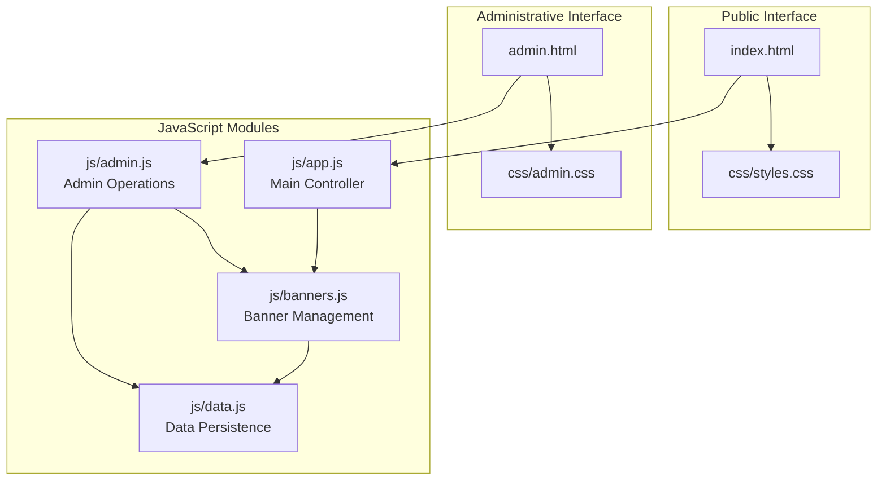
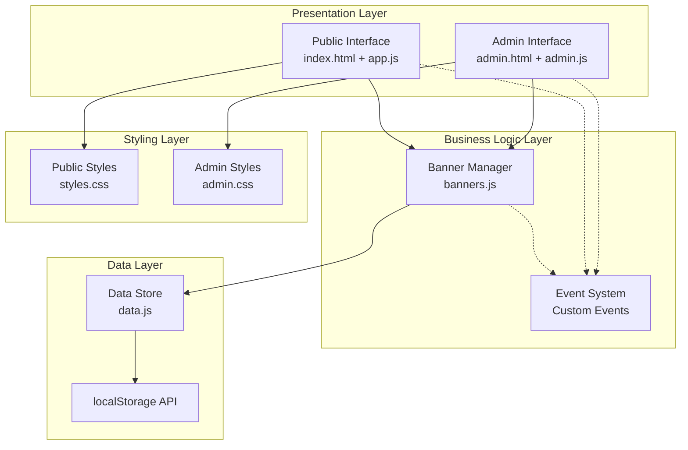
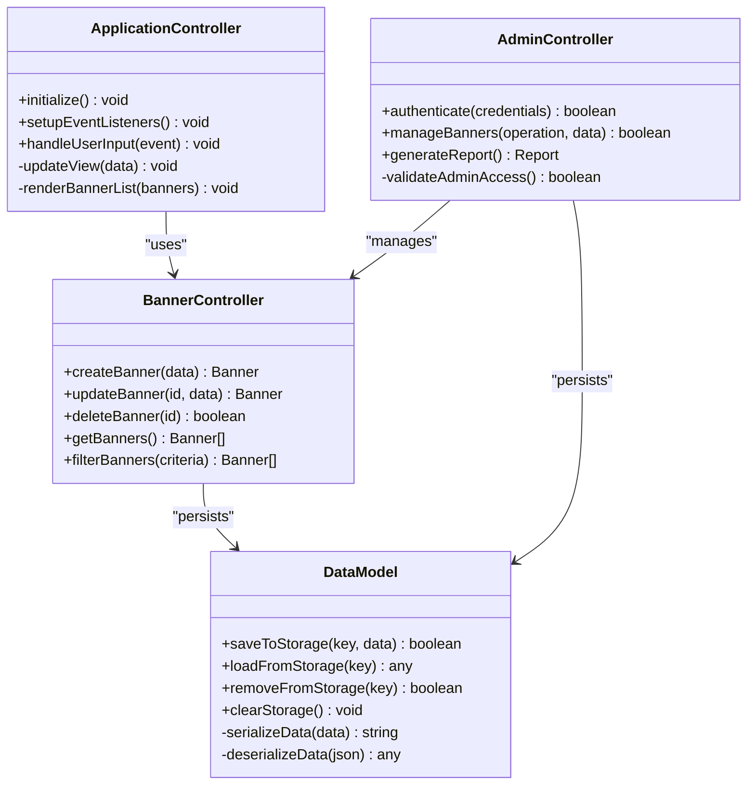
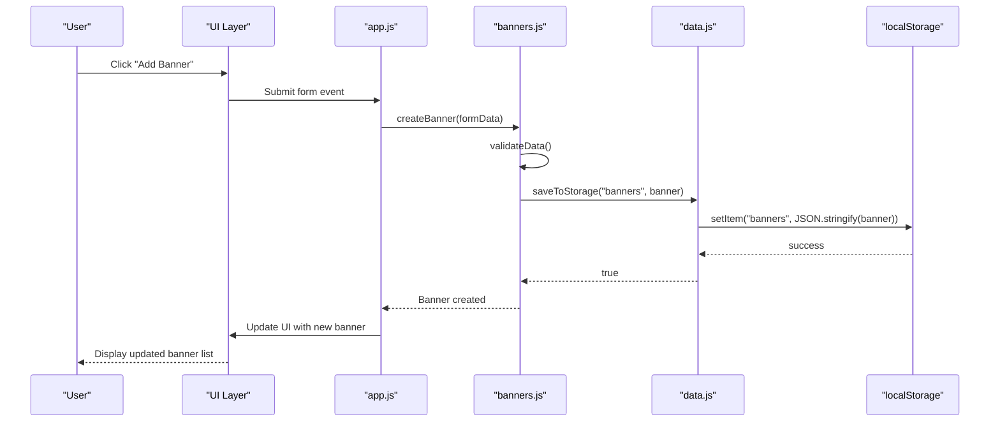
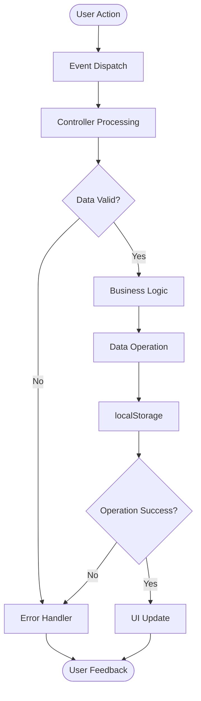
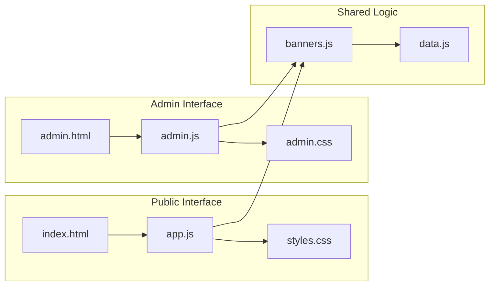
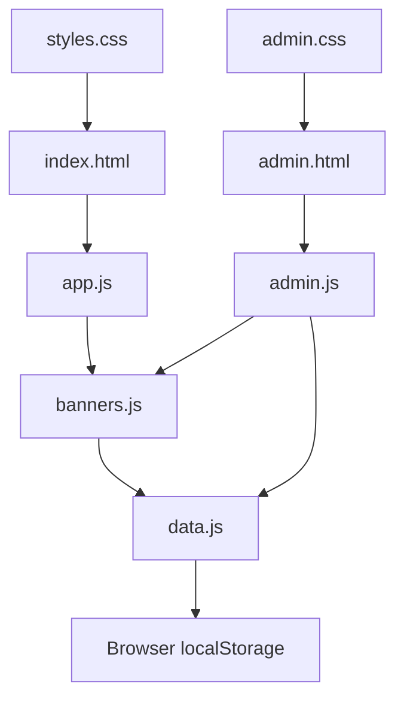

# Architecture Overview

<cite>
**Referenced Files in This Document**
- [index.html](file://index.html)
- [admin.html](file://admin.html)
- [js/app.js](file://js/app.js)
- [js/banners.js](file://js/banners.js)
- [js/data.js](file://js/data.js)
- [js/admin.js](file://js/admin.js)
- [css/styles.css](file://css/styles.css)
- [css/admin.css](file://css/admin.css)
</cite>

## Table of Contents
1. [Introduction](#introduction)
2. [Project Structure](#project-structure)
3. [Core Components](#core-components)
4. [Architecture Overview](#architecture-overview)
5. [Detailed Component Analysis](#detailed-component-analysis)
6. [Dependency Analysis](#dependency-analysis)
7. [Performance Considerations](#performance-considerations)
8. [Troubleshooting Guide](#troubleshooting-guide)
9. [Conclusion](#conclusion)

## Introduction
This document describes the architecture of the KPR Crackers application, a client-side web application built with vanilla JavaScript modules and no external frameworks. The system implements a dual-interface design:
- Public interface for browsing and interacting with banners
- Administrative interface for managing banner content

The application follows a modular pattern with clear separation of concerns:
- Main controller orchestrating UI and module coordination
- Banner management module handling business logic
- Data persistence layer abstracting local storage operations
- Administrative module providing CRUD operations for banners

The implementation uses a client-side MVC-like pattern where DOM manipulation drives the user interface, and an event-driven architecture facilitates communication between components.

## Project Structure
The application follows a feature-based organization with separate HTML pages for different interfaces and modular JavaScript files for functionality.

**Diagram sources**
- [index.html](file://index.html)
- [admin.html](file://admin.html)
- [js/app.js](file://js/app.js)
- [js/banners.js](file://js/banners.js)
- [js/data.js](file://js/data.js)
- [js/admin.js](file://js/admin.js)
- [css/styles.css](file://css/styles.css)
- [css/admin.css](file://css/admin.css)

**Section sources**
- [index.html](file://index.html)
- [admin.html](file://admin.html)
- [js/app.js](file://js/app.js)
- [js/banners.js](file://js/banners.js)
- [js/data.js](file://js/data.js)
- [js/admin.js](file://js/admin.js)

## Core Components

### Main Controller (app.js)
The main controller serves as the application entry point, initializing the UI and coordinating between modules. It handles:
- Application initialization and setup
- Event listener registration
- Module coordination and data flow management
- User interaction handling for the public interface

### Banner Management (banners.js)
The banner management module encapsulates all banner-related business logic:
- Banner creation, update, and deletion operations
- Banner validation and formatting
- Banner filtering and search functionality
- Event emission for banner state changes

### Data Persistence Layer (data.js)
The data layer provides a unified interface for local storage operations:
- Abstracted localStorage access methods
- Data serialization and deserialization
- Storage quota management
- Error handling for storage operations

### Administrative Module (admin.js)
The administrative interface module provides CRUD operations:
- Admin authentication and authorization
- Banner management dashboard
- Bulk operations and batch processing
- Admin-specific UI interactions

**Section sources**
- [js/app.js](file://js/app.js)
- [js/banners.js](file://js/banners.js)
- [js/data.js](file://js/data.js)
- [js/admin.js](file://js/admin.js)

## Architecture Overview

The application implements a layered architecture with clear separation between presentation, business logic, and data persistence layers.

**Diagram sources**
- [index.html](file://index.html)
- [admin.html](file://admin.html)
- [js/app.js](file://js/app.js)
- [js/banners.js](file://js/banners.js)
- [js/data.js](file://js/data.js)
- [js/admin.js](file://js/admin.js)
- [css/styles.css](file://css/styles.css)
- [css/admin.css](file://css/admin.css)

## Detailed Component Analysis

### Client-Side MVC Pattern Implementation

The application implements a simplified MVC pattern adapted for vanilla JavaScript:

**Diagram sources**
- [js/app.js](file://js/app.js)
- [js/banners.js](file://js/banners.js)
- [js/data.js](file://js/data.js)
- [js/admin.js](file://js/admin.js)

#### Model-View-Controller Relationships
- **Model**: Data.js provides the data abstraction layer
- **View**: HTML templates and CSS styles handle presentation
- **Controller**: app.js and admin.js manage user interactions and business logic coordination

### Event-Driven Architecture

The application uses custom events for loose coupling between components:

**Diagram sources**
- [js/app.js](file://js/app.js)
- [js/banners.js](file://js/banners.js)
- [js/data.js](file://js/data.js)

### Data Flow Architecture

**Diagram sources**
- [js/app.js](file://js/app.js)
- [js/banners.js](file://js/banners.js)
- [js/data.js](file://js/data.js)

### Dual-Interface Architecture

The application maintains two distinct interfaces with shared business logic:

**Diagram sources**
- [index.html](file://index.html)
- [admin.html](file://admin.html)
- [js/app.js](file://js/app.js)
- [js/admin.js](file://js/admin.js)
- [js/banners.js](file://js/banners.js)
- [js/data.js](file://js/data.js)
- [css/styles.css](file://css/styles.css)
- [css/admin.css](file://css/admin.css)

## Dependency Analysis

The application follows a unidirectional dependency pattern to maintain clear separation of concerns:

**Diagram sources**
- [js/app.js](file://js/app.js)
- [js/banners.js](file://js/banners.js)
- [js/data.js](file://js/data.js)
- [js/admin.js](file://js/admin.js)
- [index.html](file://index.html)
- [admin.html](file://admin.html)
- [css/styles.css](file://css/styles.css)
- [css/admin.css](file://css/admin.css)

### Dependency Characteristics
- **Low Coupling**: Modules communicate through well-defined interfaces
- **High Cohesion**: Each module has a single responsibility
- **Unidirectional Dependencies**: No circular dependencies exist
- **Clear Boundaries**: Public and admin interfaces are properly separated

**Section sources**
- [js/app.js](file://js/app.js)
- [js/banners.js](file://js/banners.js)
- [js/data.js](file://js/data.js)
- [js/admin.js](file://js/admin.js)

## Performance Considerations

### Local Storage Optimization
- Efficient data serialization using JSON format
- Batch operations for multiple data updates
- Lazy loading of banner data on demand
- Memory management through proper cleanup

### DOM Manipulation Efficiency
- Minimal DOM queries through cached element references
- Efficient event delegation for dynamic content
- Optimized rendering with minimal reflows and repaints
- Debounced input handlers for better performance

### Memory Management
- Proper event listener cleanup
- Object reference management
- Garbage collection optimization through null assignments

## Troubleshooting Guide

### Common Issues and Solutions

#### Local Storage Errors
- **Quota Exceeded**: Implement data pruning strategies
- **Serialization Errors**: Add try-catch blocks around JSON operations
- **Cross-origin Restrictions**: Ensure same-origin policy compliance

#### Event Handling Issues
- **Memory Leaks**: Remove event listeners when elements are destroyed
- **Event Bubbling**: Use stopPropagation() appropriately
- **Timing Issues**: Ensure DOM is ready before attaching listeners

#### Data Synchronization Problems
- **Race Conditions**: Implement proper async/await patterns
- **Data Consistency**: Use transaction-like operations for complex updates
- **Cache Invalidation**: Clear related caches when data changes

**Section sources**
- [js/data.js](file://js/data.js)
- [js/app.js](file://js/app.js)
- [js/banners.js](file://js/banners.js)

## Conclusion

The KPR Crackers application demonstrates a well-architected vanilla JavaScript solution that effectively separates concerns while maintaining simplicity. The dual-interface design allows for both public consumption and administrative management of banner content. The modular architecture promotes code reusability and maintainability, while the event-driven approach ensures loose coupling between components.

Key architectural strengths include:
- Clear separation between presentation, business logic, and data layers
- Effective use of vanilla JavaScript without framework dependencies
- Robust local storage strategy for client-side persistence
- Scalable event-driven communication between modules
- Maintainable code structure with single-responsibility modules

This architecture provides a solid foundation for future enhancements while maintaining the simplicity and performance benefits of a lightweight client-side application.