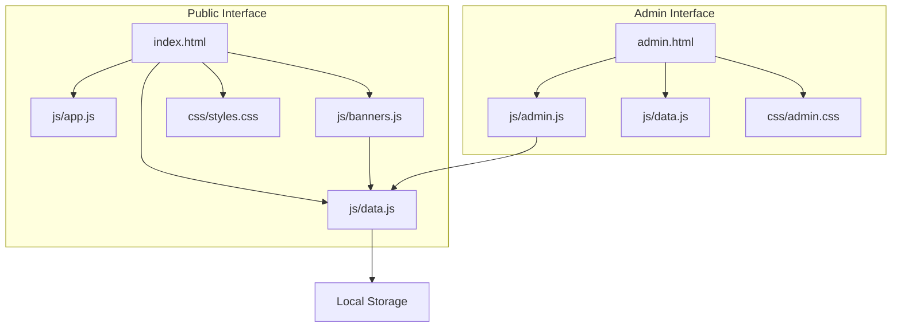
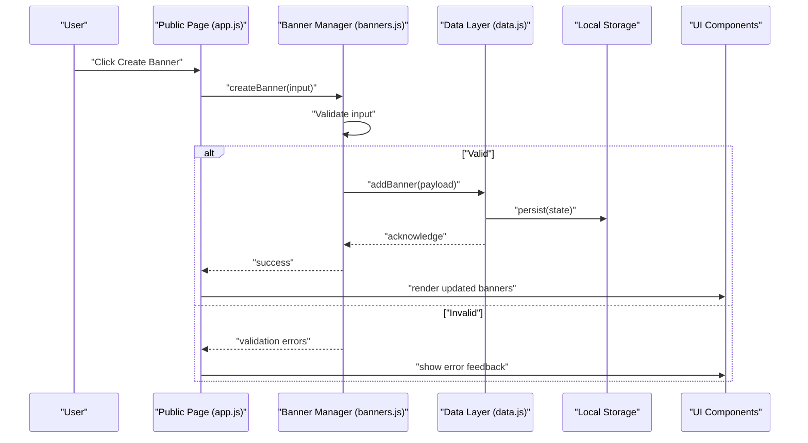
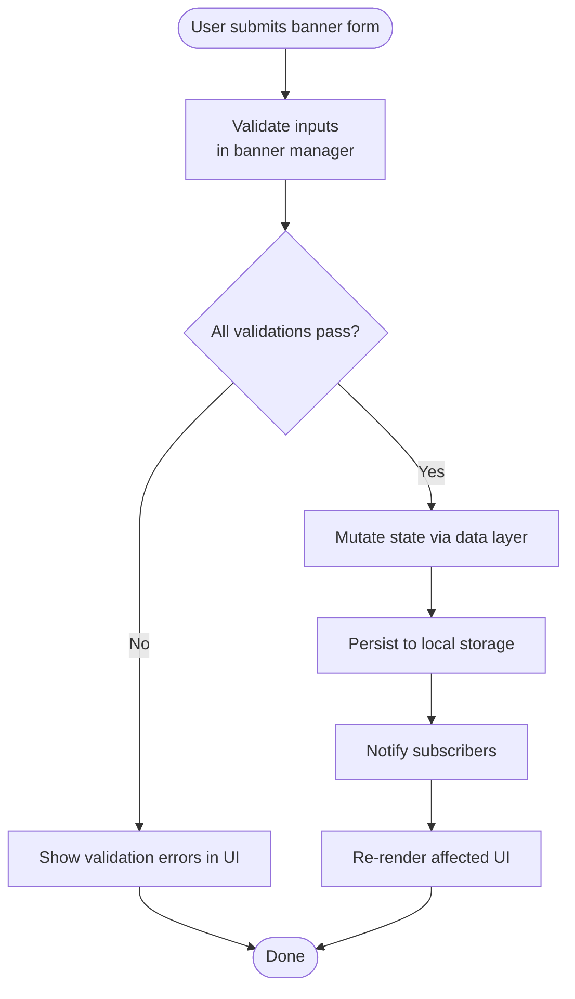
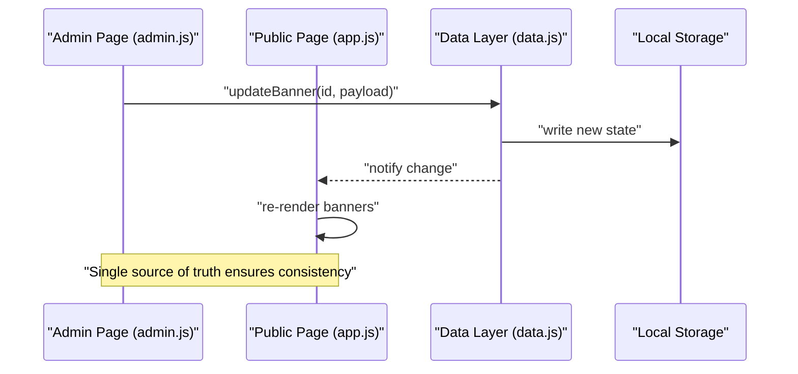
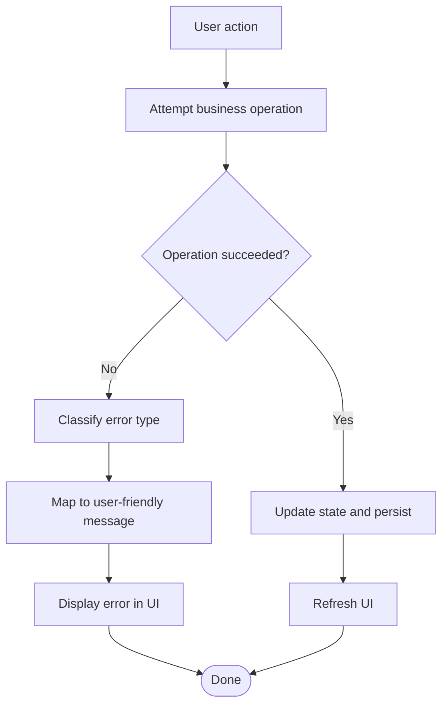
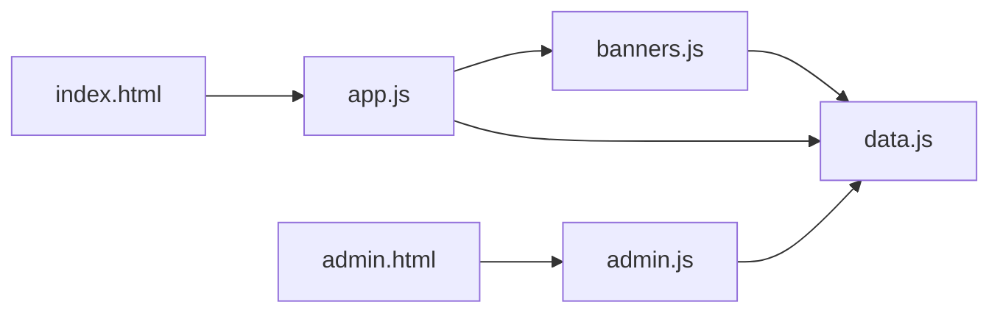

# Data Flow Patterns

<cite>
**Referenced Files in This Document**
- [index.html](file://index.html)
- [admin.html](file://admin.html)
- [js/app.js](file://js/app.js)
- [js/data.js](file://js/data.js)
- [js/banners.js](file://js/banners.js)
- [js/admin.js](file://js/admin.js)
- [css/styles.css](file://css/styles.css)
- [css/admin.css](file://css/admin.css)
</cite>

## Table of Contents
1. [Introduction](#introduction)
2. [Project Structure](#project-structure)
3. [Core Components](#core-components)
4. [Architecture Overview](#architecture-overview)
5. [Detailed Component Analysis](#detailed-component-analysis)
6. [Dependency Analysis](#dependency-analysis)
7. [Performance Considerations](#performance-considerations)
8. [Troubleshooting Guide](#troubleshooting-guide)
9. [Conclusion](#conclusion)

## Introduction
This document explains the data flow patterns in the KPR Crackers application with a focus on its event-driven, unidirectional data flow. User interactions trigger events that propagate through business logic modules, update the data layer persisted to local storage, and finally refresh the appropriate UI components. The documentation covers:
- Event-driven architecture across module boundaries
- Unidirectional data flow from user actions to persistence and rendering
- Lifecycle of banner creation and updates
- Synchronization between admin and public interfaces
- Error handling patterns throughout the pipeline

## Project Structure
The application is organized into two primary entry points (public and admin pages), each loading shared JavaScript modules for state management and feature logic. CSS files provide styling for both views.

**Diagram sources**
- [index.html](file://index.html)
- [admin.html](file://admin.html)
- [js/app.js](file://js/app.js)
- [js/banners.js](file://js/banners.js)
- [js/data.js](file://js/data.js)
- [js/admin.js](file://js/admin.js)
- [css/styles.css](file://css/styles.css)
- [css/admin.css](file://css/admin.css)

**Section sources**
- [index.html](file://index.html)
- [admin.html](file://admin.html)
- [js/app.js](file://js/app.js)
- [js/banners.js](file://js/banners.js)
- [js/data.js](file://js/data.js)
- [js/admin.js](file://js/admin.js)
- [css/styles.css](file://css/styles.css)
- [css/admin.css](file://css/admin.css)

## Core Components
- Public page controller (app.js): Initializes the public view, wires up user interactions, and delegates to banners and data modules.
- Banner manager (banners.js): Encapsulates banner-related business logic and orchestrates create/update/delete operations via the data layer.
- Data layer (data.js): Centralized state and persistence using local storage; exposes methods to read, write, and subscribe to changes.
- Admin controller (admin.js): Manages admin-specific interactions and synchronizes state with the same data layer used by the public interface.

Key responsibilities:
- Event wiring and dispatching
- Business rule validation
- State mutation and persistence
- UI re-rendering based on state changes

**Section sources**
- [js/app.js](file://js/app.js)
- [js/banners.js](file://js/banners.js)
- [js/data.js](file://js/data.js)
- [js/admin.js](file://js/admin.js)

## Architecture Overview
The system follows an event-driven, unidirectional data flow:
- User actions emit events or call handlers in the page controllers.
- Controllers invoke business logic in feature modules (e.g., banners).
- Feature modules mutate state and persist changes via the data layer.
- The data layer notifies subscribers and triggers UI updates.
- UI components re-render only the affected parts.

**Diagram sources**
- [js/app.js](file://js/app.js)
- [js/banners.js](file://js/banners.js)
- [js/data.js](file://js/data.js)

## Detailed Component Analysis

### Public Page Controller (app.js)
Responsibilities:
- Initialize the public view and bind global event listeners.
- Forward user actions to the banner manager.
- Handle success and error feedback to the UI.

Data flow highlights:
- Listens for form submissions and button clicks.
- Calls banner manager methods with validated inputs.
- On success, requests UI refresh; on failure, displays localized messages.

**Section sources**
- [js/app.js](file://js/app.js)

### Banner Manager (banners.js)
Responsibilities:
- Implement banner business rules (creation, updates, deletion).
- Validate inputs before mutating state.
- Coordinate with the data layer for persistence.

Validation and processing:
- Enforces required fields and constraints.
- Normalizes payloads before sending to the data layer.
- Emits structured results for UI consumption.

**Section sources**
- [js/banners.js](file://js/banners.js)

### Data Layer (data.js)
Responsibilities:
- Maintain canonical state for banners.
- Persist state to local storage.
- Provide subscription/notification mechanisms for UI updates.

Persistence and synchronization:
- Reads initial state from local storage on load.
- Writes state after every mutation.
- Notifies subscribers when state changes, enabling cross-page sync.

**Section sources**
- [js/data.js](file://js/data.js)

### Admin Controller (admin.js)
Responsibilities:
- Manage admin-only workflows (e.g., editing banners).
- Reuse the same data layer to ensure consistency with the public interface.
- Present admin-specific feedback and controls.

Synchronization behavior:
- Subscribes to data layer changes to reflect updates made elsewhere.
- Ensures admin edits are immediately visible on the public page after reload or via live updates if implemented.

**Section sources**
- [js/admin.js](file://js/admin.js)

### Banner Creation Workflow (End-to-End)
This sequence shows how a user creates a banner from start to finish.

**Diagram sources**
- [js/banners.js](file://js/banners.js)
- [js/data.js](file://js/data.js)

**Section sources**
- [js/banners.js](file://js/banners.js)
- [js/data.js](file://js/data.js)

### Data Synchronization Between Admin and Public Interfaces
Both admin and public pages share the same data layer and local storage key(s). Changes made in admin should be reflected in the public view.

**Diagram sources**
- [js/admin.js](file://js/admin.js)
- [js/app.js](file://js/app.js)
- [js/data.js](file://js/data.js)

**Section sources**
- [js/admin.js](file://js/admin.js)
- [js/app.js](file://js/app.js)
- [js/data.js](file://js/data.js)

### Error Handling Patterns Across the Pipeline
- Input validation errors are surfaced early in the banner manager and displayed in the UI without mutating state.
- Persistence failures are caught at the data layer and propagated back to callers for graceful degradation.
- UI feedback distinguishes between transient and permanent errors where applicable.

**Diagram sources**
- [js/banners.js](file://js/banners.js)
- [js/data.js](file://js/data.js)

**Section sources**
- [js/banners.js](file://js/banners.js)
- [js/data.js](file://js/data.js)

## Dependency Analysis
High-level dependencies among modules:
- app.js depends on banners.js and data.js.
- admin.js depends on data.js.
- banners.js depends on data.js.
- Both pages depend on their respective CSS files.

**Diagram sources**
- [js/app.js](file://js/app.js)
- [js/banners.js](file://js/banners.js)
- [js/data.js](file://js/data.js)
- [js/admin.js](file://js/admin.js)
- [index.html](file://index.html)
- [admin.html](file://admin.html)

**Section sources**
- [js/app.js](file://js/app.js)
- [js/banners.js](file://js/banners.js)
- [js/data.js](file://js/data.js)
- [js/admin.js](file://js/admin.js)
- [index.html](file://index.html)
- [admin.html](file://admin.html)

## Performance Considerations
- Batch updates: Prefer consolidating multiple mutations into fewer data layer calls to reduce local storage writes.
- Selective re-renders: Update only affected DOM nodes rather than full reflows.
- Debounce heavy operations: For frequent inputs (e.g., search/filter), debounce to avoid excessive renders.
- Avoid redundant subscriptions: Ensure UI components unsubscribe when no longer needed to prevent memory leaks.

[No sources needed since this section provides general guidance]

## Troubleshooting Guide
Common issues and resolutions:
- No banners appear after creating one:
  - Verify data layer persists to local storage and that the public page reads the correct key.
  - Confirm the UI re-render path is triggered after persistence.
- Admin changes not reflected on the public page:
  - Ensure both pages subscribe to the same data store and that notifications are emitted on updates.
  - Check for stale references or missing reloads if live updates are not implemented.
- Validation errors not shown:
  - Confirm the banner manager returns structured errors and the UI maps them to messages.
- Local storage quota exceeded:
  - Implement size checks and warn users; consider pruning old entries.

**Section sources**
- [js/data.js](file://js/data.js)
- [js/banners.js](file://js/banners.js)
- [js/app.js](file://js/app.js)
- [js/admin.js](file://js/admin.js)

## Conclusion
The KPR Crackers application implements a clear, event-driven, unidirectional data flow. User actions drive business logic, which mutates state and persists it to local storage. The data layer notifies subscribers, enabling consistent UI updates across both public and admin interfaces. By centralizing state and enforcing validation and error handling at well-defined layers, the system remains maintainable and predictable.

[No sources needed since this section summarizes without analyzing specific files]