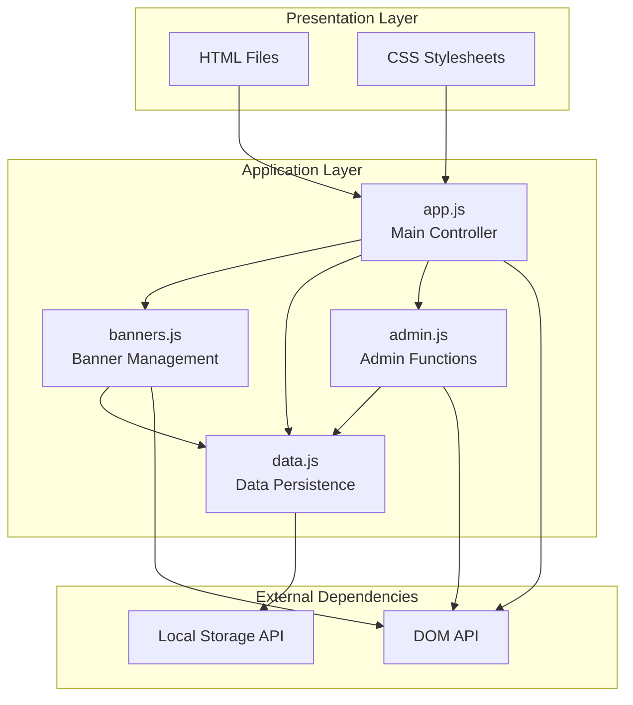
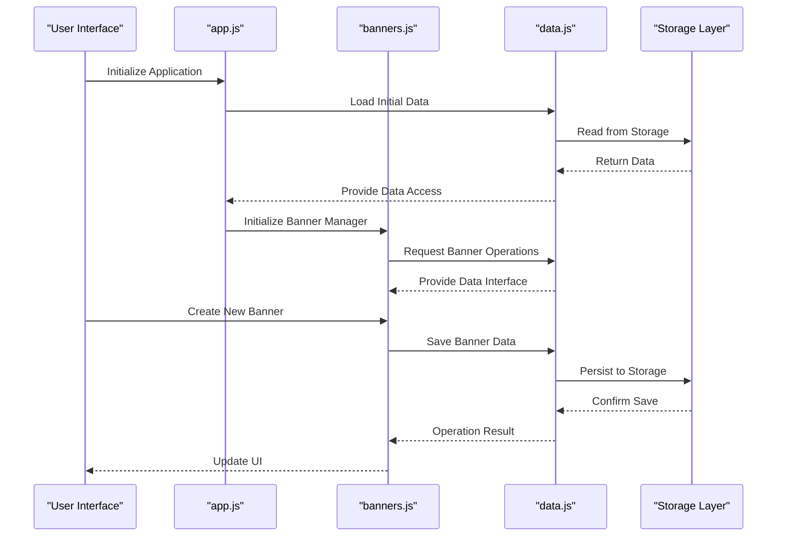
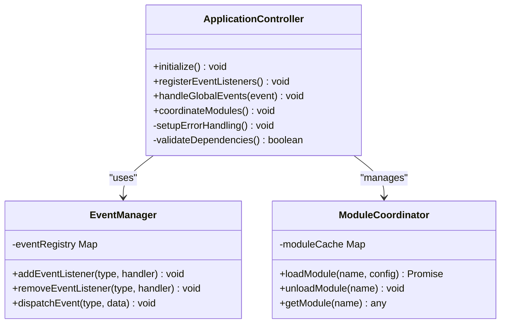
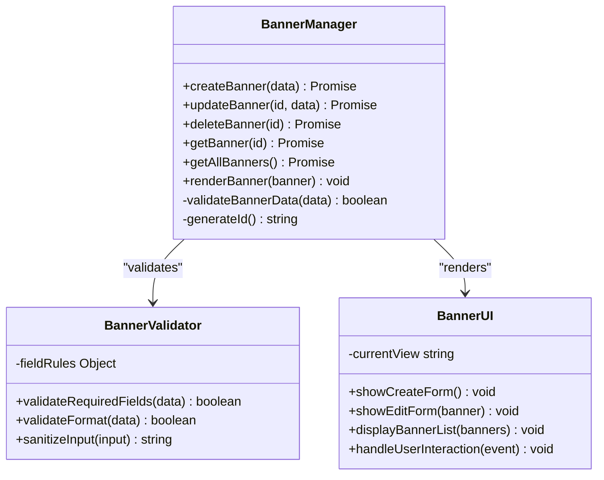
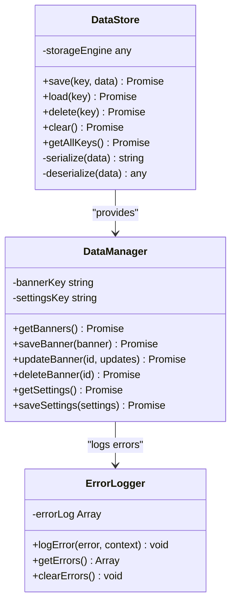
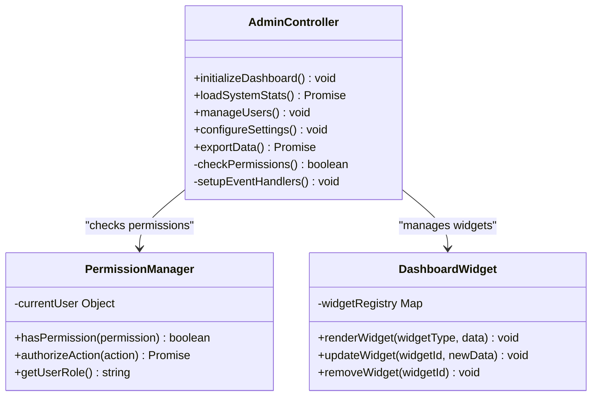
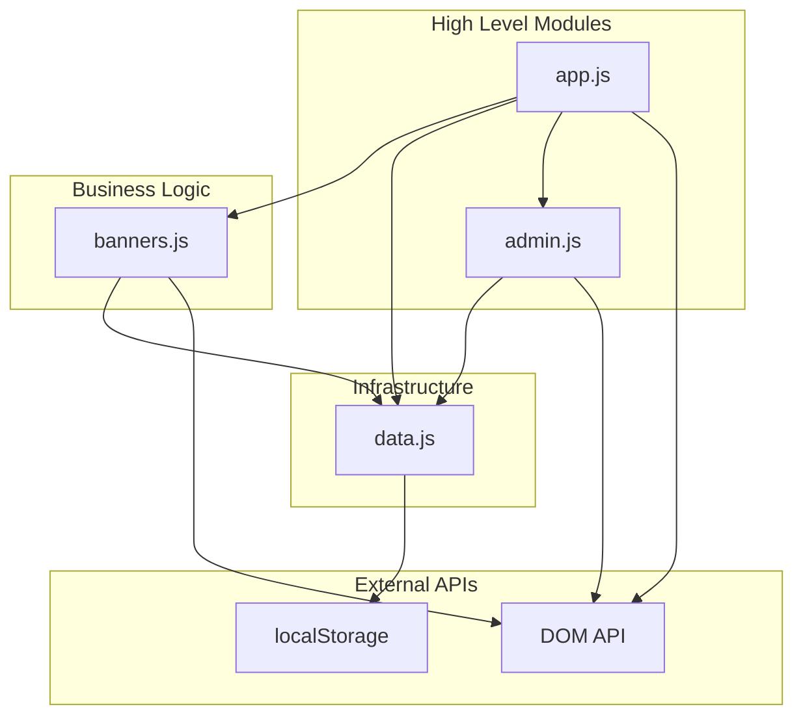

# Module Architecture

<cite>
**Referenced Files in This Document**
- [app.js](file://js/app.js)
- [banners.js](file://js/banners.js)
- [data.js](file://js/data.js)
- [admin.js](file://js/admin.js)
- [index.html](file://index.html)
- [admin.html](file://admin.html)
</cite>

## Table of Contents
1. [Introduction](#introduction)
2. [Project Structure](#project-structure)
3. [Core Components](#core-components)
4. [Architecture Overview](#architecture-overview)
5. [Detailed Component Analysis](#detailed-component-analysis)
6. [Dependency Analysis](#dependency-analysis)
7. [Module Communication Patterns](#module-communication-patterns)
8. [Performance Considerations](#performance-considerations)
9. [Troubleshooting Guide](#troubleshooting-guide)
10. [Conclusion](#conclusion)

## Introduction

KPR Crackers implements a well-structured modular architecture using JavaScript modules to separate concerns and improve maintainability. The application follows a clear separation of responsibilities where each module handles specific functionality: the main application controller, banner management, data persistence, and administrative functions. This modular approach promotes code reusability, testability, and easier debugging while maintaining clean boundaries between different application features.

## Project Structure

The KPR Crackers application follows a feature-based organization with clear separation between presentation logic (HTML/CSS) and business logic (JavaScript). The JavaScript layer is organized into four primary modules that work together through well-defined interfaces.

**Diagram sources**
- [app.js](file://js/app.js)
- [banners.js](file://js/banners.js)
- [data.js](file://js/data.js)
- [admin.js](file://js/admin.js)

**Section sources**
- [index.html](file://index.html)
- [admin.html](file://admin.html)

## Core Components

### Main Application Controller (app.js)
The main application controller serves as the central coordinator for all other modules. It handles global event listeners, initializes the application state, and manages communication between different components. This module acts as the entry point for the application lifecycle and ensures proper initialization order of dependent modules.

### Banner Management Module (banners.js)
The banner management module encapsulates all banner-specific operations including creation, modification, deletion, and display logic. It provides a clean interface for banner CRUD operations and handles user interactions related to banners. This module maintains its own state and communicates with the data layer for persistence.

### Data Persistence Layer (data.js)
The data module provides centralized access to application data and handles all persistence operations. It abstracts the underlying storage mechanism (likely localStorage or similar) and provides a consistent API for data operations across all modules. This module ensures data integrity and handles error scenarios gracefully.

### Administrative Functions (admin.js)
The administrative module handles dashboard controls and administrative functions. It provides specialized interfaces for managing application settings, monitoring system status, and performing administrative tasks. This module typically has elevated privileges and access to sensitive operations.

**Section sources**
- [app.js](file://js/app.js)
- [banners.js](file://js/banners.js)
- [data.js](file://js/data.js)
- [admin.js](file://js/admin.js)

## Architecture Overview

The KPR Crackers application follows a layered architecture pattern with clear separation of concerns. Each module exposes a well-defined public API while keeping internal implementation details private. The architecture emphasizes loose coupling through event-driven communication and dependency injection patterns.

**Diagram sources**
- [app.js](file://js/app.js)
- [banners.js](file://js/banners.js)
- [data.js](file://js/data.js)

## Detailed Component Analysis

### Main Application Controller (app.js)

The main application controller orchestrates the entire application lifecycle and serves as the central hub for inter-module communication. It handles global event registration, module initialization, and cross-cutting concerns like error handling and logging.

**Diagram sources**
- [app.js](file://js/app.js)

### Banner Management Module (banners.js)

The banner management module provides comprehensive functionality for banner operations including CRUD operations, validation, and user interaction handling. It maintains banner state and coordinates with the data layer for persistence.

**Diagram sources**
- [banners.js](file://js/banners.js)

### Data Persistence Layer (data.js)

The data module provides a unified interface for all data operations and abstracts the underlying storage mechanism. It handles data serialization, deserialization, and ensures data consistency across the application.

**Diagram sources**
- [data.js](file://js/data.js)

### Administrative Functions (admin.js)

The administrative module provides specialized functionality for application administration including dashboard controls, system monitoring, and administrative task management. It typically requires authentication and authorization checks.

**Diagram sources**
- [admin.js](file://js/admin.js)

## Dependency Analysis

The KPR Crackers application follows a clear dependency hierarchy where modules depend on lower-level abstractions but never on higher-level components. This design promotes loose coupling and makes the system more maintainable and testable.

**Diagram sources**
- [app.js](file://js/app.js)
- [banners.js](file://js/banners.js)
- [data.js](file://js/data.js)
- [admin.js](file://js/admin.js)

### Import/Export Patterns

The modules use ES6 module syntax for clear import/export relationships. Each module exports only its public API while keeping internal implementation details private. This pattern ensures clean interfaces and prevents tight coupling between modules.

**Section sources**
- [app.js](file://js/app.js)
- [banners.js](file://js/banners.js)
- [data.js](file://js/data.js)
- [admin.js](file://js/admin.js)

## Module Communication Patterns

### Event-Driven Communication

The application uses an event-driven architecture for loose coupling between modules. Modules communicate through custom events rather than direct method calls, promoting better separation of concerns and easier testing.

### Shared State Management

While each module maintains its own state, there are shared interfaces for accessing common data. The data module acts as the single source of truth for application data, ensuring consistency across all modules.

### Dependency Injection

Modules receive their dependencies through constructor parameters or setter methods rather than creating them internally. This pattern enables better testing through mocking and allows for runtime configuration of module behavior.

## Performance Considerations

### Lazy Loading

Modules are loaded on-demand rather than at application startup to improve initial load time. The main controller manages the loading sequence based on actual usage requirements.

### Memory Management

Each module implements proper cleanup routines to prevent memory leaks. Event listeners are removed when modules are unloaded, and large data structures are properly disposed of.

### Caching Strategies

The data module implements intelligent caching to reduce storage operations and improve response times. Frequently accessed data is cached in memory with appropriate invalidation strategies.

## Troubleshooting Guide

### Common Module Issues

**Initialization Order Problems**: Ensure modules are initialized in the correct dependency order. The main controller should handle this sequencing automatically.

**Event Listener Leaks**: Verify that all event listeners are properly removed when modules are destroyed to prevent memory leaks.

**Data Synchronization Issues**: Check that all modules are using the same data instance and that updates are properly propagated through the event system.

### Debugging Techniques

Enable detailed logging in development mode to track module interactions and identify communication breakdowns. Use browser developer tools to inspect module states and event flows.

**Section sources**
- [app.js](file://js/app.js)
- [data.js](file://js/data.js)

## Conclusion

The KPR Crackers application demonstrates a well-architected modular JavaScript system with clear separation of concerns, loose coupling, and strong interfaces. The four-module architecture provides excellent scalability and maintainability while keeping the codebase organized and understandable. The event-driven communication pattern and dependency injection principles ensure that the system remains flexible and testable. This architectural approach serves as an excellent foundation for future enhancements and feature additions.