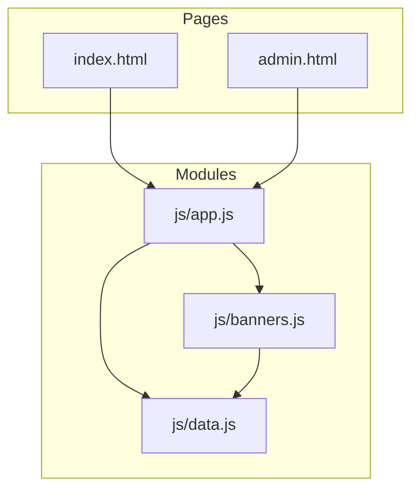
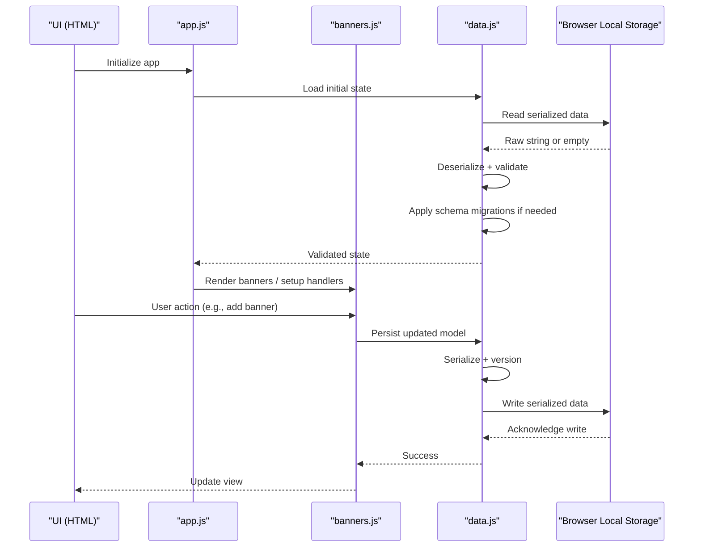
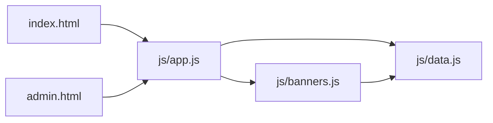
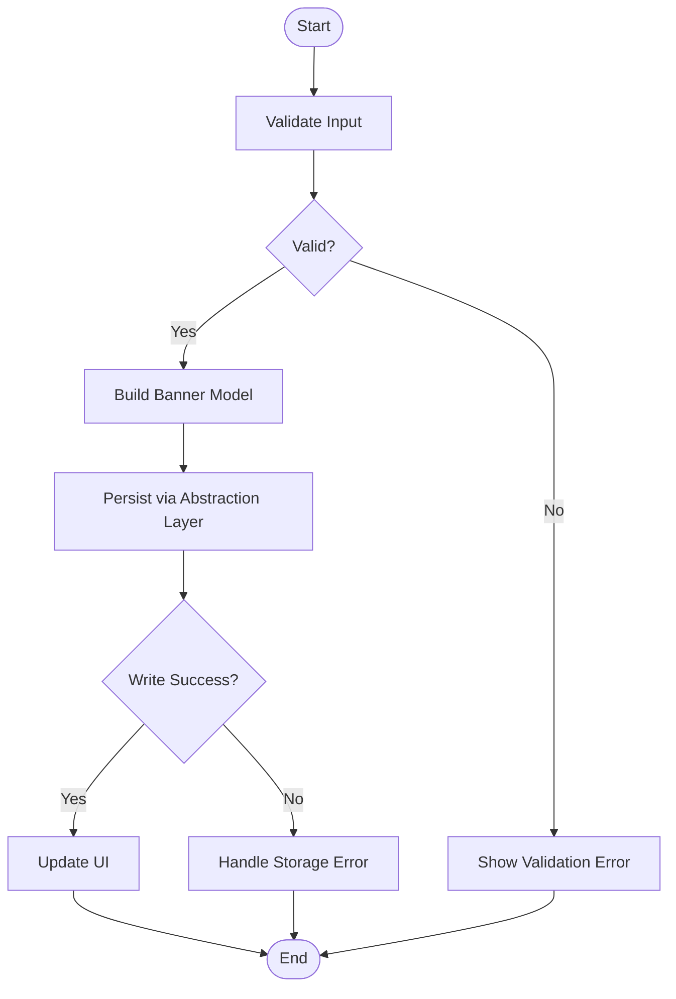
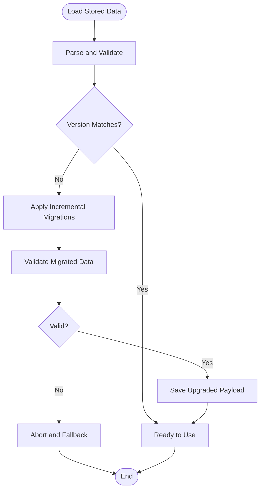

# Storage Strategy

<cite>
**Referenced Files in This Document**
- [js/data.js](file://js/data.js)
- [js/app.js](file://js/app.js)
- [js/banners.js](file://js/banners.js)
- [index.html](file://index.html)
- [admin.html](file://admin.html)
</cite>

## Table of Contents
1. [Introduction](#introduction)
2. [Project Structure](#project-structure)
3. [Core Components](#core-components)
4. [Architecture Overview](#architecture-overview)
5. [Detailed Component Analysis](#detailed-component-analysis)
6. [Dependency Analysis](#dependency-analysis)
7. [Performance Considerations](#performance-considerations)
8. [Troubleshooting Guide](#troubleshooting-guide)
9. [Conclusion](#conclusion)
10. [Appendices](#appendices)

## Introduction
This document describes the client-side storage strategy used by KPR Crackers for persistent data management. It explains how local storage is implemented, including serialization and deserialization, schema versioning, and a data abstraction layer that provides a consistent API across storage operations. It also documents the primary data models (banner objects, user sessions, application state), backup and recovery mechanisms, migration strategies for schema updates, performance considerations for large datasets, common operation examples, error handling patterns, and best practices to maintain data integrity.

## Project Structure
The project is organized into HTML pages and JavaScript modules:
- index.html and admin.html are entry points for the main and admin experiences.
- js/app.js orchestrates application initialization and wiring between UI and data layers.
- js/banners.js manages banner-related logic and persistence.
- js/data.js implements the core storage abstraction and utilities.

**Diagram sources**
- [index.html](file://index.html)
- [admin.html](file://admin.html)
- [js/app.js](file://js/app.js)
- [js/banners.js](file://js/banners.js)
- [js/data.js](file://js/data.js)

**Section sources**
- [index.html](file://index.html)
- [admin.html](file://admin.html)
- [js/app.js](file://js/app.js)
- [js/banners.js](file://js/banners.js)
- [js/data.js](file://js/data.js)

## Core Components
- Data Abstraction Layer: A unified interface for reading, writing, and managing persisted data with consistent methods and error semantics.
- Serialization Utilities: Helpers for safe JSON serialization/deserialization and validation.
- Schema Versioning: A mechanism to track and migrate stored data when the schema evolves.
- Domain Modules: Banner management and session/state handling built on top of the abstraction layer.

Key responsibilities:
- Provide a stable API for all storage operations.
- Ensure backward compatibility via schema versioning and migrations.
- Centralize error handling and logging for storage failures.
- Encapsulate domain-specific logic (e.g., banners) while delegating persistence to the abstraction layer.

**Section sources**
- [js/data.js](file://js/data.js)
- [js/banners.js](file://js/banners.js)
- [js/app.js](file://js/app.js)

## Architecture Overview
The storage architecture separates concerns between UI, domain logic, and persistence:
- Pages load app.js which initializes the application and wires UI events to domain functions.
- Domain modules (e.g., banners.js) implement business rules and call the data abstraction layer for persistence.
- The data abstraction layer handles serialization, schema versioning, and underlying storage calls.

**Diagram sources**
- [js/app.js](file://js/app.js)
- [js/banners.js](file://js/banners.js)
- [js/data.js](file://js/data.js)

## Detailed Component Analysis

### Data Abstraction Layer (Storage API)
Responsibilities:
- Define a consistent set of operations for get, set, remove, and list-like queries.
- Wrap low-level storage calls with robust error handling and fallbacks.
- Manage schema versions and run migrations when necessary.
- Provide utility helpers for serialization and validation.

Typical operations:
- Get current state or specific entities.
- Set or update entities with automatic versioning.
- Remove or clear data safely.
- Query filtered lists (e.g., banners).

Error handling:
- Catch storage exceptions (quota exceeded, unavailable storage).
- Normalize errors into a consistent shape for consumers.
- Log actionable diagnostics without exposing sensitive details.

Schema versioning:
- Maintain a version field in stored payloads.
- On read, compare stored version with expected version.
- If mismatched, apply incremental migrations to transform old schemas to the current one.
- After successful migration, persist the upgraded payload.

Serialization and deserialization:
- Use JSON-based formats for portability and readability.
- Validate structures after deserialization; reject malformed data.
- Sanitize inputs to prevent injection or unexpected types.

Best practices:
- Always wrap storage writes in try/catch and report failures gracefully.
- Avoid blocking the main thread with heavy operations; batch updates where possible.
- Keep payloads small and structured; avoid storing large blobs directly.

**Section sources**
- [js/data.js](file://js/data.js)

### Banner Management Module
Responsibilities:
- Implement CRUD operations for banner entities.
- Enforce domain constraints (e.g., required fields, uniqueness).
- Coordinate with the data abstraction layer for persistence.
- Emit UI updates upon successful mutations.

Common operations:
- Create a new banner and persist it.
- Update an existing banner’s properties.
- Delete a banner by identifier.
- List banners with optional filters (e.g., active status).

Data model highlights:
- Identifier: unique key for each banner.
- Content fields: title, description, media reference, etc.
- Metadata: timestamps, flags (active/inactive), version.

Integration:
- Calls the data abstraction layer to read/write banner collections.
- Handles optimistic UI updates and reverts on failure.

**Section sources**
- [js/banners.js](file://js/banners.js)
- [js/data.js](file://js/data.js)

### Application Initialization and Wiring
Responsibilities:
- Bootstrap the application by loading persisted state.
- Initialize domain modules (e.g., banners).
- Attach event listeners to UI elements.
- Handle global errors and provide user feedback.

Flow:
- On page load, initialize app module.
- Load state from storage via the abstraction layer.
- Render initial views based on loaded data.
- Wire up user interactions to domain functions.

**Section sources**
- [js/app.js](file://js/app.js)
- [index.html](file://index.html)
- [admin.html](file://admin.html)

### Data Models

#### Banner Object
- Purpose: Represents a content banner displayed in the UI.
- Key attributes:
  - id: unique identifier
  - title: display text
  - description: supporting text
  - mediaUrl: reference to image or asset
  - isActive: boolean flag
  - createdAt, updatedAt: timestamps
  - version: schema version for migration tracking

Validation:
- Required fields: id, title, isActive.
- Optional fields: description, mediaUrl.
- Type checks and normalization applied during deserialization.

**Section sources**
- [js/banners.js](file://js/banners.js)
- [js/data.js](file://js/data.js)

#### User Session
- Purpose: Tracks user context and preferences within the browser session.
- Key attributes:
  - sessionId: unique session token
  - userId: user identifier
  - roles: array of role strings
  - lastActive: timestamp
  - preferences: key-value settings

Lifecycle:
- Created on first interaction or login flow.
- Updated on activity to refresh lastActive.
- Cleared on logout or expiration policy.

**Section sources**
- [js/app.js](file://js/app.js)
- [js/data.js](file://js/data.js)

#### Application State
- Purpose: Holds global runtime state derived from persisted data.
- Key attributes:
  - banners: collection of banner objects
  - session: current user session object
  - ui: transient UI flags (not persisted)
  - meta: metadata like lastSyncTime, schemaVersion

Consistency:
- Derived from persisted store; UI state may be ephemeral.
- Changes propagate to UI through reactive updates.

**Section sources**
- [js/app.js](file://js/app.js)
- [js/data.js](file://js/data.js)

### Backup and Recovery
Backup:
- Export current state to a downloadable JSON file.
- Include schema version and timestamps for traceability.
- Optionally compress or split large exports.

Recovery:
- Import a previously exported JSON file.
- Validate structure and schema version before applying.
- Run migrations if the imported schema is older than current.
- Confirm with the user before overwriting existing data.

Operational notes:
- Provide clear success/failure feedback.
- Preserve original data until import succeeds fully.
- Support partial imports by merging only valid sections.

**Section sources**
- [js/data.js](file://js/data.js)
- [js/app.js](file://js/app.js)

### Migration Strategies for Schema Updates
Approach:
- Maintain a monotonically increasing schema version.
- On load, detect mismatches and apply incremental migrations.
- Each migration transforms data from version N to N+1.
- After migration, persist the upgraded payload and update version.

Migration design:
- Idempotent transformations to support retries.
- Defensive checks to handle missing or malformed fields.
- Rollback-safe: keep original snapshot until migration completes.

Example migration steps:
- Add default values for new fields.
- Rename or merge fields.
- Normalize enums or arrays.
- Archive deprecated fields under a legacy namespace.

**Section sources**
- [js/data.js](file://js/data.js)

### Common Storage Operations

Examples of typical workflows:
- Create a banner:
  - Validate input.
  - Generate id and timestamps.
  - Persist via abstraction layer.
  - Update UI and notify success.
- Update a banner:
  - Fetch current entity.
  - Merge changes.
  - Persist updated entity.
  - Refresh UI.
- Delete a banner:
  - Remove by id.
  - Update collections.
  - Reflect deletion in UI.
- List banners:
  - Query persisted collection.
  - Apply filters/sorting.
  - Render results.

Error handling:
- Wrap each operation in try/catch.
- Normalize errors and present user-friendly messages.
- Log diagnostic info for developers.

**Section sources**
- [js/banners.js](file://js/banners.js)
- [js/data.js](file://js/data.js)

### Error Handling for Storage Failures
Patterns:
- Detect quota exceeded and prompt users to free space or export data.
- Handle storage unavailability (private browsing modes) by falling back to in-memory state and warning the user.
- Capture and log stack traces for debugging without leaking sensitive data.
- Provide retry mechanisms for transient failures.

User feedback:
- Show non-blocking notifications for recoverable issues.
- Disable destructive actions when storage is unavailable.
- Offer export/import flows to mitigate data loss risks.

**Section sources**
- [js/data.js](file://js/data.js)
- [js/app.js](file://js/app.js)

### Best Practices for Data Integrity
- Validate all incoming data before persisting.
- Use schema versioning to ensure forward/backward compatibility.
- Prefer immutable updates to avoid accidental mutations.
- Batch writes to reduce overhead and improve consistency.
- Keep backups before major schema changes.
- Test migrations thoroughly against representative datasets.
- Monitor storage usage and warn users proactively.

[No sources needed since this section provides general guidance]

## Dependency Analysis
The following diagram shows how modules depend on each other and the storage layer:

**Diagram sources**
- [index.html](file://index.html)
- [admin.html](file://admin.html)
- [js/app.js](file://js/app.js)
- [js/banners.js](file://js/banners.js)
- [js/data.js](file://js/data.js)

**Section sources**
- [index.html](file://index.html)
- [admin.html](file://admin.html)
- [js/app.js](file://js/app.js)
- [js/banners.js](file://js/banners.js)
- [js/data.js](file://js/data.js)

## Performance Considerations
- Minimize serialization overhead by batching updates and avoiding frequent small writes.
- Use efficient queries by maintaining indexes or auxiliary structures for filtering.
- Defer heavy computations off the main thread using Web Workers if needed.
- Limit stored payload sizes; consider external storage for large assets and store references instead.
- Profile storage operations to identify bottlenecks and optimize hot paths.
- Cache frequently accessed data in memory and synchronize with storage lazily.

[No sources needed since this section provides general guidance]

## Troubleshooting Guide
Symptoms and resolutions:
- Data not persisting:
  - Check storage availability and permissions.
  - Verify serialization and schema versioning logic.
  - Inspect error logs for quota or type errors.
- Corrupted data after update:
  - Restore from backup and re-run migrations.
  - Validate schema and fix migration scripts.
- Slow UI due to storage:
  - Reduce write frequency and batch operations.
  - Offload heavy tasks and use lazy loading.

Diagnostic steps:
- Export current state and inspect structure.
- Compare schema version and migration history.
- Reproduce issues in different browsers and modes.

**Section sources**
- [js/data.js](file://js/data.js)
- [js/app.js](file://js/app.js)

## Conclusion
KPR Crackers employs a robust client-side storage strategy centered around a data abstraction layer that standardizes persistence operations, enforces schema versioning, and centralizes error handling. Domain modules like banner management build on this foundation to deliver consistent behavior across the application. By following the outlined best practices, implementing comprehensive migrations, and providing backup/recovery tools, the system maintains data integrity and performance even as requirements evolve.

[No sources needed since this section summarizes without analyzing specific files]

## Appendices

### Appendix A: Example Operation Flows

#### Create Banner Flow

**Diagram sources**
- [js/banners.js](file://js/banners.js)
- [js/data.js](file://js/data.js)

#### Schema Migration Flow

**Diagram sources**
- [js/data.js](file://js/data.js)