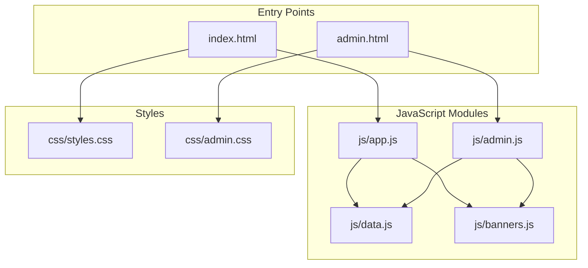
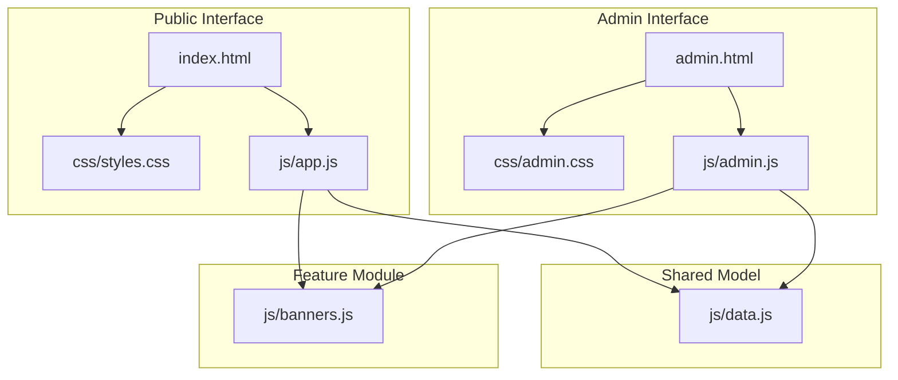
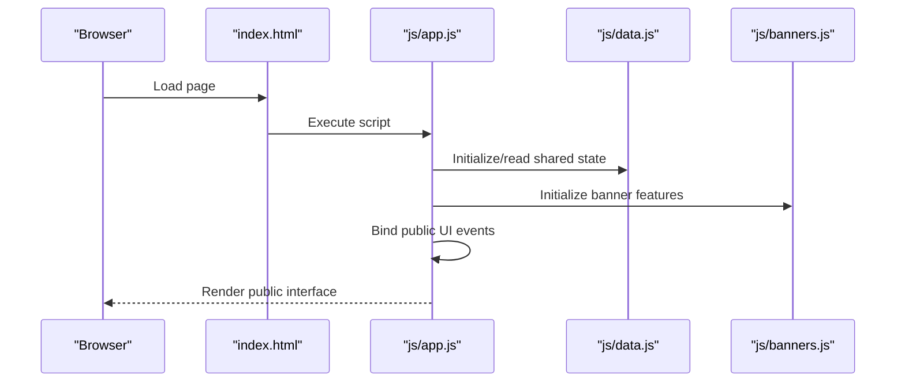
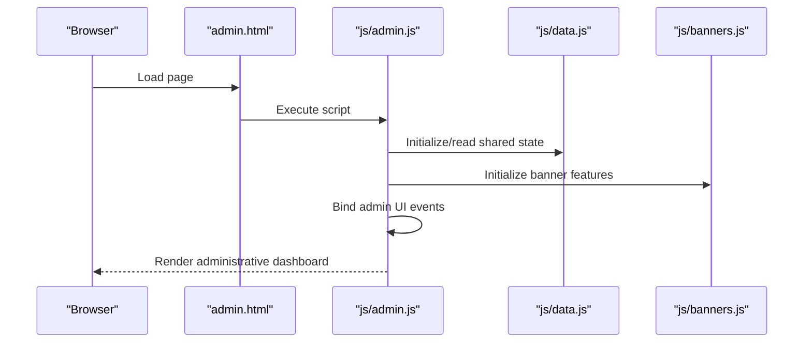
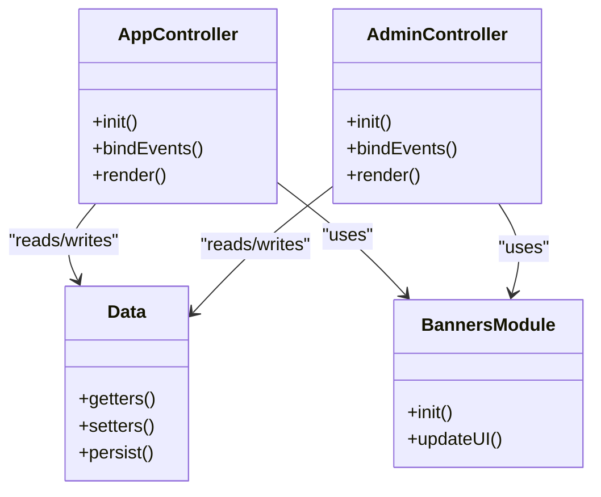
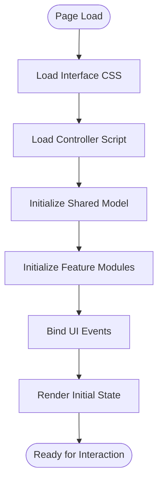
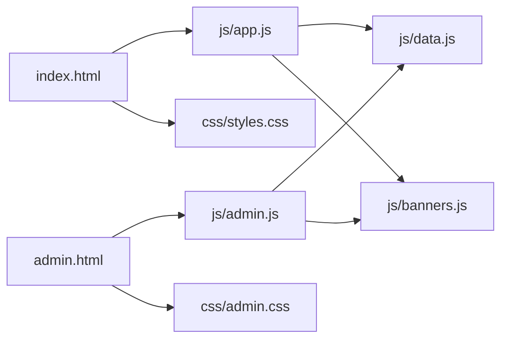

# System Architecture

<cite>
**Referenced Files in This Document**
- [index.html](file://index.html)
- [admin.html](file://admin.html)
- [app.js](file://js/app.js)
- [admin.js](file://js/admin.js)
- [data.js](file://js/data.js)
- [banners.js](file://js/banners.js)
- [styles.css](file://css/styles.css)
- [admin.css](file://css/admin.css)
</cite>

## Table of Contents
1. [Introduction](#introduction)
2. [Project Structure](#project-structure)
3. [Core Components](#core-components)
4. [Architecture Overview](#architecture-overview)
5. [Detailed Component Analysis](#detailed-component-analysis)
6. [Dependency Analysis](#dependency-analysis)
7. [Performance Considerations](#performance-considerations)
8. [Troubleshooting Guide](#troubleshooting-guide)
9. [Conclusion](#conclusion)

## Introduction
This document describes the architecture of the KPR Crackers system, a client-side application built with vanilla JavaScript modules and no external frameworks. The system implements a dual-interface design:
- Public interface entry point for end users
- Administrative dashboard entry point for management tasks

The application follows a lightweight Model-View-Controller (MVC) pattern to separate concerns between data (Model), presentation (View), and interaction logic (Controller). It uses an explicit bootstrap process to initialize modules and UI components based on the active page.

## Project Structure
The repository is organized by feature and layer:
- HTML entry points define the two interfaces
- JavaScript modules implement MVC layers and shared utilities
- CSS files provide styling per interface

**Diagram sources**
- [index.html](file://index.html)
- [admin.html](file://admin.html)
- [js/app.js](file://js/app.js)
- [js/admin.js](file://js/admin.js)
- [js/data.js](file://js/data.js)
- [js/banners.js](file://js/banners.js)
- [css/styles.css](file://css/styles.css)
- [css/admin.css](file://css/admin.css)

**Section sources**
- [index.html](file://index.html)
- [admin.html](file://admin.html)
- [js/app.js](file://js/app.js)
- [js/admin.js](file://js/admin.js)
- [js/data.js](file://js/data.js)
- [js/banners.js](file://js/banners.js)
- [css/styles.css](file://css/styles.css)
- [css/admin.css](file://css/admin.css)

## Core Components
- Entry points
  - index.html: Bootstraps the public interface and loads app.js and styles.css
  - admin.html: Bootstraps the administrative dashboard and loads admin.js and admin.css
- JavaScript modules
  - js/app.js: Public controller/view orchestration; initializes public UI and event wiring
  - js/admin.js: Administrative controller/view orchestration; initializes admin UI and event wiring
  - js/data.js: Shared data model and persistence helpers used by both interfaces
  - js/banners.js: Feature module that manages banner-related view updates and interactions
- Styles
  - css/styles.css: Public interface styles
  - css/admin.css: Administrative interface styles

Responsibilities:
- Model (js/data.js): Provides state accessors/mutators and any local storage or in-memory data operations
- View (HTML + CSS): Static templates and styling for each interface
- Controller (js/app.js, js/admin.js): Initializes views, binds events, reads/writes model, and updates DOM

**Section sources**
- [index.html](file://index.html)
- [admin.html](file://admin.html)
- [js/app.js](file://js/app.js)
- [js/admin.js](file://js/admin.js)
- [js/data.js](file://js/data.js)
- [js/banners.js](file://js/banners.js)
- [css/styles.css](file://css/styles.css)
- [css/admin.css](file://css/admin.css)

## Architecture Overview
The system uses a simple MVC layout with clear separation of concerns:
- Models encapsulate data and business rules
- Views render content using HTML/CSS
- Controllers coordinate user actions, update models, and refresh views

**Diagram sources**
- [index.html](file://index.html)
- [admin.html](file://admin.html)
- [js/app.js](file://js/app.js)
- [js/admin.js](file://js/admin.js)
- [js/data.js](file://js/data.js)
- [js/banners.js](file://js/banners.js)
- [css/styles.css](file://css/styles.css)
- [css/admin.css](file://css/admin.css)

## Detailed Component Analysis

### Public Interface Bootstrap (index.html)
- Loads styles.css for public UI
- Loads app.js as the main controller
- app.js initializes public views, binds events, and interacts with the shared model and banners module

**Diagram sources**
- [index.html](file://index.html)
- [js/app.js](file://js/app.js)
- [js/data.js](file://js/data.js)
- [js/banners.js](file://js/banners.js)

**Section sources**
- [index.html](file://index.html)
- [js/app.js](file://js/app.js)
- [js/data.js](file://js/data.js)
- [js/banners.js](file://js/banners.js)

### Administrative Dashboard Bootstrap (admin.html)
- Loads admin.css for admin UI
- Loads admin.js as the admin controller
- admin.js initializes admin views, binds administrative events, and interacts with the shared model and banners module

**Diagram sources**
- [admin.html](file://admin.html)
- [js/admin.js](file://js/admin.js)
- [js/data.js](file://js/data.js)
- [js/banners.js](file://js/banners.js)

**Section sources**
- [admin.html](file://admin.html)
- [js/admin.js](file://js/admin.js)
- [js/data.js](file://js/data.js)
- [js/banners.js](file://js/banners.js)

### MVC Layer Responsibilities
- Model (js/data.js)
  - Centralizes data access and mutations
  - Exposes getters/setters and persistence helpers
- View (HTML + CSS)
  - index.html and admin.html define static structure
  - css/styles.css and css/admin.css style respective interfaces
- Controller (js/app.js, js/admin.js)
  - Initializes UI components
  - Wires event listeners
  - Reads/writes model and updates DOM via view elements

**Diagram sources**
- [js/data.js](file://js/data.js)
- [js/app.js](file://js/app.js)
- [js/admin.js](file://js/admin.js)
- [js/banners.js](file://js/banners.js)

**Section sources**
- [js/data.js](file://js/data.js)
- [js/app.js](file://js/app.js)
- [js/admin.js](file://js/admin.js)
- [js/banners.js](file://js/banners.js)

### Application Bootstrap Process
The initialization sequence ensures modules load in the correct order and UI is ready before user interaction:
1. HTML entry point loads CSS and its controller script
2. Controller imports/initializes the shared model
3. Controller initializes feature modules (e.g., banners)
4. Controller binds UI events and renders initial state

[No sources needed since this diagram shows conceptual workflow, not actual code structure]

## Dependency Analysis
The dependency graph highlights how entry points depend on controllers, which in turn depend on shared model and feature modules.

**Diagram sources**
- [index.html](file://index.html)
- [admin.html](file://admin.html)
- [js/app.js](file://js/app.js)
- [js/admin.js](file://js/admin.js)
- [js/data.js](file://js/data.js)
- [js/banners.js](file://js/banners.js)
- [css/styles.css](file://css/styles.css)
- [css/admin.css](file://css/admin.css)

**Section sources**
- [index.html](file://index.html)
- [admin.html](file://admin.html)
- [js/app.js](file://js/app.js)
- [js/admin.js](file://js/admin.js)
- [js/data.js](file://js/data.js)
- [js/banners.js](file://js/banners.js)
- [css/styles.css](file://css/styles.css)
- [css/admin.css](file://css/admin.css)

## Performance Considerations
- Keep controller scripts small and focused; defer heavy initialization until after DOMContentLoaded if necessary
- Avoid repeated DOM queries by caching element references during initialization
- Use efficient event delegation for dynamic lists or large tables
- Minimize synchronous I/O; prefer asynchronous patterns when interacting with storage or network resources
- Separate public and admin styles to reduce unused CSS per interface

## Troubleshooting Guide
Common issues and checks:
- Missing or incorrect script paths in HTML entry points will prevent controllers from loading
- Conflicts between public and admin styles can be resolved by scoping selectors within their respective CSS files
- If shared model state appears inconsistent, verify that all controllers read/write through the same model API
- Ensure feature modules are initialized only once per page load to avoid duplicate bindings

**Section sources**
- [index.html](file://index.html)
- [admin.html](file://admin.html)
- [js/app.js](file://js/app.js)
- [js/admin.js](file://js/admin.js)
- [js/data.js](file://js/data.js)
- [js/banners.js](file://js/banners.js)
- [css/styles.css](file://css/styles.css)
- [css/admin.css](file://css/admin.css)

## Conclusion
The KPR Crackers system employs a clean, framework-free architecture with a dual-interface design and a straightforward MVC pattern. The public and administrative dashboards share a common model and feature modules while maintaining distinct controllers and styles. The explicit bootstrap process ensures predictable initialization and clear separation of concerns, making the system easy to extend and maintain.