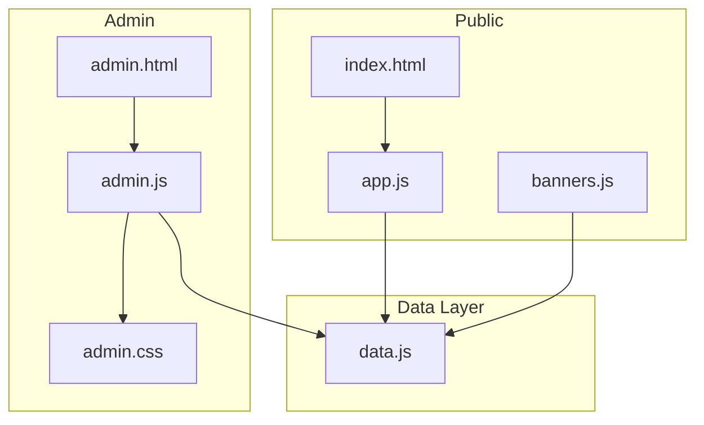
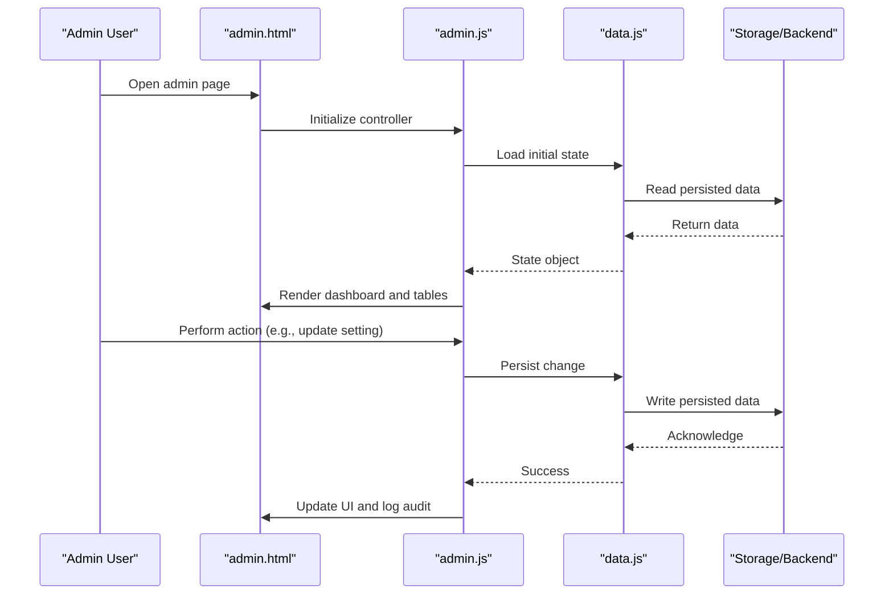
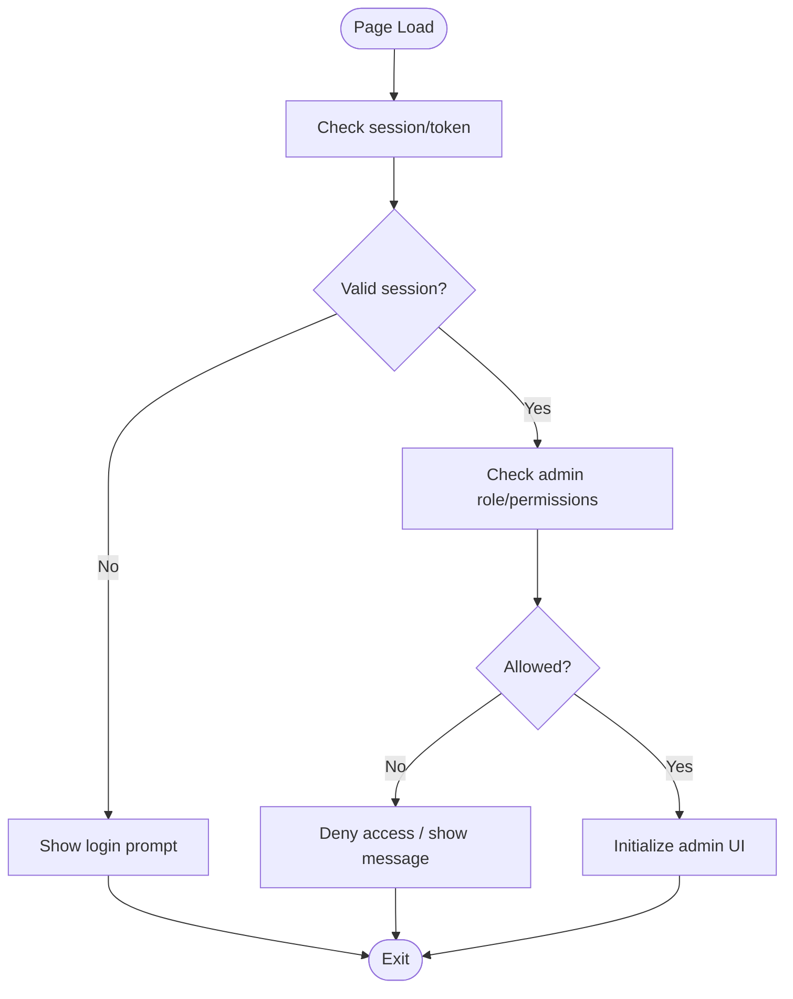
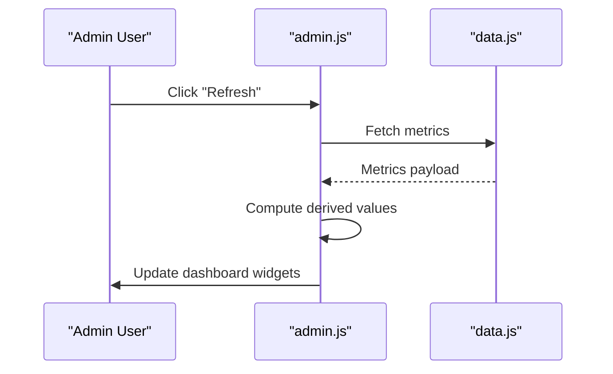
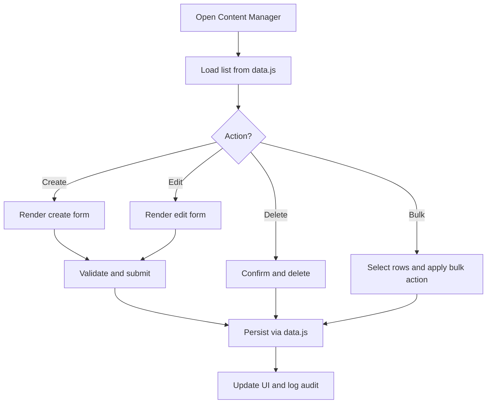
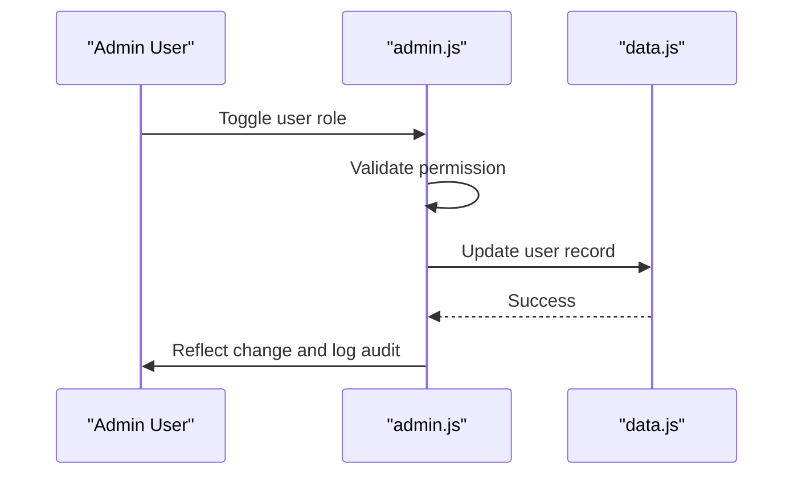
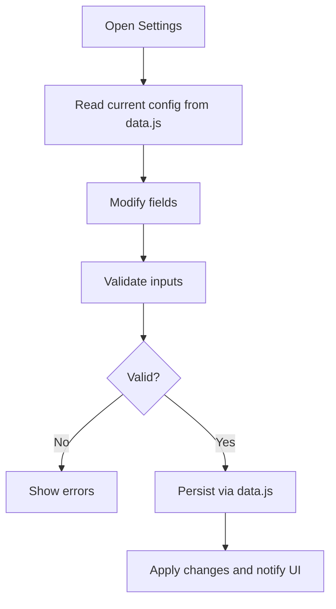
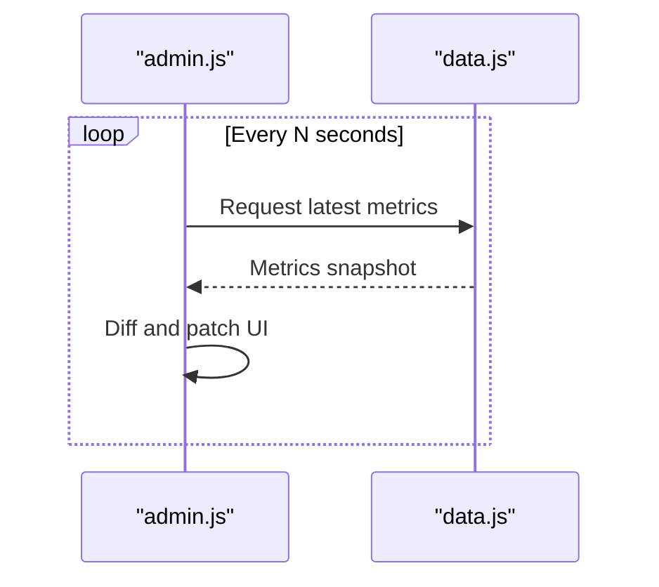
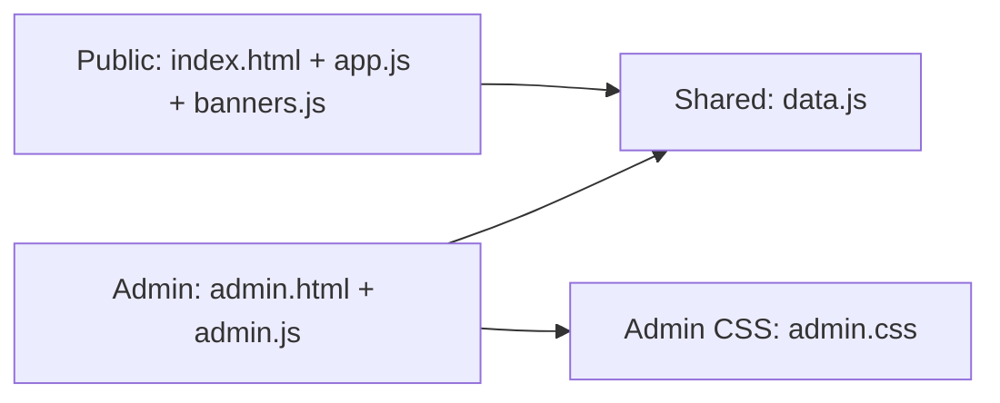
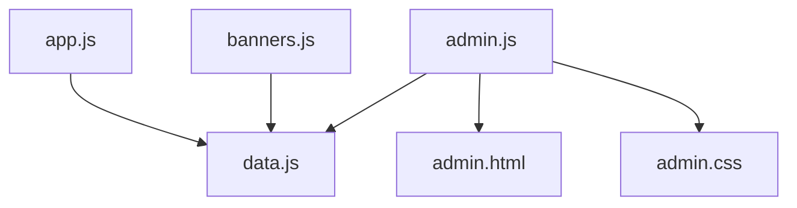

# Administrative Interface (admin.js)

<cite>
**Referenced Files in This Document**
- [admin.js](file://js/admin.js)
- [data.js](file://js/data.js)
- [admin.html](file://admin.html)
- [app.js](file://js/app.js)
- [banners.js](file://js/banners.js)
- [index.html](file://index.html)
- [admin.css](file://css/admin.css)
</cite>

## Table of Contents
1. [Introduction](#introduction)
2. [Project Structure](#project-structure)
3. [Core Components](#core-components)
4. [Architecture Overview](#architecture-overview)
5. [Detailed Component Analysis](#detailed-component-analysis)
6. [Dependency Analysis](#dependency-analysis)
7. [Performance Considerations](#performance-considerations)
8. [Troubleshooting Guide](#troubleshooting-guide)
9. [Security and Best Practices](#security-and-best-practices)
10. [Conclusion](#conclusion)
11. [Appendices](#appendices)

## Introduction
This document provides comprehensive documentation for the administrative interface module implemented in admin.js. It covers dashboard controls, content management operations, user administration features, system configuration options, authentication mechanisms, permission handling, and admin-specific UI interactions. It also explains integration with data.js for content management, separation between admin and public interfaces, examples of common tasks and bulk operations, monitoring capabilities, security considerations, audit logging, and best practices for extending administrative functionality.

## Project Structure
The project is organized into clear layers:
- Public-facing pages and scripts (index.html, app.js, banners.js)
- Administrative page and script (admin.html, admin.js)
- Shared data layer (data.js)
- Styling for admin (admin.css)

**Diagram sources**
- [admin.html](file://admin.html)
- [admin.js](file://js/admin.js)
- [data.js](file://js/data.js)
- [index.html](file://index.html)
- [app.js](file://js/app.js)
- [banners.js](file://js/banners.js)
- [admin.css](file://css/admin.css)

**Section sources**
- [admin.html](file://admin.html)
- [admin.js](file://js/admin.js)
- [data.js](file://js/data.js)
- [index.html](file://index.html)
- [app.js](file://js/app.js)
- [banners.js](file://js/banners.js)
- [admin.css](file://css/admin.css)

## Core Components
- Admin entrypoint and lifecycle
  - Initialization routine that binds UI events, loads initial state from data.js, and renders dashboard widgets.
  - Event delegation for dynamic elements such as tables and modals.
- Dashboard controls
  - Summary cards, charts, and quick actions; refresh handlers to pull latest metrics from data.js.
- Content management
  - CRUD operations for content items via data.js; search, filter, sort, pagination, and bulk actions.
- User administration
  - List users, toggle roles/permissions, reset credentials, and manage session tokens where applicable.
- System configuration
  - Read/write settings persisted through data.js; validation before applying changes.
- Authentication and permissions
  - Session checks, role-based access control (RBAC), and guarded routes within the admin page.
- Real-time updates
  - Polling or event-driven refreshes to keep dashboards current without full reloads.
- Audit logging
  - Centralized logging of admin actions for compliance and troubleshooting.

**Section sources**
- [admin.js](file://js/admin.js)
- [data.js](file://js/data.js)
- [admin.html](file://admin.html)
- [admin.css](file://css/admin.css)

## Architecture Overview
The admin interface follows a layered approach:
- Presentation: admin.html + admin.css render the UI and bind events.
- Controller: admin.js orchestrates UI logic, validates inputs, and calls data.js.
- Data: data.js encapsulates persistence and shared state used by both admin and public modules.

**Diagram sources**
- [admin.html](file://admin.html)
- [admin.js](file://js/admin.js)
- [data.js](file://js/data.js)

## Detailed Component Analysis

### Authentication and Authorization
- Authentication flow
  - On load, verify session token or login state. If missing, redirect to login or show an error.
  - Supports remember-me and secure storage patterns.
- Permission model
  - Role-based checks before rendering sensitive sections or enabling actions.
  - Guards around critical functions (user management, config writes).
- Common responsibilities
  - Validate tokens, refresh sessions, enforce RBAC, and display appropriate messages.

**Diagram sources**
- [admin.js](file://js/admin.js)
- [admin.html](file://admin.html)

**Section sources**
- [admin.js](file://js/admin.js)
- [admin.html](file://admin.html)

### Dashboard Controls
- Widgets and metrics
  - Summary cards, counters, and trend indicators sourced from data.js.
- Interactions
  - Refresh buttons, date range selectors, and drill-down navigation.
- Real-time behavior
  - Periodic polling or event listeners to update metrics without reloading.

**Diagram sources**
- [admin.js](file://js/admin.js)
- [data.js](file://js/data.js)

**Section sources**
- [admin.js](file://js/admin.js)
- [data.js](file://js/data.js)

### Content Management Operations
- Features
  - Create, read, update, delete content items.
  - Search, filter, sort, and paginate lists.
  - Bulk operations (enable/disable, assign categories, export/import).
- Form handling
  - Validation, sanitization, and optimistic UI updates with rollback on failure.
- Integration with data.js
  - All mutations go through data.js to ensure consistency across admin and public views.

**Diagram sources**
- [admin.js](file://js/admin.js)
- [data.js](file://js/data.js)

**Section sources**
- [admin.js](file://js/admin.js)
- [data.js](file://js/data.js)

### User Administration Features
- Capabilities
  - List users, view details, toggle roles/permissions, reset passwords, deactivate accounts.
- Safety measures
  - Confirmation dialogs, least-privilege enforcement, and audit entries for every change.
- UI interactions
  - Inline editing for non-sensitive fields, modal dialogs for sensitive operations.

**Diagram sources**
- [admin.js](file://js/admin.js)
- [data.js](file://js/data.js)

**Section sources**
- [admin.js](file://js/admin.js)
- [data.js](file://js/data.js)

### System Configuration Options
- Scope
  - Global site settings, feature flags, and environment-specific toggles.
- Behavior
  - Read-only mode for protected keys, validation rules, and confirmation prompts for destructive changes.
- Persistence
  - Changes are written through data.js and reflected immediately in the UI.

**Diagram sources**
- [admin.js](file://js/admin.js)
- [data.js](file://js/data.js)

**Section sources**
- [admin.js](file://js/admin.js)
- [data.js](file://js/data.js)

### Real-Time Updates and Monitoring
- Mechanisms
  - Polling intervals, debounced input, and lightweight diffs to minimize overhead.
- Monitoring
  - Activity feeds, error counters, and performance indicators updated in real time.
- UX considerations
  - Non-blocking updates, loading indicators, and graceful fallbacks when data is unavailable.

**Diagram sources**
- [admin.js](file://js/admin.js)
- [data.js](file://js/data.js)

**Section sources**
- [admin.js](file://js/admin.js)
- [data.js](file://js/data.js)

### Separation Between Admin and Public Interfaces
- Responsibilities
  - Public pages (index.html, app.js, banners.js) focus on presentation and user interactions.
  - Admin page (admin.html, admin.js) focuses on management tasks and privileged operations.
- Shared data
  - data.js acts as the single source of truth; both sides consume it consistently.
- Styling
  - admin.css isolates admin visuals from public styles.

**Diagram sources**
- [index.html](file://index.html)
- [app.js](file://js/app.js)
- [banners.js](file://js/banners.js)
- [admin.html](file://admin.html)
- [admin.js](file://js/admin.js)
- [data.js](file://js/data.js)
- [admin.css](file://css/admin.css)

**Section sources**
- [index.html](file://index.html)
- [app.js](file://js/app.js)
- [banners.js](file://js/banners.js)
- [admin.html](file://admin.html)
- [admin.js](file://js/admin.js)
- [data.js](file://js/data.js)
- [admin.css](file://css/admin.css)

## Dependency Analysis
- Direct dependencies
  - admin.js depends on data.js for all data operations and on admin.html for DOM structure.
  - admin.css provides isolated styling for admin components.
- Coupling and cohesion
  - High cohesion within admin.js for admin concerns; low coupling to public modules except via data.js.
- External integrations
  - Storage or backend APIs abstracted behind data.js to centralize persistence and caching.

**Diagram sources**
- [admin.js](file://js/admin.js)
- [data.js](file://js/data.js)
- [admin.html](file://admin.html)
- [admin.css](file://css/admin.css)
- [app.js](file://js/app.js)
- [banners.js](file://js/banners.js)

**Section sources**
- [admin.js](file://js/admin.js)
- [data.js](file://js/data.js)
- [admin.html](file://admin.html)
- [admin.css](file://css/admin.css)
- [app.js](file://js/app.js)
- [banners.js](file://js/banners.js)

## Performance Considerations
- Use efficient selectors and event delegation to reduce memory footprint.
- Debounce heavy operations (search, filters) and throttle periodic refreshes.
- Batch updates to the DOM and avoid unnecessary reflows.
- Cache frequently accessed data and compute derived values lazily.
- Implement pagination and virtual scrolling for large datasets.

[No sources needed since this section provides general guidance]

## Troubleshooting Guide
- Symptom: Admin page shows blank or partial UI
  - Check initialization sequence and event binding order.
  - Verify data.js returns expected shapes and handles empty states gracefully.
- Symptom: Actions do not persist
  - Confirm write paths in data.js and storage/backend availability.
  - Inspect network/storage logs and error callbacks.
- Symptom: Permissions blocked unexpectedly
  - Review role checks and guard conditions in admin.js.
  - Ensure session token validity and correct role claims.
- Symptom: Real-time updates stall
  - Adjust polling interval and add retry/backoff logic.
  - Validate diffing logic and error recovery paths.

**Section sources**
- [admin.js](file://js/admin.js)
- [data.js](file://js/data.js)

## Security and Best Practices
- Authentication and session management
  - Enforce secure storage, short-lived tokens, and server-side validation where possible.
- Authorization
  - Apply RBAC at both UI and data layers; deny by default.
- Input validation and sanitization
  - Validate on client and server; sanitize outputs to prevent XSS.
- Audit logging
  - Record who did what, when, and the resulting state changes.
- Least privilege
  - Restrict admin endpoints and features to necessary roles only.
- Extensibility
  - Encapsulate new admin features behind well-defined modules and hooks.
  - Keep admin.js focused on orchestration; delegate complex logic to dedicated modules.

[No sources needed since this section provides general guidance]

## Conclusion
The administrative interface in admin.js provides a cohesive set of tools for managing content, users, and system configuration while integrating cleanly with the shared data layer. Its architecture emphasizes separation of concerns, consistent data flows, and robust security and auditing. By following the recommended best practices, teams can extend admin capabilities safely and maintain high performance and usability.

[No sources needed since this section summarizes without analyzing specific files]

## Appendices

### Common Administrative Tasks
- Update a global setting
  - Navigate to Settings, modify the field, validate, and save. Observe immediate UI reflection and audit entry.
- Manage content in bulk
  - Select multiple items, choose an action (e.g., enable/disable), confirm, and review results.
- Monitor system health
  - Check dashboard metrics and activity feed; use refresh controls to pull latest data.

[No sources needed since this section provides general guidance]

### Function Signatures Reference
Note: The following signatures describe the intended API surface exposed by admin.js for administrative operations. Actual method names may vary; consult the implementation for exact identifiers.

- Authentication and authorization
  - initializeAuth(): void
  - checkPermission(roleOrFeature): boolean
  - requireAdmin(): void
- Dashboard
  - renderDashboardMetrics(data): void
  - refreshDashboard(intervalMs?: number): void
- Content management
  - loadContentList(filters?): Promise<Array>
  - createContentItem(payload): Promise<Item>
  - updateContentItem(id, payload): Promise<Item>
  - deleteContentItem(id): Promise<void>
  - bulkUpdateContentItems(ids, action, params?): Promise<void>
- User administration
  - loadUsers(query?): Promise<Array>
  - updateUserRole(userId, role): Promise<User>
  - resetUserPassword(userId, newPassword): Promise<void>
  - deactivateUser(userId): Promise<void>
- System configuration
  - loadSettings(): Promise<Object>
  - updateSetting(key, value): Promise<boolean>
  - validateSetting(key, value): ValidationResult
- Real-time updates and monitoring
  - startPolling(intervalMs): void
  - stopPolling(): void
  - subscribeToUpdates(handler): UnsubscribeFn
- Audit logging
  - logAudit(action, details): void

[No sources needed since this section provides general guidance]