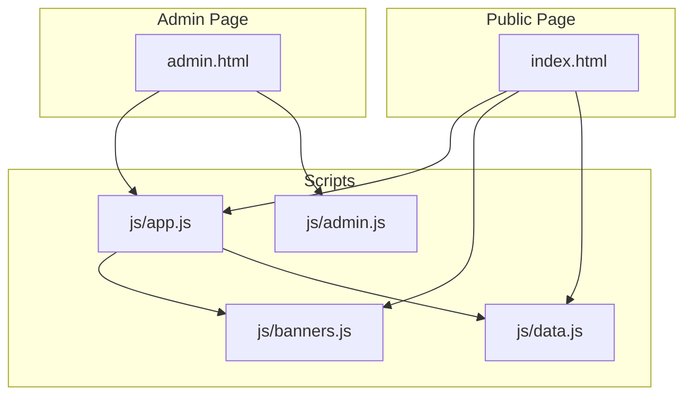
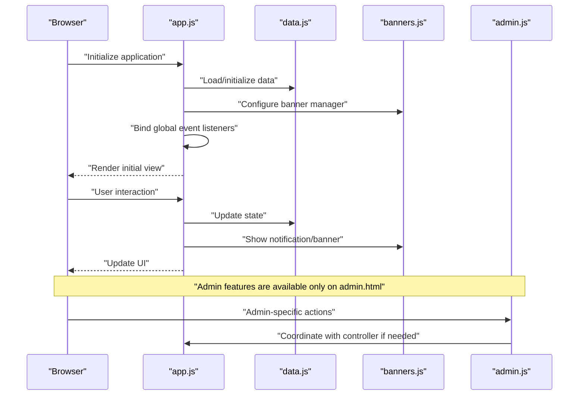
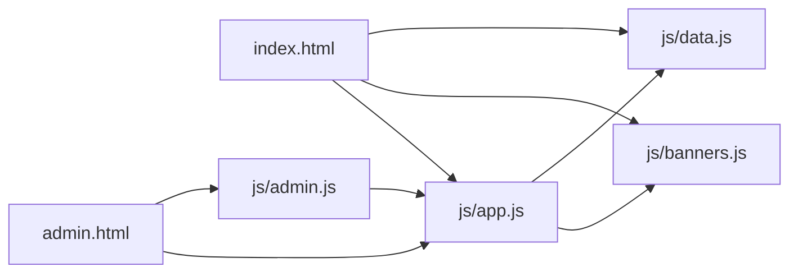

# Application Controller (app.js)

<cite>
**Referenced Files in This Document**
- [app.js](file://js/app.js)
- [banners.js](file://js/banners.js)
- [data.js](file://js/data.js)
- [admin.js](file://js/admin.js)
- [index.html](file://index.html)
- [admin.html](file://admin.html)
</cite>

## Table of Contents
1. [Introduction](#introduction)
2. [Project Structure](#project-structure)
3. [Core Components](#core-components)
4. [Architecture Overview](#architecture-overview)
5. [Detailed Component Analysis](#detailed-component-analysis)
6. [Dependency Analysis](#dependency-analysis)
7. [Performance Considerations](#performance-considerations)
8. [Troubleshooting Guide](#troubleshooting-guide)
9. [Conclusion](#conclusion)
10. [Appendices](#appendices)

## Introduction
This document provides comprehensive documentation for the main application controller module (app.js). It explains how the controller initializes the application, sets up event handling patterns, orchestrates other modules, manages global state, and integrates with banners.js and data.js. It also clarifies how the public and admin interfaces are managed and their lifecycles.

## Project Structure
The project is organized into a small set of JavaScript modules and HTML pages:
- js/app.js: Main application controller that bootstraps the app, wires events, and coordinates modules.
- js/banners.js: Banner management logic (creation, display, dismissal).
- js/data.js: Data access layer or data store used by the app.
- js/admin.js: Admin interface logic, typically loaded only on the admin page.
- index.html: Public-facing entry point that loads app.js and related scripts.
- admin.html: Admin entry point that loads both app.js and admin.js.

**Diagram sources**
- [index.html](file://index.html)
- [admin.html](file://admin.html)
- [app.js](file://js/app.js)
- [banners.js](file://js/banners.js)
- [data.js](file://js/data.js)
- [admin.js](file://js/admin.js)

**Section sources**
- [index.html](file://index.html)
- [admin.html](file://admin.html)
- [app.js](file://js/app.js)
- [banners.js](file://js/banners.js)
- [data.js](file://js/data.js)
- [admin.js](file://js/admin.js)

## Core Components
- Application Controller (app.js): Bootstraps the application, initializes core services, registers global event listeners, and coordinates between banners.js and data.js. It exposes an initialization function and may provide extension points for feature registration.
- Banner Manager (banners.js): Provides functions to create, show, hide, and dismiss banners. The controller uses this to notify users about actions and errors.
- Data Layer (data.js): Encapsulates data operations and state. The controller reads from and writes to this layer to keep UI consistent with persisted data.
- Admin Interface (admin.js): Admin-specific logic loaded only on the admin page. The controller can coordinate with it when needed.

Key responsibilities of app.js include:
- Initialization sequence: load configuration, initialize data, set up banner manager, bind DOM events, and render initial views.
- Event orchestration: centralize event listener setup and dispatching for user interactions.
- State management: maintain and synchronize global application state across modules.
- Integration points: call into banners.js and data.js at appropriate times.

**Section sources**
- [app.js](file://js/app.js)
- [banners.js](file://js/banners.js)
- [data.js](file://js/data.js)
- [admin.js](file://js/admin.js)

## Architecture Overview
The controller acts as the central coordinator. On page load, it initializes the data layer, configures the banner system, binds global events, and renders the initial view. User interactions trigger handlers that update state via the data layer and reflect changes through banners and UI updates.

**Diagram sources**
- [app.js](file://js/app.js)
- [banners.js](file://js/banners.js)
- [data.js](file://js/data.js)
- [admin.js](file://js/admin.js)

## Detailed Component Analysis

### Application Controller (app.js)
Responsibilities:
- Initialization:
  - Initialize data layer.
  - Configure banner manager.
  - Bind global event listeners.
  - Render initial view based on current state.
- Event Handling:
  - Centralized setup of event listeners for user interactions.
  - Delegates action processing to appropriate handlers.
- State Management:
  - Maintains global application state.
  - Ensures consistency between data layer and UI.
- Integration Points:
  - Calls into banners.js to show success/error/info messages.
  - Reads/writes to data.js to persist and retrieve application data.
- Extension Points:
  - Registration hooks for new features or plugins.
  - Modular handler functions that can be extended without modifying core logic.

Common usage patterns:
- Call the initialization function once during page load.
- Use provided API methods to perform actions; these will update state and trigger UI updates.
- Register custom handlers or features using documented extension points.

Error handling strategies:
- Wrap critical operations in try/catch blocks where necessary.
- Show user-friendly notifications via banners.js for failures.
- Log errors for debugging while preserving user experience.

Lifecycle management:
- Public interface lifecycle is controlled by app.js on index.html.
- Admin interface lifecycle is controlled by admin.js on admin.html; app.js may coordinate with admin.js when required.

Function signatures overview:
- Initialization:
  - init(): void
- Event binding:
  - bindGlobalEvents(): void
- State management:
  - getState(): object
  - setState(partialState): void
- Feature coordination:
  - handleAction(actionType, payload): Promise<void> | void
- Notifications:
  - showBanner(message, type): void
- Extension points:
  - registerFeature(featureName, featureConfig): void

Integration with banners.js:
- Uses banner creation and display functions to inform users about outcomes.

Integration with data.js:
- Reads initial data and persists changes through data layer methods.

Relationship with admin interface:
- When running on admin.html, app.js may enable additional capabilities or delegate specific flows to admin.js.

**Section sources**
- [app.js](file://js/app.js)
- [banners.js](file://js/banners.js)
- [data.js](file://js/data.js)
- [admin.js](file://js/admin.js)

### Banner Manager (banners.js)
Responsibilities:
- Create and manage banner instances.
- Provide functions to show success, error, and info banners.
- Handle auto-dismissal and manual dismissal.

Typical integration:
- Called by app.js after actions complete to notify users.

**Section sources**
- [banners.js](file://js/banners.js)

### Data Layer (data.js)
Responsibilities:
- Encapsulate data operations and persistence.
- Provide getters and setters for application state.
- Ensure data integrity and consistency.

Typical integration:
- Used by app.js to load initial data and persist changes.

**Section sources**
- [data.js](file://js/data.js)

### Admin Interface (admin.js)
Responsibilities:
- Implement admin-specific functionality.
- Coordinate with app.js when cross-module actions are needed.

Lifecycle:
- Loaded only on admin.html.
- May extend or override certain behaviors exposed by app.js.

**Section sources**
- [admin.js](file://js/admin.js)

## Dependency Analysis
High-level dependencies:
- app.js depends on banners.js and data.js.
- admin.js depends on app.js for shared functionality.
- index.html loads app.js, banners.js, and data.js.
- admin.html loads app.js and admin.js.

**Diagram sources**
- [index.html](file://index.html)
- [admin.html](file://admin.html)
- [app.js](file://js/app.js)
- [banners.js](file://js/banners.js)
- [data.js](file://js/data.js)
- [admin.js](file://js/admin.js)

**Section sources**
- [index.html](file://index.html)
- [admin.html](file://admin.html)
- [app.js](file://js/app.js)
- [banners.js](file://js/banners.js)
- [data.js](file://js/data.js)
- [admin.js](file://js/admin.js)

## Performance Considerations
- Minimize redundant DOM queries by caching references where appropriate.
- Batch state updates to reduce reflows and repaints.
- Debounce or throttle frequent user interactions (e.g., search input) to avoid excessive processing.
- Lazy-load admin features only when on admin.html to reduce overhead on public pages.
- Avoid heavy synchronous operations in event handlers; prefer asynchronous patterns where possible.

## Troubleshooting Guide
Common issues and resolutions:
- Initialization order problems:
  - Ensure app.js initialization runs after DOM is ready and required modules are loaded.
- Missing event listeners:
  - Verify that bindGlobalEvents() is called during initialization.
- State inconsistencies:
  - Confirm that all state mutations go through setState() and that UI updates follow state changes.
- Banner not showing:
  - Check that banners.js is loaded and showBanner() is invoked correctly.
- Admin features not available:
  - Confirm that admin.html includes admin.js and that admin-specific code paths are executed only on the admin page.

Error handling best practices:
- Wrap critical operations in try/catch and surface user-friendly messages via banners.js.
- Log detailed errors for debugging while keeping user-facing messages concise.

**Section sources**
- [app.js](file://js/app.js)
- [banners.js](file://js/banners.js)
- [data.js](file://js/data.js)
- [admin.js](file://js/admin.js)

## Conclusion
The app.js module serves as the central controller that initializes the application, manages global state, orchestrates events, and integrates with banners.js and data.js. It provides clear extension points for adding new features and coordinates the lifecycles of both public and admin interfaces. By following the documented patterns and integration points, developers can extend and maintain the application effectively.

## Appendices

### Common Usage Patterns
- Initialize the application on page load:
  - Call the initialization function once after DOM readiness.
- Perform actions:
  - Use provided API methods to update state; rely on the controller to handle UI updates and notifications.
- Add new features:
  - Register new features using the documented extension points and ensure they integrate with the data layer and banner system.

### Public vs Admin Interfaces
- Public interface:
  - Loaded on index.html; app.js manages its lifecycle and behavior.
- Admin interface:
  - Loaded on admin.html; admin.js handles admin-specific logic and coordinates with app.js when needed.

[No sources needed since this section summarizes general guidance]