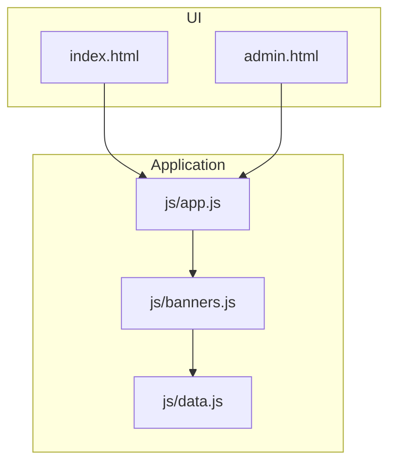
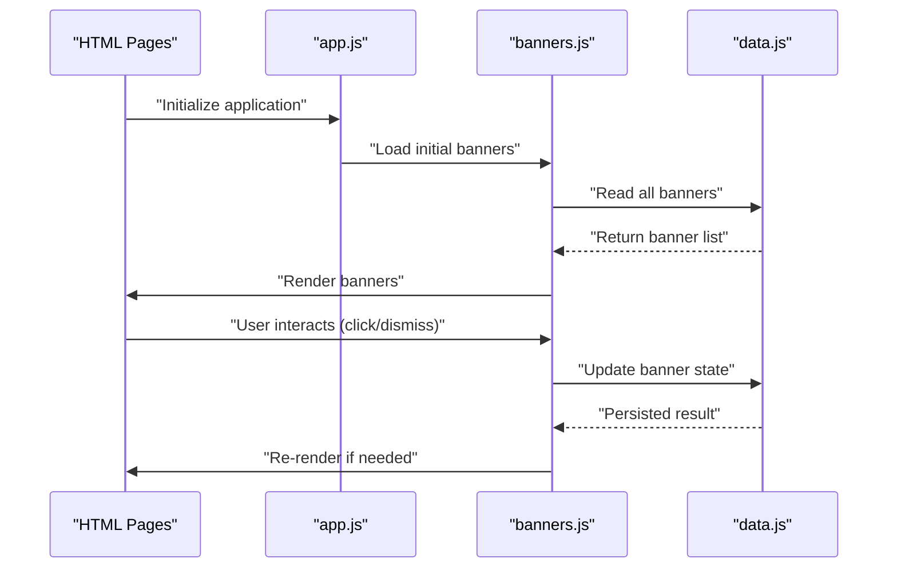
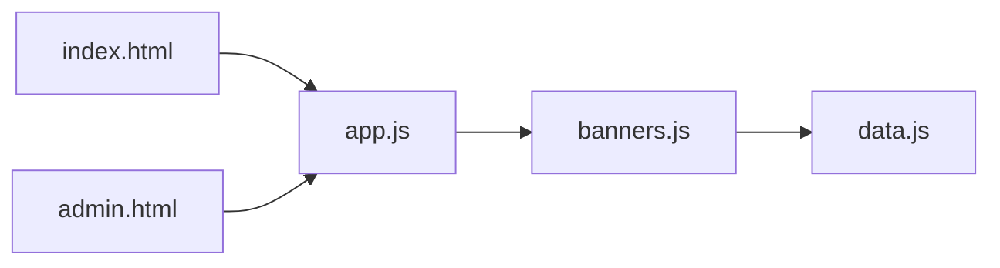

# Banner Management Module (banners.js)

<cite>
**Referenced Files in This Document**
- [banners.js](file://js/banners.js)
- [data.js](file://js/data.js)
- [app.js](file://js/app.js)
- [index.html](file://index.html)
- [admin.html](file://admin.html)
</cite>

## Table of Contents
1. [Introduction](#introduction)
2. [Project Structure](#project-structure)
3. [Core Components](#core-components)
4. [Architecture Overview](#architecture-overview)
5. [Detailed Component Analysis](#detailed-component-analysis)
6. [Dependency Analysis](#dependency-analysis)
7. [Performance Considerations](#performance-considerations)
8. [Troubleshooting Guide](#troubleshooting-guide)
9. [Conclusion](#conclusion)
10. [Appendices](#appendices)

## Introduction
This document provides comprehensive documentation for the banner management module implemented in banners.js. It explains how banners are created, read, updated, and deleted; how they are displayed and rotated; how user interactions are handled; and how the module integrates with data.js for persistence and UI components for rendering. It also covers filtering, sorting, scheduling, validation rules, performance optimization techniques, and guidance for extending functionality.

## Project Structure
The project is organized into a small set of JavaScript modules and HTML pages:
- js/banners.js: Core banner management logic (CRUD, display, rotation, interaction handlers, filtering/sorting).
- js/data.js: Persistence layer for banners and related state.
- js/app.js: Application bootstrap and integration glue between UI and modules.
- index.html: Main page where banners are rendered to end users.
- admin.html: Admin interface used to manage banners.

**Diagram sources**
- [index.html](file://index.html)
- [admin.html](file://admin.html)
- [app.js](file://js/app.js)
- [banners.js](file://js/banners.js)
- [data.js](file://js/data.js)

**Section sources**
- [banners.js](file://js/banners.js)
- [data.js](file://js/data.js)
- [app.js](file://js/app.js)
- [index.html](file://index.html)
- [admin.html](file://admin.html)

## Core Components
- Banner object model: Defines the shape of a banner entity including fields such as identifier, title, content, media, links, visibility flags, schedule, weights, and metadata.
- CRUD operations: Functions to create, read, update, and delete banners, including validation and persistence calls.
- Display and rotation: Logic to select which banner(s) to show at any time, considering filters, schedules, weights, and rotation strategies.
- Interaction handlers: Event listeners for clicks, dismissals, or other user actions that affect banner behavior.
- Filtering and sorting: Utilities to filter banners by criteria (e.g., category, active status, date range) and sort them by priority or custom order.
- Scheduling: Support for start/end times and recurring patterns to control when banners are visible.
- Rendering helpers: Functions to generate DOM elements or template strings for banners and integrate with UI containers.

Key responsibilities:
- Maintain a single source of truth for banner state via data.js.
- Provide a stable API surface for app.js to call during initialization and user interactions.
- Ensure robust validation and error handling around input and persistence.

**Section sources**
- [banners.js](file://js/banners.js)
- [data.js](file://js/data.js)

## Architecture Overview
The banner system follows a layered architecture:
- UI Layer: HTML pages render banner placeholders and bind events.
- Application Layer: app.js initializes modules and wires up lifecycle events.
- Domain Layer: banners.js encapsulates business logic for banners.
- Persistence Layer: data.js persists banner data and exposes query APIs.

**Diagram sources**
- [app.js](file://js/app.js)
- [banners.js](file://js/banners.js)
- [data.js](file://js/data.js)
- [index.html](file://index.html)
- [admin.html](file://admin.html)

## Detailed Component Analysis

### Banner Object Model
A banner typically includes:
- id: Unique identifier.
- title: Human-readable label.
- content: Text or rich content.
- media: Image/video URL or resource reference.
- link: Destination URL for click-throughs.
- target: Link target (e.g., same tab vs new tab).
- category: Grouping tag for filtering.
- weight: Priority factor for selection/rotation.
- active: Boolean flag controlling visibility.
- schedule: Start and end timestamps or recurrence rules.
- impressions: Counters for analytics.
- lastShown: Timestamp of last display.
- metadata: Additional key-value pairs.

Validation rules commonly enforced:
- Required fields: id, title, content, active.
- Type checks: booleans, numbers, strings.
- Date/time constraints: valid ISO formats, non-overlapping schedules.
- URL format: well-formed link and media URLs.
- Range limits: max length for text fields, reasonable weight ranges.

Example usage references:
- Creating a new banner object before persistence.
- Validating inputs prior to update operations.
- Reading scheduled banners based on current time.

**Section sources**
- [banners.js](file://js/banners.js)
- [data.js](file://js/data.js)

### CRUD Operations
Create:
- Purpose: Add a new banner after validation and assign an id if missing.
- Parameters: Banner object with required fields.
- Returns: Created banner instance or error details.
- Side effects: Persists to storage via data.js.

Read:
- Purpose: Retrieve one or multiple banners, optionally filtered and sorted.
- Parameters: Filter criteria (category, active, date range), sort options.
- Returns: Array of matching banners or a single banner by id.
- Side effects: None beyond returning data.

Update:
- Purpose: Modify an existing banner’s properties.
- Parameters: Banner id and partial update object.
- Returns: Updated banner or error details.
- Side effects: Persists changes via data.js.

Delete:
- Purpose: Remove a banner from storage.
- Parameters: Banner id.
- Returns: Success indicator or error details.
- Side effects: Removes from storage and triggers re-render if necessary.

Integration points:
- All mutations call data.js methods to ensure consistency.
- UI updates are triggered after successful mutations.

**Section sources**
- [banners.js](file://js/banners.js)
- [data.js](file://js/data.js)

### Display Logic and Rotation Mechanisms
Display selection:
- Filters banners by active status, category, and schedule windows.
- Applies weighting to influence selection probability or ordering.
- Respects rotation strategy (e.g., round-robin, weighted random, recency-based).

Rotation strategies:
- Weighted random: Higher-weighted banners appear more frequently.
- Round-robin: Cycles through available banners deterministically.
- Recency-aware: Avoids showing the same banner too soon after lastShown.

Scheduling:
- Supports start/end timestamps and optional recurrence patterns.
- Evaluates current time against schedule to determine eligibility.

Rendering:
- Generates DOM nodes or template strings for each selected banner.
- Injects into designated container elements in the UI.
- Updates counters and lastShown timestamps upon display.

Example usage references:
- Selecting the next banner to show based on rotation policy.
- Checking schedule eligibility before rendering.
- Updating impression counters after user views a banner.

**Section sources**
- [banners.js](file://js/banners.js)

### User Interaction Handlers
Common interactions:
- Click: Navigates to link or triggers custom action; records impression and click metrics.
- Dismiss: Hides banner temporarily or permanently; may adjust rotation weights.
- Close button: Similar to dismiss but with different UX semantics.

Event binding:
- Attaches event listeners to banner elements after rendering.
- Uses delegation for dynamic content to avoid repeated bindings.

State updates:
- Increments impression/click counts.
- Updates lastShown timestamp.
- Persists changes via data.js.

Error handling:
- Gracefully handles invalid links or missing resources.
- Logs errors without breaking UI flow.

**Section sources**
- [banners.js](file://js/banners.js)

### Filtering and Sorting
Filtering:
- By category/tag.
- By active/inactive status.
- By date range using schedule fields.
- By keyword search across title/content.

Sorting:
- By weight descending.
- By creation/update timestamps.
- By custom comparator provided by caller.

Implementation notes:
- Filters are applied before sorting to reduce dataset size.
- Sorting is stable to preserve relative order among equal keys.

**Section sources**
- [banners.js](file://js/banners.js)

### Scheduling Capabilities
Features:
- Start and end timestamps for one-time campaigns.
- Optional recurrence rules (e.g., daily, weekly).
- Timezone-aware evaluation if supported.

Behavior:
- Only eligible banners are considered for display.
- Invalid or overlapping schedules are rejected during validation.

**Section sources**
- [banners.js](file://js/banners.js)

### Rendering Functions
Responsibilities:
- Convert banner objects into DOM elements or template strings.
- Bind interaction handlers to generated elements.
- Manage container placement and layout classes.
- Handle empty states when no banners match filters.

Integration:
- Called by app.js after loading or updating banners.
- Accepts configuration options for theme or layout variants.

**Section sources**
- [banners.js](file://js/banners.js)

### Integration with data.js
Persistence contract:
- Read: Fetches all banners or specific subsets.
- Write: Creates, updates, deletes banners.
- Query: Provides filtered/sorted results.

Consistency:
- Mutations return promises or callbacks indicating success/failure.
- Errors propagate to callers for appropriate handling.

**Section sources**
- [data.js](file://js/data.js)
- [banners.js](file://js/banners.js)

### Integration with UI Components
Pages:
- index.html: Displays banners to end users.
- admin.html: Provides controls to manage banners.

Wiring:
- app.js initializes banners.js and binds UI events.
- Render functions inject banners into predefined containers.

Accessibility:
- Ensures semantic markup and keyboard navigation support.
- Adds ARIA attributes where appropriate.

**Section sources**
- [app.js](file://js/app.js)
- [index.html](file://index.html)
- [admin.html](file://admin.html)
- [banners.js](file://js/banners.js)

## Dependency Analysis
High-level dependencies:
- banners.js depends on data.js for persistence.
- app.js orchestrates initialization and event wiring.
- HTML pages provide containers and trigger app initialization.

**Diagram sources**
- [index.html](file://index.html)
- [admin.html](file://admin.html)
- [app.js](file://js/app.js)
- [banners.js](file://js/banners.js)
- [data.js](file://js/data.js)

**Section sources**
- [banners.js](file://js/banners.js)
- [data.js](file://js/data.js)
- [app.js](file://js/app.js)
- [index.html](file://index.html)
- [admin.html](file://admin.html)

## Performance Considerations
- Minimize DOM operations: Batch updates and use efficient selectors.
- Debounce heavy computations: Throttle filter/sort operations on large datasets.
- Lazy rendering: Render only visible banners initially; load more on demand.
- Efficient scheduling checks: Cache current time window and reuse across evaluations.
- Avoid redundant persistence: Coalesce rapid updates and persist once per batch.
- Use stable IDs: Prevent unnecessary re-renders by preserving element identity.
- Optimize image/media loading: Preload critical assets and defer non-critical ones.

[No sources needed since this section provides general guidance]

## Troubleshooting Guide
Common issues and resolutions:
- Validation failures: Check required fields, types, and date formats.
- Schedule conflicts: Ensure start/end times are valid and non-overlapping.
- Missing containers: Verify HTML contains expected banner placeholders.
- Event binding problems: Confirm elements exist before attaching listeners.
- Persistence errors: Inspect data.js responses and handle rejection paths.
- Rotation anomalies: Review weights and lastShown timestamps for correctness.

Debugging tips:
- Log banner lists before and after mutations.
- Print selected banners and reasons for exclusion.
- Track impression/click counters to verify updates.

**Section sources**
- [banners.js](file://js/banners.js)
- [data.js](file://js/data.js)

## Conclusion
The banner management module centralizes banner lifecycle, display, rotation, and interaction handling while delegating persistence to data.js. Its modular design allows easy extension of features such as advanced scheduling, richer analytics, and customizable rendering. Following the guidelines here will help you maintain consistent behavior, optimize performance, and integrate seamlessly with the UI.

[No sources needed since this section summarizes without analyzing specific files]

## Appendices

### Function Signatures and Examples
Note: The following outlines typical function signatures and behaviors. Refer to the codebase for exact names and parameters.

- createBanner(banner): Creates and persists a new banner.
  - Parameters: banner object with required fields.
  - Returns: Promise resolving to created banner or rejects with error.
  - Example path: [banners.js](file://js/banners.js)

- getBanners(filters, sortOptions): Retrieves banners with optional filtering and sorting.
  - Parameters: filters object, sort options.
  - Returns: Promise resolving to array of banners.
  - Example path: [banners.js](file://js/banners.js)

- updateBanner(id, patch): Updates an existing banner.
  - Parameters: id string, patch object.
  - Returns: Promise resolving to updated banner or rejects with error.
  - Example path: [banners.js](file://js/banners.js)

- deleteBanner(id): Deletes a banner.
  - Parameters: id string.
  - Returns: Promise resolving to boolean or rejects with error.
  - Example path: [banners.js](file://js/banners.js)

- selectNextBanner(): Chooses the next banner to display based on rotation strategy.
  - Parameters: none.
  - Returns: Selected banner or null.
  - Example path: [banners.js](file://js/banners.js)

- renderBanners(containerId, banners): Renders banners into a DOM container.
  - Parameters: container selector/id, array of banners.
  - Returns: void.
  - Example path: [banners.js](file://js/banners.js)

- bindInteractionHandlers(containerId): Attaches click/dismiss handlers.
  - Parameters: container selector/id.
  - Returns: void.
  - Example path: [banners.js](file://js/banners.js)

- validateBanner(banner): Validates a banner object.
  - Parameters: banner object.
  - Returns: boolean or error details.
  - Example path: [banners.js](file://js/banners.js)

- isEligibleForSchedule(banner, now): Checks schedule eligibility.
  - Parameters: banner object, current time.
  - Returns: boolean.
  - Example path: [banners.js](file://js/banners.js)

- filterBanners(banners, criteria): Filters banners by criteria.
  - Parameters: banners array, criteria object.
  - Returns: filtered array.
  - Example path: [banners.js](file://js/banners.js)

- sortBanners(banners, comparator): Sorts banners using comparator.
  - Parameters: banners array, comparator function.
  - Returns: sorted array.
  - Example path: [banners.js](file://js/banners.js)

- recordImpression(bannerId): Records view metrics.
  - Parameters: banner id.
  - Returns: void.
  - Example path: [banners.js](file://js/banners.js)

- recordClick(bannerId): Records click metrics.
  - Parameters: banner id.
  - Returns: void.
  - Example path: [banners.js](file://js/banners.js)

- initializeBanners(): Bootstraps banner system.
  - Parameters: none.
  - Returns: Promise resolving on completion.
  - Example path: [app.js](file://js/app.js)

**Section sources**
- [banners.js](file://js/banners.js)
- [app.js](file://js/app.js)