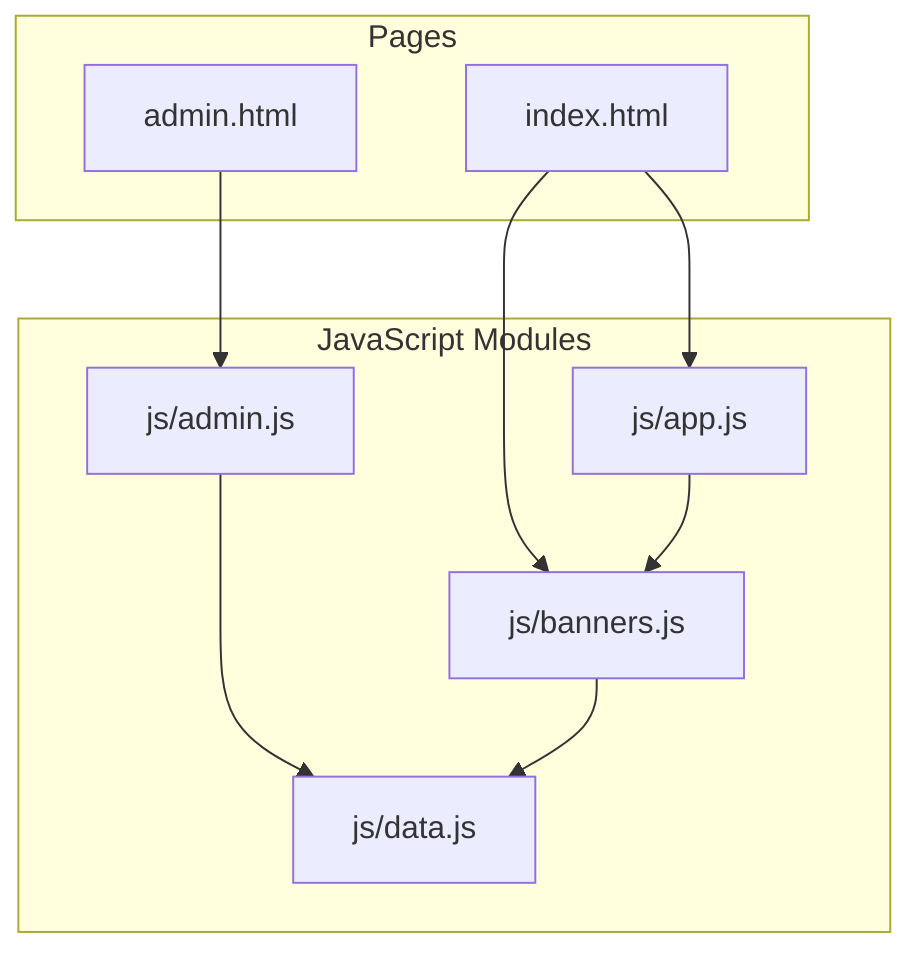
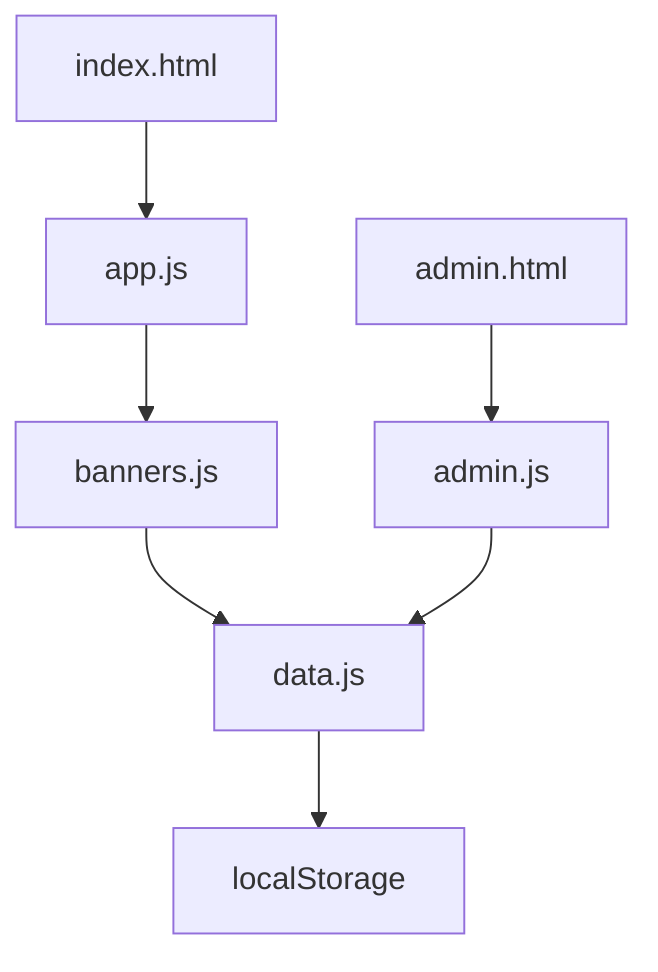
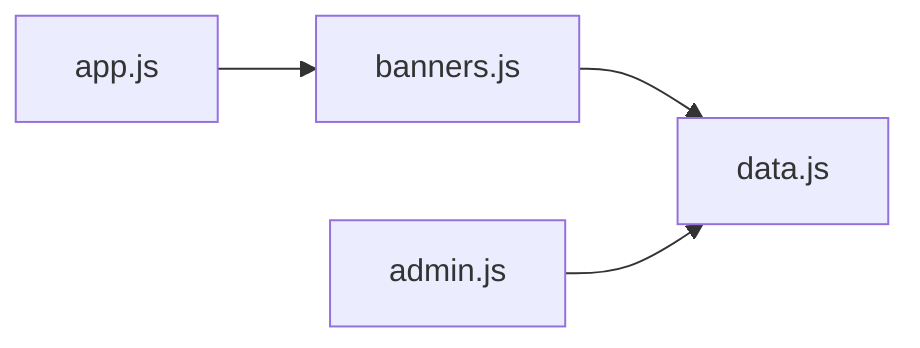

# Core Modules Reference

<cite>
**Referenced Files in This Document**
- [app.js](file://js/app.js)
- [banners.js](file://js/banners.js)
- [data.js](file://js/data.js)
- [admin.js](file://js/admin.js)
- [index.html](file://index.html)
- [admin.html](file://admin.html)
</cite>

## Table of Contents
1. [Introduction](#introduction)
2. [Project Structure](#project-structure)
3. [Core Components](#core-components)
4. [Architecture Overview](#architecture-overview)
5. [Detailed Component Analysis](#detailed-component-analysis)
6. [Dependency Analysis](#dependency-analysis)
7. [Performance Considerations](#performance-considerations)
8. [Troubleshooting Guide](#troubleshooting-guide)
9. [Conclusion](#conclusion)

## Introduction
This document provides detailed reference documentation for the core JavaScript modules of the KPR Crackers application. It focuses on responsibilities, APIs, integration points, and extension guidance for:
- app.js: Main application controller and event handling patterns
- banners.js: Banner management (CRUD operations, display logic, user interactions)
- data.js: Data persistence layer using local storage and validation rules
- admin.js: Administrative functions, user management, and dashboard controls

The goal is to help developers understand how these modules work together and how to extend functionality safely.

## Project Structure
The application is a client-side web app with HTML pages and modular JavaScript files:
- index.html: Main page that loads app.js and banners.js
- admin.html: Admin page that loads admin.js and shared modules
- js/app.js: Application bootstrap and global event wiring
- js/banners.js: Banner domain logic and UI interactions
- js/data.js: Local storage persistence and validation helpers
- js/admin.js: Admin-only features and dashboard controls

**Diagram sources**
- [index.html](file://index.html)
- [admin.html](file://admin.html)
- [app.js](file://js/app.js)
- [banners.js](file://js/banners.js)
- [data.js](file://js/data.js)
- [admin.js](file://js/admin.js)

**Section sources**
- [index.html](file://index.html)
- [admin.html](file://admin.html)
- [app.js](file://js/app.js)
- [banners.js](file://js/banners.js)
- [data.js](file://js/data.js)
- [admin.js](file://js/admin.js)

## Core Components
- app.js: Initializes the application, wires DOM events, and coordinates between banners and data layers.
- banners.js: Encapsulates banner CRUD operations, rendering, and user interaction handlers.
- data.js: Provides persistent storage via localStorage, schema validation, and utility methods for reading/writing data.
- admin.js: Implements administrative capabilities such as user management and dashboard controls; depends on data.js for persistence.

Key integration points:
- app.js orchestrates initialization and delegates to banners.js for banner-related UI.
- banners.js uses data.js for all read/write operations.
- admin.js uses data.js directly for admin-specific data tasks.

**Section sources**
- [app.js](file://js/app.js)
- [banners.js](file://js/banners.js)
- [data.js](file://js/data.js)
- [admin.js](file://js/admin.js)

## Architecture Overview
The application follows a simple layered architecture:
- Presentation Layer: HTML pages (index.html, admin.html)
- Controller Layer: app.js (bootstrap and event coordination), admin.js (admin control flow)
- Domain/UI Logic: banners.js (banner lifecycle and UI interactions)
- Persistence Layer: data.js (localStorage access and validation)

**Diagram sources**
- [index.html](file://index.html)
- [admin.html](file://admin.html)
- [app.js](file://js/app.js)
- [banners.js](file://js/banners.js)
- [data.js](file://js/data.js)
- [admin.js](file://js/admin.js)

## Detailed Component Analysis

### app.js — Main Application Controller
Responsibilities:
- Bootstrap the application when the DOM is ready
- Wire up global event listeners (e.g., navigation, toggles)
- Initialize and coordinate other modules (notably banners.js)
- Provide a central place for cross-cutting concerns like error notifications or analytics hooks

Event Handling Patterns:
- Uses delegated event listeners where appropriate for dynamic content
- Centralizes event registration to avoid scattered setup code
- Emits custom events or calls module entry points to keep coupling low

Integration Points:
- Calls into banners.js to render initial state and bind banner-specific events
- May call data.js indirectly through banners.js for consistency

Extension Guidance:
- Add new top-level features by registering events here and delegating to feature modules
- Keep UI updates within their respective modules; use app.js for orchestration only

**Section sources**
- [app.js](file://js/app.js)

### banners.js — Banner Management Module
Responsibilities:
- Manage banner entities (create, read, update, delete)
- Render banners to the DOM based on current state
- Handle user interactions (add, edit, delete, toggle visibility)
- Validate inputs before persisting changes

API Surface:
- Initialization function(s) to set up the banner UI and bind events
- Functions to add, update, delete, and list banners
- Rendering functions to refresh the banner list or individual items
- Validation helpers for banner fields

Data Flow:
- Reads from data.js for initial load and subsequent queries
- Writes to data.js after successful validation and user confirmation
- Updates the UI immediately after successful operations

User Interactions:
- Form submissions for creating/editing banners
- Click handlers for delete and toggle actions
- Feedback messages for success/error states

Error Handling:
- Validates input and returns descriptive errors
- Catches persistence failures and surfaces user-friendly messages

Usage Examples:
- On page load, initialize the banner manager and render existing banners
- When a user submits a new banner, validate, persist via data.js, then re-render

**Section sources**
- [banners.js](file://js/banners.js)

### data.js — Data Persistence Layer
Responsibilities:
- Provide a consistent interface to localStorage
- Enforce data schemas and validation rules
- Offer utility functions for reading, writing, and transforming stored data

Storage Operations:
- get/set wrappers around localStorage
- Batch operations for multiple keys if needed
- Migration helpers for evolving data schemas

Validation Rules:
- Type checks for required fields
- Length/format constraints for text fields
- Business rule validations (e.g., unique identifiers)

Error Handling:
- Returns structured results indicating success/failure
- Throws or logs errors for unexpected conditions

Integration Points:
- Consumed by banners.js for banner CRUD
- Consumed by admin.js for admin data tasks

Usage Examples:
- Load initial data on app start
- Persist updated banner records after edits
- Validate form payloads before saving

**Section sources**
- [data.js](file://js/data.js)

### admin.js — Administrative Functions
Responsibilities:
- Implement admin-only features such as user management and dashboard controls
- Provide interfaces to manage system settings or content moderation
- Coordinate with data.js for persistence of admin data

User Management:
- List users, create/update roles, deactivate accounts
- Audit actions and log admin activities

Dashboard Controls:
- Toggle features or flags
- View summary statistics and quick actions

Security Considerations:
- Ensure admin-only routes are protected at the UI level
- Avoid exposing sensitive operations without proper checks

Integration Points:
- Directly uses data.js for persistence
- May interact with banners.js indirectly via data.js

Usage Examples:
- Load admin dashboard on admin.html
- Perform user role updates and persist changes via data.js

**Section sources**
- [admin.js](file://js/admin.js)

## Dependency Analysis
Module relationships:
- app.js depends on banners.js for banner UI orchestration
- banners.js depends on data.js for persistence
- admin.js depends on data.js for admin data operations
- Both banners.js and admin.js rely on data.js, keeping persistence concerns centralized

**Diagram sources**
- [app.js](file://js/app.js)
- [banners.js](file://js/banners.js)
- [data.js](file://js/data.js)
- [admin.js](file://js/admin.js)

**Section sources**
- [app.js](file://js/app.js)
- [banners.js](file://js/banners.js)
- [data.js](file://js/data.js)
- [admin.js](file://js/admin.js)

## Performance Considerations
- Minimize DOM thrashing by batching updates in banners.js
- Debounce frequent user inputs (e.g., search/filter) before calling data.js
- Use efficient selectors and avoid unnecessary re-renders
- Cache frequently accessed data in memory while respecting localStorage limits
- Keep validation fast and fail-fast to reduce round-trips

[No sources needed since this section provides general guidance]

## Troubleshooting Guide
Common issues and resolutions:
- LocalStorage quota exceeded: Check data.js for size limits and implement cleanup strategies
- Stale UI state: Ensure banners.js re-renders after every successful write operation
- Event binding conflicts: Verify app.js does not double-bind events; prefer delegation for dynamic elements
- Validation errors: Inspect data.js validators and ensure form inputs match expected schemas
- Admin access problems: Confirm admin.html loads admin.js and that UI guards prevent unauthorized actions

**Section sources**
- [data.js](file://js/data.js)
- [banners.js](file://js/banners.js)
- [app.js](file://js/app.js)
- [admin.js](file://js/admin.js)

## Conclusion
The KPR Crackers application separates concerns across four focused modules:
- app.js orchestrates initialization and events
- banners.js encapsulates banner domain logic and UI interactions
- data.js centralizes persistence and validation
- admin.js implements administrative features

By following the integration patterns and extension guidance outlined above, you can safely add new features while maintaining clarity and performance.