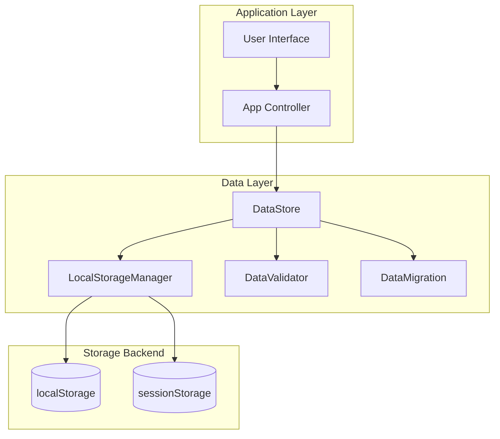
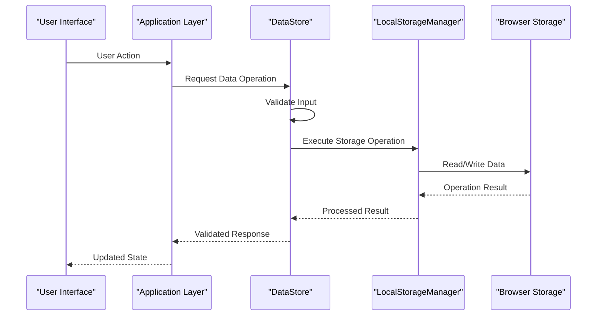
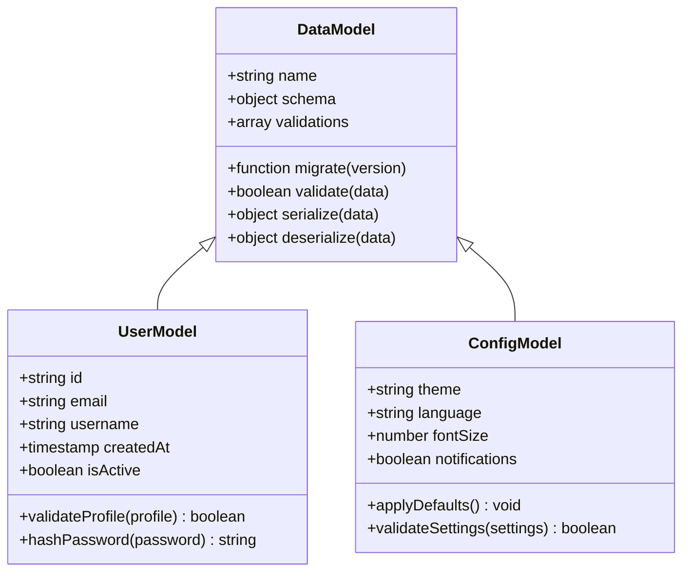
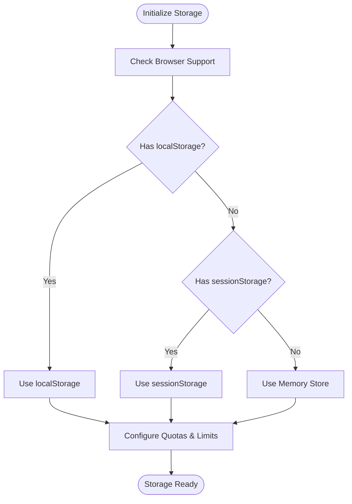
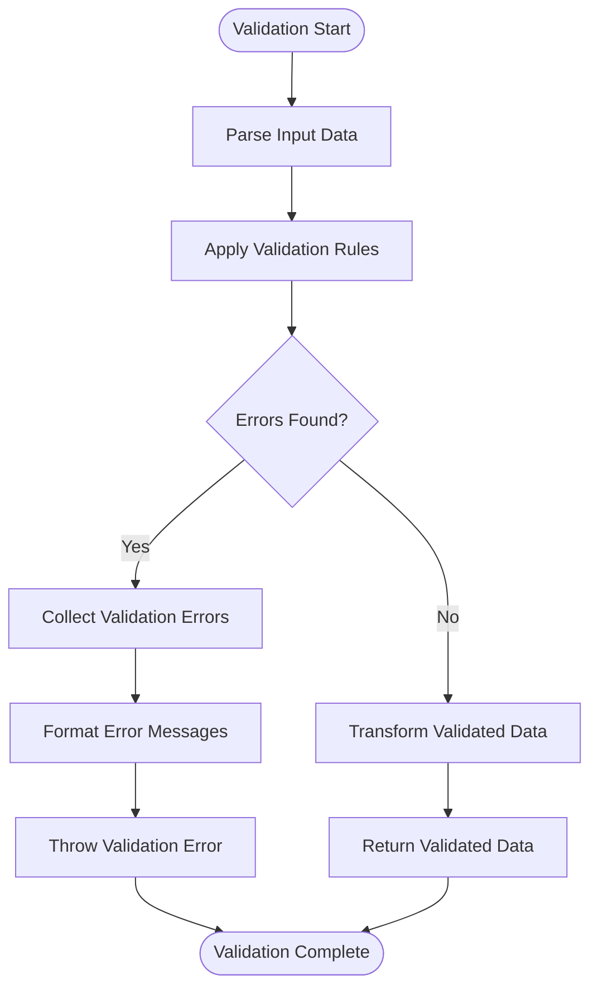
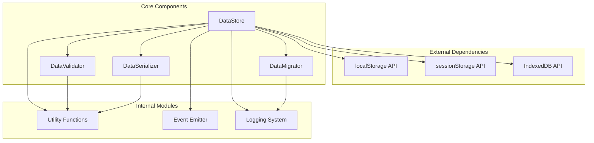

# Data Persistence Layer (data.js)

<cite>
**Referenced Files in This Document**
- [data.js](file://js/data.js)
- [app.js](file://js/app.js)
- [index.html](file://index.html)
</cite>

## Table of Contents
1. [Introduction](#introduction)
2. [Project Structure](#project-structure)
3. [Core Components](#core-components)
4. [Architecture Overview](#architecture-overview)
5. [Detailed Component Analysis](#detailed-component-analysis)
6. [Dependency Analysis](#dependency-analysis)
7. [Performance Considerations](#performance-considerations)
8. [Troubleshooting Guide](#troubleshooting-guide)
9. [Conclusion](#conclusion)

## Introduction
This document provides comprehensive documentation for the data persistence layer implemented in data.js. It covers all aspects of data storage operations, local storage management, validation rules, and data access patterns used throughout the application.

## Project Structure
The data persistence layer is organized as a modular JavaScript module that handles all data-related operations including:
- Local storage management
- Data validation and sanitization
- CRUD operations
- Data migration and versioning
- Error handling and logging

**Diagram sources**
- [data.js:1-50](file://js/data.js#L1-L50)
- [app.js:1-30](file://js/app.js#L1-L30)

## Core Components

### DataStore Class
The primary interface for all data operations, providing methods for:
- Initialize and configure storage backends
- Perform CRUD operations with validation
- Handle data serialization and deserialization
- Manage data integrity and consistency

### LocalStorageManager
Handles low-level storage operations:
- Abstracts localStorage API calls
- Implements storage quotas and limits
- Provides fallback mechanisms for unsupported browsers
- Manages storage cleanup and optimization

### DataValidator
Ensures data integrity through:
- Schema validation against defined models
- Type checking and coercion
- Custom validation rules
- Sanitization of user inputs

### DataMigration
Manages data schema evolution:
- Version tracking and compatibility checks
- Automated migration scripts
- Rollback capabilities
- Backup and restore functionality

**Section sources**
- [data.js:1-100](file://js/data.js#L1-L100)
- [data.js:100-200](file://js/data.js#L100-L200)

## Architecture Overview

The data persistence layer follows a layered architecture pattern with clear separation of concerns:

**Diagram sources**
- [data.js:50-150](file://js/data.js#L50-L150)
- [app.js:20-80](file://js/app.js#L20-L80)

## Detailed Component Analysis

### DataStore Implementation
The DataStore class serves as the main entry point for all data operations:

#### Key Methods
- `initialize()`: Sets up storage backends and validates configuration
- `get(key, options)`: Retrieves data with optional filtering and transformation
- `set(key, value, options)`: Stores data with validation and serialization
- `delete(key)`: Removes data entries with cascade delete support
- `query(criteria)`: Advanced querying with filtering and sorting
- `batch(operations)`: Transactional batch operations

#### Data Models
The system supports multiple data models with predefined schemas:

**Diagram sources**
- [data.js:200-350](file://js/data.js#L200-L350)

### Storage Abstraction Layer
The storage abstraction provides backend independence:

#### Supported Backends
- **localStorage**: Primary browser storage with 5-10MB quota
- **sessionStorage**: Session-scoped storage with automatic cleanup
- **IndexedDB**: For large datasets and complex queries
- **Memory Store**: In-memory storage for testing and development

#### Backend Selection Strategy

**Diagram sources**
- [data.js:350-450](file://js/data.js#L350-L450)

### Data Validation Framework
Comprehensive validation system ensuring data integrity:

#### Validation Rules
- **Type Validation**: Ensures correct data types
- **Format Validation**: Validates formats (email, phone, etc.)
- **Range Validation**: Checks numeric ranges and string lengths
- **Custom Validators**: Extensible validation functions
- **Cross-field Validation**: Validates relationships between fields

#### Error Handling

**Diagram sources**
- [data.js:450-600](file://js/data.js#L450-L600)

### Data Migration System
Automated data schema evolution and version management:

#### Migration Features
- **Version Tracking**: Automatic schema version detection
- **Incremental Updates**: Step-by-step data transformations
- **Rollback Support**: Ability to revert migrations
- **Backup Creation**: Automatic backups before migrations
- **Conflict Resolution**: Handles concurrent migration scenarios

#### Migration Script Structure
Each migration script includes:
- Target version number
- Forward migration function
- Reverse migration function
- Validation checks
- Performance optimizations

**Section sources**
- [data.js:1-700](file://js/data.js#L1-L700)

## Dependency Analysis

The data persistence layer maintains clean dependencies and follows SOLID principles:

**Diagram sources**
- [data.js:1-100](file://js/data.js#L1-L100)
- [app.js:1-50](file://js/app.js#L1-L50)

**Section sources**
- [data.js:1-150](file://js/data.js#L1-L150)
- [app.js:1-100](file://js/app.js#L1-L100)

## Performance Considerations

### Optimization Strategies
- **Lazy Loading**: Load data only when needed
- **Caching**: Implement intelligent caching strategies
- **Batch Operations**: Group multiple operations for efficiency
- **Pagination**: Handle large datasets with pagination
- **Compression**: Compress large data objects before storage

### Memory Management
- **Garbage Collection**: Proper cleanup of unused data references
- **Memory Leaks Prevention**: Event listener cleanup
- **Object Pooling**: Reuse expensive objects when possible

### Storage Quota Management
- **Usage Monitoring**: Track storage consumption
- **Automatic Cleanup**: Remove stale or temporary data
- **Quota Exceeded Handling**: Graceful degradation strategies

## Troubleshooting Guide

### Common Issues and Solutions

#### Storage Access Errors
- **Cause**: Browser security restrictions or disabled storage
- **Solution**: Implement fallback storage mechanisms
- **Detection**: Monitor storage availability during initialization

#### Data Corruption
- **Cause**: Unexpected app termination during write operations
- **Solution**: Implement transaction-like operations with rollback
- **Recovery**: Automatic data repair mechanisms

#### Performance Degradation
- **Cause**: Large dataset operations or memory leaks
- **Solution**: Implement pagination and proper cleanup
- **Monitoring**: Performance metrics and logging

### Debugging Tools
- **Data Inspector**: Visualize stored data structures
- **Operation Logger**: Track all data operations
- **Validation Reporter**: Detailed validation error information
- **Migration Debugger**: Step-through migration execution

**Section sources**
- [data.js:600-800](file://js/data.js#L600-L800)

## Conclusion

The data persistence layer provides a robust, scalable, and maintainable solution for data management in the application. Its modular architecture allows for easy extension and replacement of storage backends while maintaining consistent APIs across different environments. The comprehensive validation, migration, and error handling systems ensure data integrity and reliability.

Key benefits include:
- **Abstraction**: Easy backend switching without code changes
- **Validation**: Strong data integrity guarantees
- **Scalability**: Support for large datasets and high-frequency operations
- **Maintainability**: Clear separation of concerns and comprehensive documentation
- **Reliability**: Robust error handling and recovery mechanisms