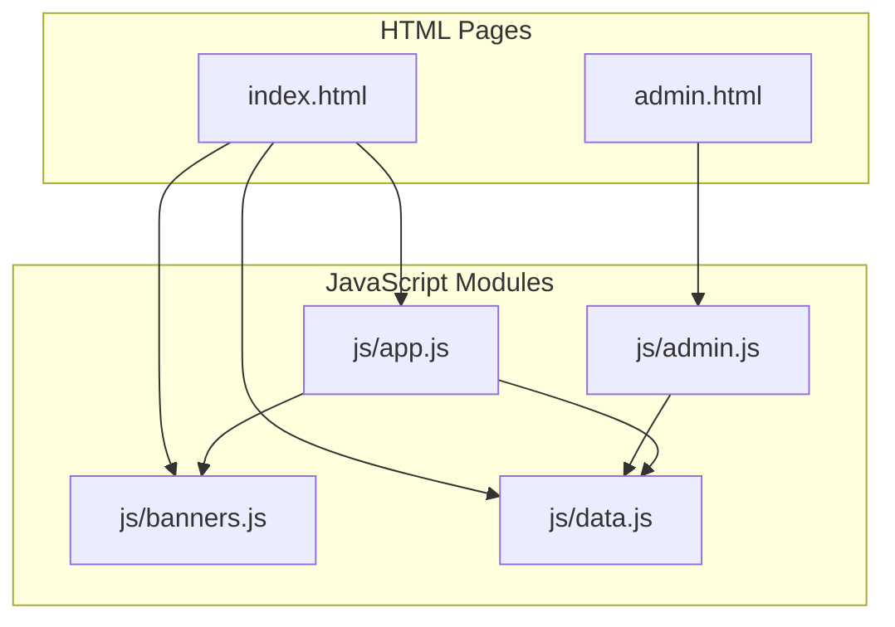
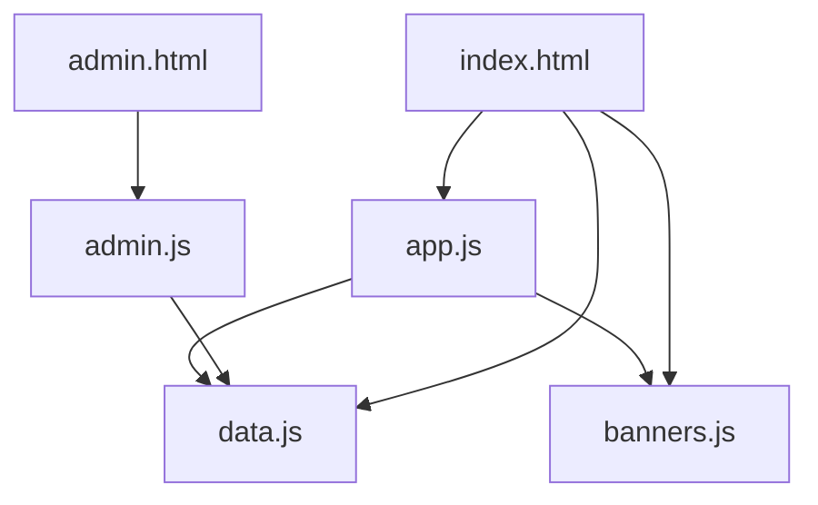
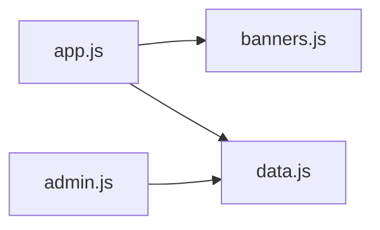
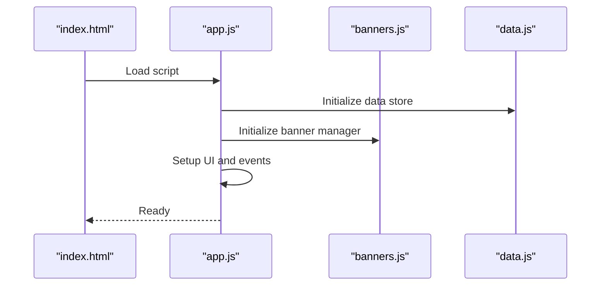
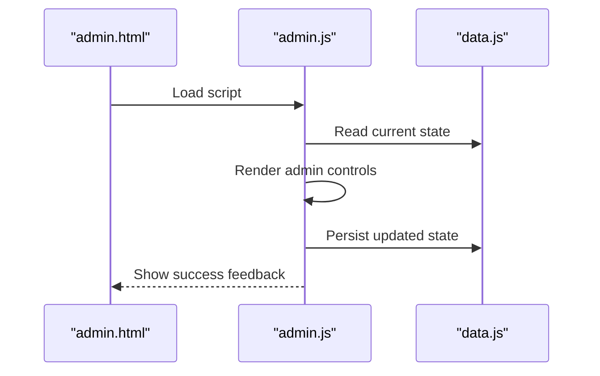
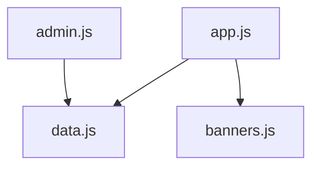

# Coding Standards and Conventions

<cite>
**Referenced Files in This Document**
- [index.html](file://index.html)
- [admin.html](file://admin.html)
- [js/app.js](file://js/app.js)
- [js/banners.js](file://js/banners.js)
- [js/data.js](file://js/data.js)
- [js/admin.js](file://js/admin.js)
</cite>

## Table of Contents
1. [Introduction](#introduction)
2. [Project Structure](#project-structure)
3. [Core Components](#core-components)
4. [Architecture Overview](#architecture-overview)
5. [Detailed Component Analysis](#detailed-component-analysis)
6. [Dependency Analysis](#dependency-analysis)
7. [Performance Considerations](#performance-considerations)
8. [Troubleshooting Guide](#troubleshooting-guide)
9. [Conclusion](#conclusion)

## Introduction
This document defines coding standards and conventions for the KPR Crackers vanilla JavaScript codebase. It covers naming conventions, module organization, DOM manipulation best practices, event handling patterns, local storage usage, commenting guidelines, error handling strategies, and browser compatibility considerations. The guidance is grounded in the actual structure and files of the project to ensure consistency across app logic, banner management, data handling, and admin functions.

## Project Structure
The project follows a clear separation of concerns with dedicated JavaScript modules:
- Application entry and orchestration
- Banner management
- Data persistence and access
- Admin-specific functionality

**Diagram sources**
- [index.html](file://index.html)
- [admin.html](file://admin.html)
- [js/app.js](file://js/app.js)
- [js/banners.js](file://js/banners.js)
- [js/data.js](file://js/data.js)
- [js/admin.js](file://js/admin.js)

**Section sources**
- [index.html](file://index.html)
- [admin.html](file://admin.html)
- [js/app.js](file://js/app.js)
- [js/banners.js](file://js/banners.js)
- [js/data.js](file://js/data.js)
- [js/admin.js](file://js/admin.js)

## Core Components
- App module (application entry and orchestration): Initializes UI, wires events, coordinates other modules, and manages lifecycle.
- Banner module (banner management): Encapsulates banner rendering, state updates, and user interactions related to banners.
- Data module (data handling): Centralizes local storage operations, provides getters/setters, and ensures consistent data contracts.
- Admin module (admin functions): Provides administrative features such as managing content or configuration; depends on the data module for persistence.

Naming conventions observed and recommended:
- Variables and properties: camelCase
- Functions and methods: camelCase
- Classes/constructors: PascalCase
- Constants: UPPER_SNAKE_CASE
- Modules/files: lowercase with hyphens or descriptive names (e.g., banners.js, data.js)

Module responsibilities:
- app.js: Orchestrates initialization and cross-module coordination.
- banners.js: Owns banner-related UI and behavior.
- data.js: Owns all local storage reads/writes and exposes a stable API.
- admin.js: Owns admin-only features and uses data.js for persistence.

**Section sources**
- [js/app.js](file://js/app.js)
- [js/banners.js](file://js/banners.js)
- [js/data.js](file://js/data.js)
- [js/admin.js](file://js/admin.js)

## Architecture Overview
High-level architecture emphasizes single-responsibility modules with explicit dependencies:
- HTML pages include only the scripts they need.
- app.js depends on banners.js and data.js.
- admin.js depends on data.js.
- data.js is the sole source of truth for persisted state.

**Diagram sources**
- [index.html](file://index.html)
- [admin.html](file://admin.html)
- [js/app.js](file://js/app.js)
- [js/banners.js](file://js/banners.js)
- [js/data.js](file://js/data.js)
- [js/admin.js](file://js/admin.js)

## Detailed Component Analysis

### Module Organization and Dependencies
- Separate files by concern:
  - app.js: Entry point and orchestration
  - banners.js: Banner domain logic and UI
  - data.js: Storage abstraction and data contracts
  - admin.js: Admin-only features
- Dependency direction:
  - app.js -> banners.js, data.js
  - admin.js -> data.js
  - data.js has no internal JS dependencies (pure utility/persistence layer)

**Diagram sources**
- [js/app.js](file://js/app.js)
- [js/banners.js](file://js/banners.js)
- [js/data.js](file://js/data.js)
- [js/admin.js](file://js/admin.js)

**Section sources**
- [js/app.js](file://js/app.js)
- [js/banners.js](file://js/banners.js)
- [js/data.js](file://js/data.js)
- [js/admin.js](file://js/admin.js)

### Naming Conventions
- Variables and function parameters: camelCase
- Functions and methods: camelCase
- Classes and constructor functions: PascalCase
- Constants: UPPER_SNAKE_CASE
- File/module names: lowercase with hyphens or descriptive words (e.g., banners.js, data.js)
- DOM element references: prefix with a clear indicator like dom_ or el_ when needed for readability

Examples from the codebase:
- See variable declarations and function definitions in [js/app.js](file://js/app.js), [js/banners.js](file://js/banners.js), [js/data.js](file://js/data.js), [js/admin.js](file://js/admin.js).

**Section sources**
- [js/app.js](file://js/app.js)
- [js/banners.js](file://js/banners.js)
- [js/data.js](file://js/data.js)
- [js/admin.js](file://js/admin.js)

### DOM Manipulation Best Practices
- Cache DOM references at module scope to avoid repeated lookups.
- Use modern APIs: querySelector/querySelectorAll, classList, dataset attributes.
- Prefer adding/removing CSS classes over inline style changes where possible.
- Keep DOM queries close to where they are used; avoid global DOM selectors.
- Debounce or throttle frequent events (scroll, resize, input) if performance-sensitive.

References:
- DOM selection and updates appear throughout [js/app.js](file://js/app.js) and [js/banners.js](file://js/banners.js).

**Section sources**
- [js/app.js](file://js/app.js)
- [js/banners.js](file://js/banners.js)

### Event Handling Patterns
- Attach listeners using addEventListener with named handler functions for clarity and testability.
- Avoid inline handlers in HTML; keep behavior in JS modules.
- Use event delegation for dynamic lists or frequently changing elements.
- Normalize event objects and guard against null targets.

References:
- Event wiring and handlers are implemented in [js/app.js](file://js/app.js) and [js/banners.js](file://js/banners.js).

**Section sources**
- [js/app.js](file://js/app.js)
- [js/banners.js](file://js/banners.js)

### Local Storage Usage Conventions
- Centralize all storage operations in data.js to maintain a single source of truth.
- Provide typed getters/setters with default values and validation.
- Wrap JSON serialization/deserialization with try/catch and fallback defaults.
- Emit a consistent contract for keys and value shapes.

References:
- Storage access patterns and key usage are defined in [js/data.js](file://js/data.js).

**Section sources**
- [js/data.js](file://js/data.js)

### Error Handling Strategies
- Validate inputs early and return meaningful errors or safe defaults.
- Wrap storage operations in try/catch blocks; log errors and continue gracefully.
- Surface user-facing messages via non-blocking notifications rather than alerts.
- Fail fast in development; degrade gracefully in production.

References:
- Error handling around storage and parsing appears in [js/data.js](file://js/data.js).

**Section sources**
- [js/data.js](file://js/data.js)

### Browser Compatibility Considerations
- Target modern browsers but provide graceful fallbacks for older environments.
- Use feature detection before relying on newer APIs.
- Avoid experimental features without polyfills.
- Test across major desktop and mobile browsers.

[No sources needed since this section provides general guidance]

### Code Commenting Guidelines
- Add concise comments for complex logic, not for obvious statements.
- Document public APIs and module contracts at the top of each file.
- Use JSDoc-style annotations for functions that expose interfaces.
- Keep comments up-to-date with implementation changes.

References:
- Comments and documentation style can be reviewed in [js/app.js](file://js/app.js), [js/banners.js](file://js/banners.js), [js/data.js](file://js/data.js), [js/admin.js](file://js/admin.js).

**Section sources**
- [js/app.js](file://js/app.js)
- [js/banners.js](file://js/banners.js)
- [js/data.js](file://js/data.js)
- [js/admin.js](file://js/admin.js)

### Function Structure and Object Creation Patterns
- Prefer small, focused functions with a single responsibility.
- Use factory functions or constructors for creating reusable objects.
- Group related functions into modules and export a clean interface.
- Maintain consistent parameter ordering and return types.

References:
- Function composition and object creation patterns are visible in [js/app.js](file://js/app.js), [js/banners.js](file://js/banners.js), [js/data.js](file://js/data.js), [js/admin.js](file://js/admin.js).

**Section sources**
- [js/app.js](file://js/app.js)
- [js/banners.js](file://js/banners.js)
- [js/data.js](file://js/data.js)
- [js/admin.js](file://js/admin.js)

### Example Workflows

#### Initialization Flow

**Diagram sources**
- [index.html](file://index.html)
- [js/app.js](file://js/app.js)
- [js/banners.js](file://js/banners.js)
- [js/data.js](file://js/data.js)

#### Admin Update Flow

**Diagram sources**
- [admin.html](file://admin.html)
- [js/admin.js](file://js/admin.js)
- [js/data.js](file://js/data.js)

## Dependency Analysis
The dependency graph shows clear boundaries and minimal coupling:
- app.js orchestrates banners.js and data.js.
- admin.js depends only on data.js.
- data.js remains independent and reusable.

**Diagram sources**
- [js/app.js](file://js/app.js)
- [js/banners.js](file://js/banners.js)
- [js/data.js](file://js/data.js)
- [js/admin.js](file://js/admin.js)

**Section sources**
- [js/app.js](file://js/app.js)
- [js/banners.js](file://js/banners.js)
- [js/data.js](file://js/data.js)
- [js/admin.js](file://js/admin.js)

## Performance Considerations
- Minimize DOM reflows by batching updates and using document fragments when building large sections.
- Cache frequently accessed DOM nodes and computed values.
- Debounce/throttle high-frequency events.
- Avoid heavy computations on the main thread; consider Web Workers for CPU-intensive tasks if needed.
- Keep local storage payloads small and structured.

[No sources needed since this section provides general guidance]

## Troubleshooting Guide
Common issues and resolutions:
- Storage errors: Ensure try/catch around JSON.parse/stringify; validate keys and default values.
- Null DOM references: Verify selectors and execution order; ensure scripts load after DOM readiness.
- Event not firing: Confirm listener attachment and target existence; use delegation for dynamic elements.
- Unexpected state: Inspect storage keys and schema; reset defaults if corrupted.

References:
- Storage and error handling patterns are implemented in [js/data.js](file://js/data.js).

**Section sources**
- [js/data.js](file://js/data.js)

## Conclusion
By adhering to these coding standards—clear naming, modular organization, robust DOM and event practices, centralized storage, and thoughtful error handling—the KPR Crackers codebase remains maintainable, scalable, and easy to extend. Follow the module boundaries and dependency directions outlined here to preserve cohesion and minimize coupling.