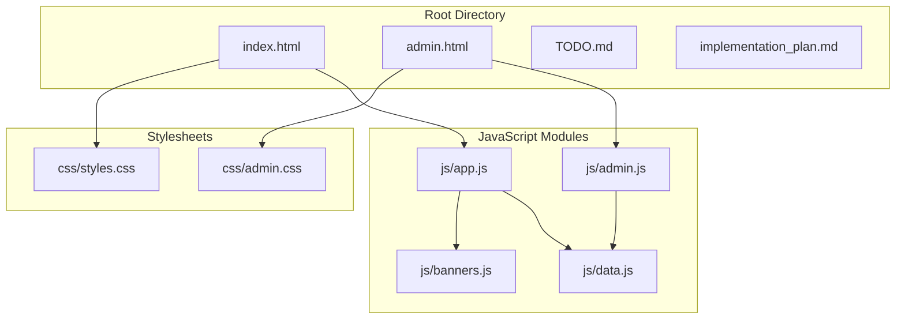
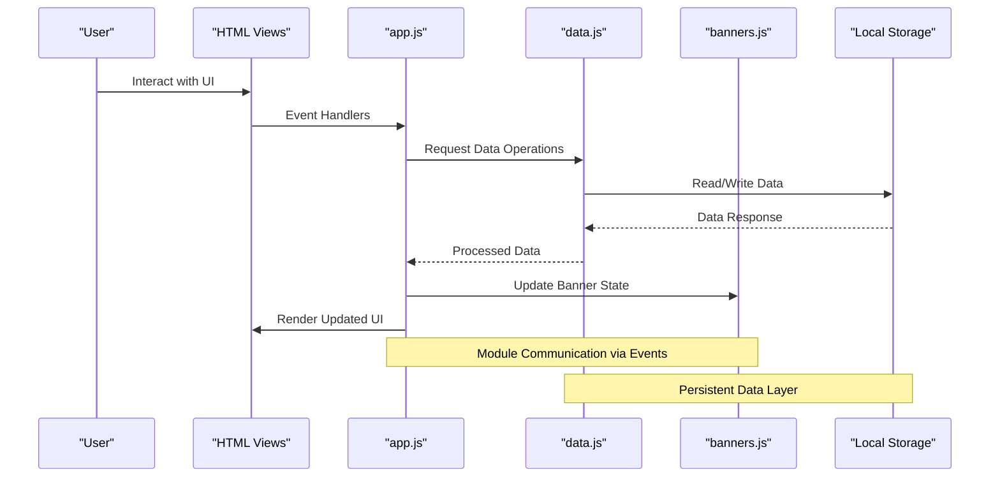
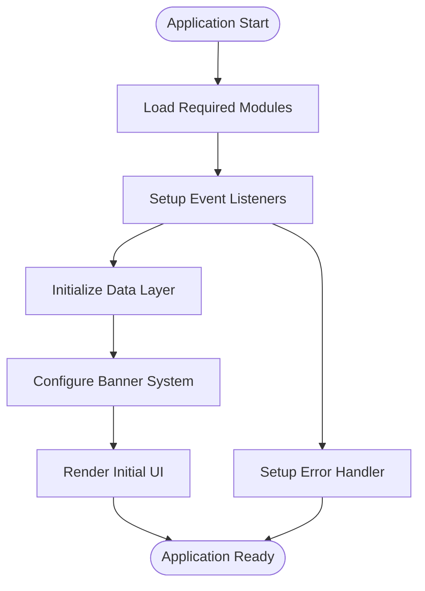
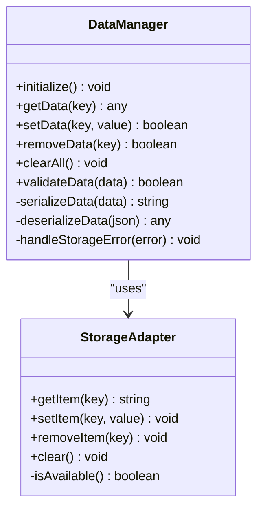
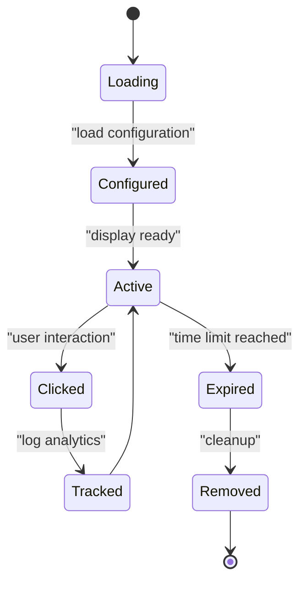

# Development Guide

<cite>
**Referenced Files in This Document**
- [index.html](file://index.html)
- [admin.html](file://admin.html)
- [js/app.js](file://js/app.js)
- [js/data.js](file://js/data.js)
- [js/admin.js](file://js/admin.js)
- [js/banners.js](file://js/banners.js)
- [css/styles.css](file://css/styles.css)
- [css/admin.css](file://css/admin.css)
- [TODO.md](file://TODO.md)
- [implementation_plan.md](file://implementation_plan.md)
</cite>

## Table of Contents
1. [Introduction](#introduction)
2. [Project Structure](#project-structure)
3. [Core Components](#core-components)
4. [Architecture Overview](#architecture-overview)
5. [Detailed Component Analysis](#detailed-component-analysis)
6. [Development Workflow](#development-workflow)
7. [Coding Standards and Conventions](#coding-standards-and-conventions)
8. [Testing Approaches](#testing-approaches)
9. [Feature Development Process](#feature-development-process)
10. [Debugging Guide](#debugging-guide)
11. [Performance Optimization](#performance-optimization)
12. [Browser Compatibility](#browser-compatibility)
13. [Roadmap and Implementation Plan](#roadmap-and-implementation-plan)
14. [Best Practices](#best-practices)
15. [Conclusion](#conclusion)

## Introduction

This development guide provides comprehensive documentation for contributing to the KPR Crackers project. The project is built using vanilla JavaScript with a modular architecture, focusing on maintainability, performance, and browser compatibility. This guide covers code organization principles, naming conventions, coding standards, development workflow, testing approaches, and best practices for extending the application.

## Project Structure

The KPR Crackers project follows a clean, feature-based organization with clear separation of concerns:



**Diagram sources**
- [index.html](file://index.html)
- [admin.html](file://admin.html)
- [js/app.js](file://js/app.js)
- [js/data.js](file://js/data.js)
- [js/admin.js](file://js/admin.js)
- [js/banners.js](file://js/banners.js)

### File Organization Principles

- **HTML Files**: Entry points for different application views
- **JavaScript Modules**: Feature-specific functionality with clear responsibilities
- **CSS Files**: Separate styling for main application and admin interface
- **Configuration Files**: Project roadmap and implementation planning

**Section sources**
- [index.html](file://index.html)
- [admin.html](file://admin.html)
- [js/app.js](file://js/app.js)

## Core Components

### Application Entry Point (app.js)
The main application module serves as the central controller, managing initialization, event handling, and coordinating between data modules and UI components.

### Data Management (data.js)
Handles all data operations including local storage management, data validation, and state persistence across application sessions.

### Admin Interface (admin.js)
Provides administrative functionality for content management, user interactions, and system configuration through a dedicated admin panel.

### Banner System (banners.js)
Manages banner advertisements, positioning, timing, and user interaction tracking independently from core application logic.

**Section sources**
- [js/app.js](file://js/app.js)
- [js/data.js](file://js/data.js)
- [js/admin.js](file://js/admin.js)
- [js/banners.js](file://js/banners.js)

## Architecture Overview

The KPR Crackers application follows a modular architecture pattern with clear separation of concerns:



**Diagram sources**
- [js/app.js](file://js/app.js)
- [js/data.js](file://js/data.js)
- [js/banners.js](file://js/banners.js)

### Module Relationships

The application uses a hub-and-spoke architecture where `app.js` acts as the central coordinator:

- **app.js**: Main application controller and event dispatcher
- **data.js**: Data layer abstraction and persistence management
- **banners.js**: Independent banner advertisement system
- **admin.js**: Administrative interface with elevated permissions

**Section sources**
- [js/app.js](file://js/app.js)
- [js/data.js](file://js/data.js)
- [js/banners.js](file://js/banners.js)
- [js/admin.js](file://js/admin.js)

## Detailed Component Analysis

### Application Controller (app.js)

The main application controller manages the overall application lifecycle, event delegation, and inter-module communication.

#### Key Responsibilities:
- Application initialization and setup
- Global event handling and delegation
- Module coordination and state management
- Error handling and logging
- Performance monitoring

#### Initialization Flow:


**Diagram sources**
- [js/app.js](file://js/app.js)

### Data Management Layer (data.js)

The data management module provides a unified interface for all data operations, abstracting local storage complexity and ensuring data consistency.

#### Core Features:
- Local storage abstraction with fallback mechanisms
- Data validation and sanitization
- Batch operations and transaction support
- Data migration and versioning
- Change detection and event broadcasting

#### Data Flow Pattern:


**Diagram sources**
- [js/data.js](file://js/data.js)

### Banner System (banners.js)

An independent module for managing banner advertisements with features like rotation, targeting, and performance tracking.

#### Banner Lifecycle:


**Diagram sources**
- [js/banners.js](file://js/banners.js)

### Admin Interface (admin.js)

Provides administrative capabilities with enhanced security controls and management interfaces.

#### Admin Features:
- Content management and editing
- User role and permission management
- System configuration and settings
- Analytics and reporting dashboard
- Backup and restore functionality

**Section sources**
- [js/app.js](file://js/app.js)
- [js/data.js](file://js/data.js)
- [js/banners.js](file://js/banners.js)
- [js/admin.js](file://js/admin.js)

## Development Workflow

### Setting Up Development Environment

1. **Prerequisites**: Modern web browser with developer tools
2. **File Organization**: Follow the established directory structure
3. **Module Loading**: Use ES6 modules or script tags with proper dependency order
4. **Testing**: Browser-based testing with console debugging

### Adding New Features

#### Step-by-Step Process:

1. **Create Feature Module**: Add new JavaScript file in `js/` directory
2. **Define Module Interface**: Establish clear API contract
3. **Implement Core Logic**: Focus on single responsibility principle
4. **Add Event Handlers**: Integrate with global event system
5. **Update Dependencies**: Modify app.js to include new module
6. **Test Integration**: Verify module works with existing system
7. **Document Changes**: Update relevant documentation

#### Module Template:
```javascript
// Example module structure
const moduleName = {
    // Configuration
    config: {},
    
    // Initialization
    init: function() {
        this.setupEventListeners();
        this.loadData();
    },
    
    // Event Handling
    setupEventListeners: function() {
        // Bind DOM events
    },
    
    // Data Operations
    loadData: function() {
        // Fetch and process data
    },
    
    // Public API
    updateState: function(newState) {
        // Update module state
    }
};

// Export module
window.moduleName = moduleName;
```

**Section sources**
- [js/app.js](file://js/app.js)

## Coding Standards and Conventions

### Naming Conventions

#### Variables and Functions:
- Use camelCase for variables and functions
- Prefix private methods with underscore
- Use descriptive names that indicate purpose
- Boolean variables should be prefixed with 'is', 'has', 'can'

#### Constants and Configuration:
- Use UPPER_SNAKE_CASE for constants
- Group related constants in configuration objects
- Define defaults in centralized config files

#### Classes and Modules:
- Use PascalCase for constructor functions
- Prefix private properties with underscore
- Use meaningful module names that describe functionality

### Code Organization

#### File Structure:
```
js/
├── app.js           # Main application controller
├── data.js          # Data management layer
├── admin.js         # Admin interface functionality
├── banners.js       # Banner advertisement system
└── utils.js         # Shared utility functions (future)
```

#### Module Pattern:
- Each file represents a single feature or concern
- Clear separation between public API and internal methods
- Consistent error handling and logging patterns
- Proper cleanup and resource management

### Error Handling

#### Standard Error Pattern:
```javascript
try {
    // Operation code
} catch (error) {
    // Log error details
    // Provide fallback behavior
    // Notify user if necessary
} finally {
    // Cleanup operations
}
```

#### Error Categories:
- **Validation Errors**: Input data validation failures
- **Network Errors**: API call and data fetching failures
- **Storage Errors**: Local storage access issues
- **Runtime Errors**: Unexpected application states

**Section sources**
- [js/app.js](file://js/app.js)
- [js/data.js](file://js/data.js)

## Testing Approaches

### Manual Testing Strategy

#### Unit Testing:
- Test individual module functions in isolation
- Validate data transformation and processing logic
- Check error handling and edge cases
- Verify localStorage operations and data persistence

#### Integration Testing:
- Test module interactions and communication
- Validate event flow and state changes
- Check cross-browser compatibility
- Verify performance under load

#### User Acceptance Testing:
- End-to-end workflow validation
- User interface responsiveness
- Accessibility compliance
- Mobile device compatibility

### Debugging Techniques

#### Console Logging:
- Use structured log messages with context
- Implement log levels (debug, info, warn, error)
- Include timestamps and module identifiers
- Clean up debug logs before production

#### Performance Profiling:
- Monitor memory usage and leaks
- Track execution time for critical operations
- Analyze DOM manipulation performance
- Measure network request efficiency

**Section sources**
- [js/app.js](file://js/app.js)

## Feature Development Process

### Adding New Modules

#### Module Creation Checklist:
1. Create new JavaScript file following naming conventions
2. Implement module initialization and configuration
3. Add event listeners and DOM manipulation handlers
4. Integrate with data layer for persistence
5. Add error handling and logging
6. Write test cases for core functionality
7. Update main application to include new module

#### Module Registration:
```javascript
// In app.js
function registerModule(moduleName, moduleInstance) {
    window[moduleName] = moduleInstance;
    moduleInstance.init();
}

// Usage
registerModule('newFeature', newFeatureModule);
```

### Modifying Existing Functionality

#### Change Process:
1. Identify affected modules and dependencies
2. Review existing code for potential breaking changes
3. Implement changes with backward compatibility
4. Update tests and verify functionality
5. Document changes and update API contracts
6. Perform regression testing

#### Version Control Best Practices:
- Use descriptive commit messages
- Create feature branches for major changes
- Write unit tests for new functionality
- Document breaking changes in changelog

**Section sources**
- [js/app.js](file://js/app.js)

## Debugging Guide

### Common Issues and Solutions

#### Local Storage Problems:
- **Issue**: Data not persisting across sessions
- **Solution**: Check storage quota, validate JSON serialization, implement fallback storage
- **Debug**: Use browser DevTools Application tab to inspect storage

#### Event Listener Memory Leaks:
- **Issue**: Performance degradation over time
- **Solution**: Remove event listeners on page unload, use event delegation
- **Debug**: Monitor memory usage in Performance tab

#### Cross-Origin Restrictions:
- **Issue**: CORS errors when accessing external resources
- **Solution**: Configure proper headers, use proxy server, implement fallbacks
- **Debug**: Check Network tab for CORS-related errors

#### Browser Compatibility:
- **Issue**: Features not working in older browsers
- **Solution**: Use polyfills, feature detection, graceful degradation
- **Debug**: Test across multiple browsers and versions

### Debugging Tools and Techniques

#### Browser Developer Tools:
- **Console**: Log messages, execute JavaScript, monitor errors
- **Sources**: Set breakpoints, step through code, inspect variables
- **Network**: Monitor HTTP requests, analyze performance
- **Memory**: Detect memory leaks, analyze heap snapshots

#### Custom Debug Utilities:
```javascript
// Debug utility functions
const Debugger = {
    enable: function() {
        this.enabled = true;
    },
    log: function(message, data) {
        if (this.enabled) {
            console.log(`[${new Date().toISOString()}] ${message}`, data);
        }
    },
    assert: function(condition, message) {
        if (!condition) {
            console.error(`Assertion failed: ${message}`);
        }
    }
};
```

**Section sources**
- [js/app.js](file://js/app.js)
- [js/data.js](file://js/data.js)

## Performance Optimization

### DOM Manipulation Best Practices

#### Efficient Updates:
- Use document fragments for batch DOM updates
- Minimize reflows and repaints by batching style changes
- Use CSS classes instead of inline styles for dynamic changes
- Implement virtual scrolling for large lists

#### Event Delegation:
- Attach single event listener to parent element
- Use event.target to identify specific elements
- Reduce memory footprint and improve performance

### Memory Management

#### Resource Cleanup:
- Remove event listeners when no longer needed
- Clear intervals and timeouts
- Release references to DOM elements
- Implement proper garbage collection patterns

#### Performance Monitoring:
- Track execution time for critical operations
- Monitor memory usage and detect leaks
- Optimize heavy computations using Web Workers
- Implement lazy loading for non-critical features

### Caching Strategies

#### Client-Side Caching:
- Cache frequently accessed data in memory
- Implement intelligent cache invalidation
- Use localStorage for persistent caching
- Consider service workers for advanced caching

**Section sources**
- [js/app.js](file://js/app.js)
- [js/data.js](file://js/data.js)

## Browser Compatibility

### Supported Browsers

#### Minimum Requirements:
- Chrome 60+ / Firefox 55+ / Safari 11+ / Edge 79+
- ES6+ language features with appropriate polyfills
- Modern DOM APIs and event handling
- Local storage and session storage support

### Polyfill Strategy

#### Essential Polyfills:
- Promise and async/await support
- Array and Object method shims
- DOM manipulation utilities
- Event handling compatibility

#### Feature Detection:
```javascript
// Feature detection example
if ('localStorage' in window) {
    // Use modern storage API
} else {
    // Fallback to cookie-based storage
}
```

### Progressive Enhancement

#### Graceful Degradation:
- Core functionality works without JavaScript
- Enhanced experience with modern browsers
- Fallback paths for unsupported features
- Mobile-first responsive design

**Section sources**
- [js/app.js](file://js/app.js)

## Roadmap and Implementation Plan

### Current Status and Future Plans

Based on the project documentation, the KPR Crackers project has a structured approach to feature development and maintenance. The implementation plan outlines key milestones and priorities for future development.

### Priority Areas

#### Short-term Goals:
- Performance optimization and memory management
- Enhanced error handling and logging
- Improved mobile responsiveness
- Security enhancements and input validation

#### Medium-term Goals:
- Advanced caching strategies
- Real-time collaboration features
- Enhanced admin interface capabilities
- Comprehensive testing suite

#### Long-term Vision:
- Modular plugin architecture
- Advanced analytics and reporting
- Multi-language support
- Cloud synchronization capabilities

**Section sources**
- [TODO.md](file://TODO.md)
- [implementation_plan.md](file://implementation_plan.md)

## Best Practices

### DOM Manipulation Guidelines

#### Efficient DOM Operations:
- Cache DOM element references to avoid repeated queries
- Use querySelector over getElementById for complex selections
- Implement event delegation for dynamic content
- Batch DOM updates to minimize reflows

#### Safe DOM Access:
- Always check element existence before manipulation
- Handle null references gracefully
- Use try-catch blocks for potentially failing operations
- Implement fallback UI for missing elements

### Event Handling Patterns

#### Event Delegation:
```javascript
// Efficient event delegation pattern
document.addEventListener('click', function(event) {
    const target = event.target.closest('.interactive-element');
    if (target) {
        handleElementClick(target);
    }
});
```

#### Event Cleanup:
- Remove event listeners when elements are removed
- Use passive event listeners for scroll and touch events
- Debounce high-frequency events (resize, scroll)
- Throttle expensive event handlers

### Local Storage Usage

#### Data Serialization:
- Always wrap localStorage operations in try-catch blocks
- Implement data validation before storage
- Use JSON.stringify with error handling
- Handle storage quota exceeded scenarios

#### Storage Best Practices:
- Store only essential data in localStorage
- Implement data migration for schema changes
- Use separate keys for different data types
- Regular cleanup of unused data

### Security Considerations

#### Input Validation:
- Sanitize all user inputs before processing
- Validate data types and formats
- Implement CSRF protection for form submissions
- Use Content Security Policy headers

#### XSS Prevention:
- Escape user-generated content before rendering
- Use textContent over innerHTML for dynamic content
- Implement proper output encoding
- Validate and sanitize file uploads

**Section sources**
- [js/app.js](file://js/app.js)
- [js/data.js](file://js/data.js)

## Conclusion

The KPR Crackers project demonstrates a well-structured vanilla JavaScript application with clear separation of concerns, modular architecture, and comprehensive development practices. By following the guidelines outlined in this development guide, contributors can effectively extend functionality, maintain code quality, and ensure optimal performance across different browsers and devices.

The project's emphasis on modularity, error handling, and performance optimization provides a solid foundation for continued development and scaling. Regular adherence to the established coding standards and development workflows will ensure consistent code quality and maintainability as the application evolves.

Key success factors for continued development include:
- Maintaining clear module boundaries and responsibilities
- Following established naming conventions and code organization
- Implementing comprehensive error handling and logging
- Prioritizing performance optimization and memory management
- Ensuring cross-browser compatibility and progressive enhancement
- Regular testing and validation of functionality

By embracing these principles and practices, the KPR Crackers project can continue to grow and evolve while maintaining its architectural integrity and code quality standards.