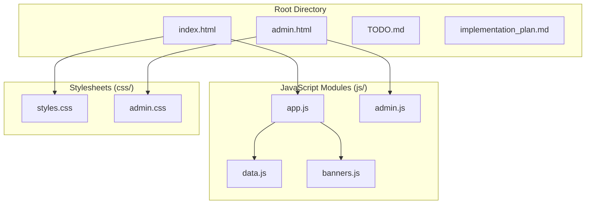
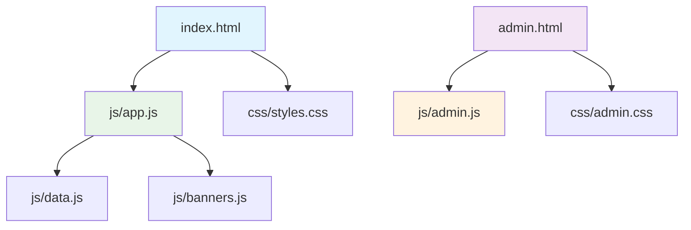
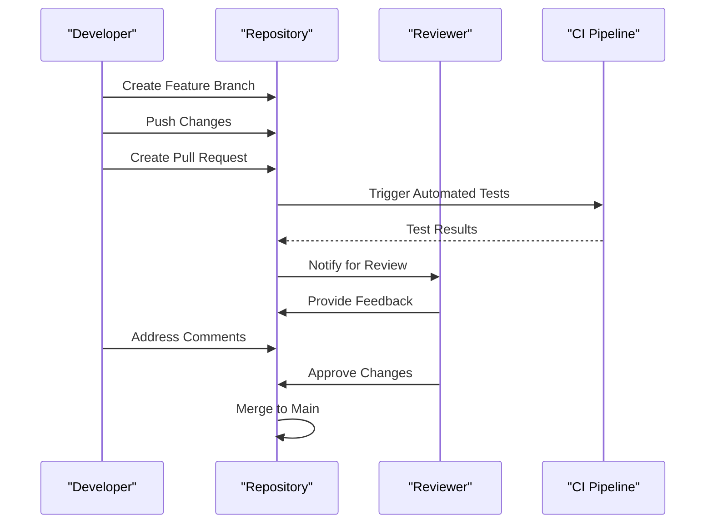

# Development Workflow and Environment Setup

<cite>
**Referenced Files in This Document**
- [index.html](file://index.html)
- [admin.html](file://admin.html)
- [js/app.js](file://js/app.js)
- [js/data.js](file://js/data.js)
- [js/admin.js](file://js/admin.js)
- [js/banners.js](file://js/banners.js)
- [css/styles.css](file://css/styles.css)
- [css/admin.css](file://css/admin.css)
- [TODO.md](file://TODO.md)
- [implementation_plan.md](file://implementation_plan.md)
</cite>

## Table of Contents
1. [Introduction](#introduction)
2. [Project Structure Overview](#project-structure-overview)
3. [Local Development Environment Setup](#local-development-environment-setup)
4. [Running the Application Locally](#running-the-application-locally)
5. [Development Workflow](#development-workflow)
6. [File Structure Navigation](#file-structure-navigation)
7. [HTML Entry Points and Module Relationships](#html-entry-points-and-module-relationships)
8. [Testing Procedures](#testing-procedures)
9. [Debugging Common Issues](#debugging-common-issues)
10. [Adding New Features](#adding-new-features)
11. [Modifying Existing Functionality](#modifying-existing-functionality)
12. [Version Control Practices](#version-control-practices)
13. [Code Review Processes](#code-review-processes)
14. [Performance Optimization Techniques](#performance-optimization-techniques)
15. [Cross-Browser Compatibility Testing](#cross-browser-compatibility-testing)
16. [Troubleshooting Guide](#troubleshooting-guide)
17. [Conclusion](#conclusion)

## Introduction

The KPR Crackers project is a web-based application that follows a modular architecture with separate entry points for different user interfaces. The project consists of HTML documents, JavaScript modules, and CSS stylesheets organized in a clear directory structure. This documentation provides comprehensive guidance for setting up the local development environment, understanding the codebase architecture, and following best practices for development, testing, and deployment.

## Project Structure Overview

The KPR Crackers project follows a feature-based organization with clear separation of concerns:



**Diagram sources**
- [index.html](file://index.html)
- [admin.html](file://admin.html)
- [js/app.js](file://js/app.js)
- [js/data.js](file://js/data.js)
- [js/admin.js](file://js/admin.js)
- [js/banners.js](file://js/banners.js)
- [css/styles.css](file://css/styles.css)
- [css/admin.css](file://css/admin.css)

**Section sources**
- [index.html](file://index.html)
- [admin.html](file://admin.html)
- [js/app.js](file://js/app.js)
- [js/data.js](file://js/data.js)
- [js/admin.js](file://js/admin.js)
- [js/banners.js](file://js/banners.js)
- [css/styles.css](file://css/styles.css)
- [css/admin.css](file://css/admin.css)

## Local Development Environment Setup

### Prerequisites

Before starting development, ensure you have the following tools installed:

- **Web Browser**: Modern browser (Chrome, Firefox, Safari, or Edge) with developer tools enabled
- **Text Editor/IDE**: VS Code, Sublime Text, or any preferred code editor
- **Local Server**: Optional but recommended for proper asset loading
- **Git**: For version control

### Development Tools Configuration

#### Visual Studio Code Extensions
Recommended extensions for optimal development experience:
- Live Server extension for automatic page reloading
- ESLint for JavaScript linting
- Prettier for code formatting
- CSS Peek for stylesheet navigation
- GitLens for enhanced Git capabilities

#### Browser Developer Tools Setup
Enable the following features in your browser's developer tools:
- Console logging for debugging
- Network tab for monitoring requests
- Sources tab for breakpoint debugging
- Performance tab for profiling
- Application tab for storage inspection

**Section sources**
- [index.html](file://index.html)
- [admin.html](file://admin.html)

## Running the Application Locally

### Direct File Access Method

The simplest way to run the application is by directly opening the HTML files:

1. Navigate to the project root directory
2. Double-click `index.html` to open the main application
3. Double-click `admin.html` to access the admin interface

### Local Server Method (Recommended)

For better development experience with proper asset loading:

#### Using Python's Built-in Server
```bash
cd 
python -m http.server 8000
```

#### Using Node.js HTTP Server
```bash
npx http-server -p 8000
```

#### Using VS Code Live Server Extension
1. Install the Live Server extension
2. Right-click on `index.html` or `admin.html`
3. Select "Open with Live Server"

### Access URLs

- Main Application: `http://localhost:8000/index.html`
- Admin Interface: `http://localhost:8000/admin.html`

**Section sources**
- [index.html](file://index.html)
- [admin.html](file://admin.html)

## Development Workflow

### Project Initialization

1. **Clone the Repository**: Set up your local development environment
2. **Install Dependencies**: If any external libraries are required
3. **Configure Development Tools**: Set up your preferred IDE/editor
4. **Start Local Server**: Use one of the methods described above

### Daily Development Tasks

#### Starting Development Session
1. Open terminal in project root
2. Start local server if not already running
3. Open preferred HTML file in browser
4. Enable developer tools for debugging

#### Making Changes
1. Edit relevant files in appropriate directories
2. Save changes (automatic reload with Live Server)
3. Test functionality in browser
4. Debug issues using developer tools

#### Committing Changes
1. Stage modified files
2. Write descriptive commit messages
3. Push changes to remote repository

**Section sources**
- [TODO.md](file://TODO.md)
- [implementation_plan.md](file://implementation_plan.md)

## File Structure Navigation

### Directory Organization

The project follows a clear hierarchical structure:

```

├── css/                    # Stylesheet files
│   ├── styles.css         # Main application styles
│   └── admin.css          # Admin interface styles
├── js/                     # JavaScript modules
│   ├── app.js             # Main application logic
│   ├── data.js            # Data management module
│   ├── admin.js           # Admin-specific functionality
│   └── banners.js         # Banner management module
├── index.html             # Main application entry point
├── admin.html             # Admin interface entry point
├── TODO.md                # Task tracking document
└── implementation_plan.md # Project implementation details
```

### Key File Responsibilities

#### HTML Entry Points
- **index.html**: Main application entry point containing core UI structure
- **admin.html**: Administrative interface entry point with specialized controls

#### JavaScript Modules
- **app.js**: Primary application controller managing main functionality
- **data.js**: Centralized data management and state handling
- **admin.js**: Administrative features and user management
- **banners.js**: Banner advertisement and content management

#### CSS Stylesheets
- **styles.css**: Core application styling and responsive design
- **admin.css**: Specialized styling for administrative interface

**Section sources**
- [js/app.js](file://js/app.js)
- [js/data.js](file://js/data.js)
- [js/admin.js](file://js/admin.js)
- [js/banners.js](file://js/banners.js)
- [css/styles.css](file://css/styles.css)
- [css/admin.css](file://css/admin.css)

## HTML Entry Points and Module Relationships

### Application Architecture

The KPR Crackers project implements a modular architecture where HTML files serve as entry points that load corresponding JavaScript modules and CSS stylesheets.



**Diagram sources**
- [index.html](file://index.html)
- [admin.html](file://admin.html)
- [js/app.js](file://js/app.js)
- [js/data.js](file://js/data.js)
- [js/admin.js](file://js/admin.js)
- [js/banners.js](file://js/banners.js)
- [css/styles.css](file://css/styles.css)
- [css/admin.css](file://css/admin.css)

### Module Loading Strategy

#### Main Application Flow
1. **index.html** loads as the primary entry point
2. **app.js** initializes the main application logic
3. **data.js** provides centralized data management
4. **banners.js** handles banner-related functionality
5. **styles.css** applies core styling

#### Admin Interface Flow
1. **admin.html** serves as the administrative entry point
2. **admin.js** manages administrative features
3. **admin.css** provides specialized admin styling

### Dependency Management

The application uses a flat dependency structure where:
- HTML files reference JavaScript and CSS assets
- JavaScript modules may depend on shared data modules
- CSS files provide independent styling layers

**Section sources**
- [index.html](file://index.html)
- [admin.html](file://admin.html)
- [js/app.js](file://js/app.js)
- [js/data.js](file://js/data.js)
- [js/admin.js](file://js/admin.js)
- [js/banners.js](file://js/banners.js)

## Testing Procedures

### Manual Testing Approach

#### Functional Testing
1. **Core Functionality**: Test main application features through `index.html`
2. **Administrative Features**: Verify admin controls via `admin.html`
3. **User Interactions**: Validate all user input and response mechanisms
4. **Data Persistence**: Ensure data operations work correctly

#### Cross-Browser Testing
Test across multiple browsers:
- Google Chrome (latest stable)
- Mozilla Firefox (latest stable)
- Microsoft Edge (Chromium-based)
- Safari (macOS/iOS)

### Browser Developer Tools Testing

#### Console Testing
Use the browser console for:
- JavaScript debugging and error investigation
- Variable inspection and function testing
- API call simulation and validation

#### Network Tab Testing
Monitor network activity for:
- Resource loading verification
- API request/response validation
- Performance bottleneck identification

#### Elements Panel Testing
Inspect and modify:
- DOM structure validation
- CSS rule application
- Responsive design testing

#### Performance Profiling
Use performance tools for:
- JavaScript execution analysis
- Memory usage monitoring
- Rendering performance optimization

### Automated Testing Considerations

While the current project structure supports manual testing, consider implementing:
- Unit tests for critical JavaScript functions
- Integration tests for user workflows
- End-to-end tests for complete user scenarios

**Section sources**
- [index.html](file://index.html)
- [admin.html](file://admin.html)
- [js/app.js](file://js/app.js)
- [js/data.js](file://js/data.js)

## Debugging Common Issues

### JavaScript Errors

#### Syntax Errors
- Check browser console for syntax error messages
- Verify JavaScript file paths in HTML references
- Ensure proper ES6+ syntax compatibility

#### Runtime Errors
- Use try-catch blocks for error handling
- Implement console logging for debugging
- Check variable initialization and scope

#### Module Loading Issues
- Verify script tag order in HTML files
- Check for circular dependencies between modules
- Ensure all referenced files exist and are accessible

### CSS Styling Problems

#### Style Not Applying
- Check CSS file path references
- Verify selector specificity and conflicts
- Use browser dev tools to inspect computed styles

#### Layout Issues
- Test responsive design across viewport sizes
- Check flexbox/grid compatibility
- Validate CSS custom properties support

### Performance Issues

#### Slow Loading
- Optimize image sizes and formats
- Minimize CSS and JavaScript file sizes
- Implement lazy loading for heavy resources

#### Memory Leaks
- Monitor memory usage in performance tab
- Clean up event listeners and timers
- Avoid global variable accumulation

**Section sources**
- [js/app.js](file://js/app.js)
- [js/admin.js](file://js/admin.js)
- [css/styles.css](file://css/styles.css)
- [css/admin.css](file://css/admin.css)

## Adding New Features

### Feature Development Process

#### Planning Phase
1. **Requirement Analysis**: Define feature scope and requirements
2. **Architecture Design**: Determine which modules need modification
3. **Implementation Plan**: Create detailed development steps

#### Development Phase

##### Creating New JavaScript Modules
1. Create new file in `js/` directory
2. Implement feature-specific functionality
3. Export necessary functions/classes
4. Update main application to import new module

##### Modifying Existing Modules
1. Identify affected files and dependencies
2. Make incremental changes with clear comments
3. Test functionality after each change
4. Update related documentation

##### Adding New Styles
1. Create or modify CSS files in `css/` directory
2. Follow existing naming conventions
3. Ensure responsive design compatibility
4. Test across different screen sizes

#### Integration Phase
1. Update HTML entry points to include new assets
2. Configure module dependencies
3. Perform integration testing
4. Update documentation and comments

### Best Practices for Feature Addition

#### Code Organization
- Keep related functionality together
- Use meaningful file and function names
- Maintain consistent coding standards
- Add comprehensive comments and documentation

#### Error Handling
- Implement robust error checking
- Provide user-friendly error messages
- Log errors for debugging purposes
- Handle edge cases gracefully

#### Performance Considerations
- Optimize resource loading
- Minimize DOM manipulation
- Use efficient algorithms and data structures
- Profile performance impact

**Section sources**
- [js/app.js](file://js/app.js)
- [js/data.js](file://js/data.js)
- [js/banners.js](file://js/banners.js)
- [css/styles.css](file://css/styles.css)

## Modifying Existing Functionality

### Change Management Process

#### Impact Assessment
1. **Dependency Analysis**: Identify all components affected by changes
2. **Risk Evaluation**: Assess potential breaking changes
3. **Testing Strategy**: Plan comprehensive testing approach

#### Implementation Guidelines

##### Safe Modification Principles
- Make small, focused changes
- Preserve existing functionality
- Maintain backward compatibility when possible
- Document all modifications thoroughly

##### Code Refactoring
- Improve code structure without changing behavior
- Extract reusable components
- Simplify complex logic
- Remove deprecated code

#### Testing Modified Functionality
1. **Unit Testing**: Test individual functions and modules
2. **Integration Testing**: Verify component interactions
3. **Regression Testing**: Ensure existing features still work
4. **User Acceptance Testing**: Validate business requirements

### Common Modification Scenarios

#### Adding New Features to Existing Modules
- Extend existing classes or functions
- Add optional parameters for new functionality
- Maintain backward compatibility
- Update type definitions and documentation

#### Performance Improvements
- Optimize algorithms and data structures
- Reduce unnecessary computations
- Implement caching strategies
- Minimize memory allocations

#### Bug Fixes
- Isolate the root cause of issues
- Implement minimal fixes
- Add test cases to prevent regression
- Document the fix and reasoning

**Section sources**
- [js/app.js](file://js/app.js)
- [js/admin.js](file://js/admin.js)
- [js/data.js](file://js/data.js)

## Version Control Practices

### Git Workflow

#### Branching Strategy
- **Main Branch**: Stable production code
- **Feature Branches**: Individual feature development
- **Bug Fix Branches**: Specific issue resolutions
- **Development Branch**: Integration testing

#### Commit Guidelines

##### Commit Message Format
```
type: concise description

Detailed explanation of changes
- What was changed
- Why it was changed
- Any breaking changes
```

##### Commit Types
- **feat**: New features
- **fix**: Bug fixes
- **docs**: Documentation updates
- **style**: Code style changes
- **refactor**: Code refactoring
- **test**: Test additions or updates
- **chore**: Maintenance tasks

#### Pull Request Process

##### Before Submitting
1. Ensure code passes all tests
2. Update documentation if needed
3. Rebase on latest main branch
4. Resolve merge conflicts

##### Code Review Checklist
- Code quality and readability
- Security considerations
- Performance implications
- Test coverage
- Documentation accuracy

### Collaboration Guidelines

#### Team Communication
- Clear issue descriptions
- Regular progress updates
- Collaborative problem-solving
- Knowledge sharing

#### Code Ownership
- Clear responsibility assignment
- Peer review requirements
- Continuous integration checks
- Automated testing pipelines

**Section sources**
- [TODO.md](file://TODO.md)
- [implementation_plan.md](file://implementation_plan.md)

## Code Review Processes

### Review Standards

#### Code Quality Criteria
- **Readability**: Clear, self-documenting code
- **Maintainability**: Easy to understand and modify
- **Performance**: Efficient algorithms and resource usage
- **Security**: No vulnerabilities or security risks
- **Compatibility**: Cross-browser and cross-platform support

#### Review Checklist

##### Structural Review
- Proper file organization and naming
- Consistent code style and formatting
- Appropriate use of design patterns
- Modular and reusable components

##### Functional Review
- Correct implementation of requirements
- Comprehensive error handling
- Adequate input validation
- Proper logging and debugging support

##### Testing Review
- Sufficient test coverage
- Meaningful test cases
- Edge case handling
- Performance testing

### Review Process Workflow



**Diagram sources**
- [TODO.md](file://TODO.md)
- [implementation_plan.md](file://implementation_plan.md)

### Automated Code Quality Checks

#### Static Analysis
- JavaScript linting with ESLint
- CSS validation and optimization
- HTML validation and accessibility checks
- Code complexity analysis

#### Security Scanning
- Dependency vulnerability scanning
- Code security analysis
- Input validation verification
- Output encoding checks

**Section sources**
- [js/app.js](file://js/app.js)
- [js/admin.js](file://js/admin.js)
- [css/styles.css](file://css/styles.css)

## Performance Optimization Techniques

### Frontend Performance

#### Asset Optimization
- **Image Optimization**: Compress images, use modern formats (WebP, AVIF)
- **CSS Minification**: Remove whitespace and comments
- **JavaScript Minification**: Bundle and minify scripts
- **Resource Caching**: Implement browser caching strategies

#### Loading Performance
- **Lazy Loading**: Load resources on demand
- **Critical CSS**: Inline essential styles
- **Script Defer**: Load non-critical scripts asynchronously
- **CDN Usage**: Serve static assets from CDN

#### Runtime Performance
- **DOM Optimization**: Minimize DOM manipulations
- **Event Delegation**: Use event delegation for dynamic elements
- **Memory Management**: Clean up event listeners and timers
- **Algorithm Efficiency**: Optimize computational complexity

### Database and API Performance

#### Query Optimization
- **Index Usage**: Proper database indexing
- **Query Optimization**: Efficient SQL queries
- **Connection Pooling**: Reuse database connections
- **Caching Strategies**: Implement appropriate caching layers

#### API Performance
- **Response Compression**: Enable gzip/brotli compression
- **Pagination**: Implement pagination for large datasets
- **Rate Limiting**: Prevent API abuse
- **Error Handling**: Efficient error responses

### Monitoring and Profiling

#### Performance Metrics
- **Load Time**: Page load and render times
- **Memory Usage**: Monitor memory consumption
- **CPU Usage**: Track processing overhead
- **Network Requests**: Analyze API call performance

#### Profiling Tools
- **Browser DevTools**: Performance and memory profiling
- **Lighthouse**: Comprehensive performance auditing
- **Custom Analytics**: User experience metrics
- **Error Tracking**: Performance-related error monitoring

**Section sources**
- [js/app.js](file://js/app.js)
- [js/data.js](file://js/data.js)
- [css/styles.css](file://css/styles.css)

## Cross-Browser Compatibility Testing

### Browser Support Matrix

#### Target Browsers
- **Desktop**: Chrome, Firefox, Safari, Edge (latest 2 versions)
- **Mobile**: iOS Safari, Android Chrome, Samsung Internet
- **Legacy**: IE11 (if required), older browser versions

### Compatibility Testing Strategy

#### Automated Testing
- **Cross-Browser Testing Services**: BrowserStack, Sauce Labs
- **Responsive Testing**: Viewport simulation tools
- **Accessibility Testing**: Automated accessibility scanners
- **Performance Testing**: Multi-browser performance comparison

#### Manual Testing
- **Visual Regression Testing**: Compare UI across browsers
- **Functional Testing**: Verify core features work consistently
- **Input Testing**: Keyboard, mouse, touch interactions
- **API Testing**: Cross-browser API compatibility

### Polyfills and Fallbacks

#### JavaScript Polyfills
- **ES6+ Features**: Promise, fetch, async/await polyfills
- **Modern APIs**: Web Storage, Geolocation, Canvas
- **Utility Functions**: Array methods, string methods
- **Feature Detection**: Conditional loading based on support

#### CSS Fallbacks
- **Modern Properties**: Flexbox, Grid fallbacks
- **CSS Custom Properties**: Variable fallbacks
- **Animations**: CSS animation fallbacks
- **Media Queries**: Progressive enhancement

### Testing Tools and Techniques

#### Browser Developer Tools
- **Console Testing**: JavaScript compatibility testing
- **Network Tab**: API compatibility verification
- **Elements Panel**: CSS compatibility checking
- **Performance Tab**: Cross-browser performance comparison

#### External Testing Services
- **Cross-Browser Testing Platforms**: Cloud-based testing
- **Automated Testing Frameworks**: Selenium, Cypress
- **Accessibility Testing**: axe-core, WAVE
- **Performance Testing**: Lighthouse CI, WebPageTest

**Section sources**
- [index.html](file://index.html)
- [admin.html](file://admin.html)
- [css/styles.css](file://css/styles.css)
- [css/admin.css](file://css/admin.css)

## Troubleshooting Guide

### Common Development Issues

#### Environment Setup Problems
- **Port Conflicts**: Change server port if default is occupied
- **File Path Issues**: Verify relative paths in HTML references
- **Permission Errors**: Check file system permissions
- **Node.js Issues**: Ensure correct Node.js version and packages

#### Build and Deployment Issues
- **Asset Loading Failures**: Verify asset paths and server configuration
- **CORS Errors**: Configure proper CORS headers
- **Cache Issues**: Clear browser cache and service workers
- **SSL Certificate Problems**: Configure proper SSL certificates

#### Performance Issues
- **Slow Loading**: Optimize assets and implement caching
- **Memory Leaks**: Monitor and clean up event listeners
- **Render Blocking**: Optimize critical rendering path
- **Database Bottlenecks**: Optimize queries and add indexes

### Debugging Strategies

#### Systematic Debugging Approach
1. **Reproduce Issue**: Create minimal reproduction case
2. **Isolate Problem**: Narrow down affected components
3. **Analyze Logs**: Review console logs and server logs
4. **Test Hypotheses**: Verify assumptions with targeted tests

#### Debugging Tools and Techniques
- **Console Logging**: Strategic log statements for flow tracing
- **Breakpoint Debugging**: Step-through code execution
- **Network Inspection**: Monitor API calls and responses
- **Memory Profiling**: Identify memory leaks and usage patterns

### Recovery Procedures

#### Rollback Strategy
- **Git Revert**: Undo problematic commits
- **Backup Restoration**: Restore from known good state
- **Feature Flags**: Disable problematic features temporarily
- **Graceful Degradation**: Maintain core functionality during issues

#### Incident Response
- **Issue Identification**: Quick problem assessment
- **Impact Analysis**: Determine affected users and features
- **Resolution Planning**: Develop fix strategy
- **Communication**: Inform stakeholders and users

**Section sources**
- [js/app.js](file://js/app.js)
- [js/admin.js](file://js/admin.js)
- [js/data.js](file://js/data.js)

## Conclusion

The KPR Crackers project provides a solid foundation for web application development with its modular architecture and clear separation of concerns. By following the development workflow outlined in this documentation, developers can efficiently contribute to the project while maintaining code quality and performance standards.

Key takeaways for successful development:
- **Environment Setup**: Proper tool configuration ensures smooth development experience
- **Modular Architecture**: Clear separation of concerns facilitates maintainable code
- **Testing Strategy**: Comprehensive testing ensures reliability and performance
- **Collaboration**: Established processes enable effective team collaboration
- **Performance Focus**: Optimization techniques ensure excellent user experience

The project's structure supports both individual development and team collaboration, making it suitable for projects of varying scales and complexity levels. By adhering to the guidelines and best practices outlined here, teams can deliver high-quality web applications that meet user needs and business objectives.