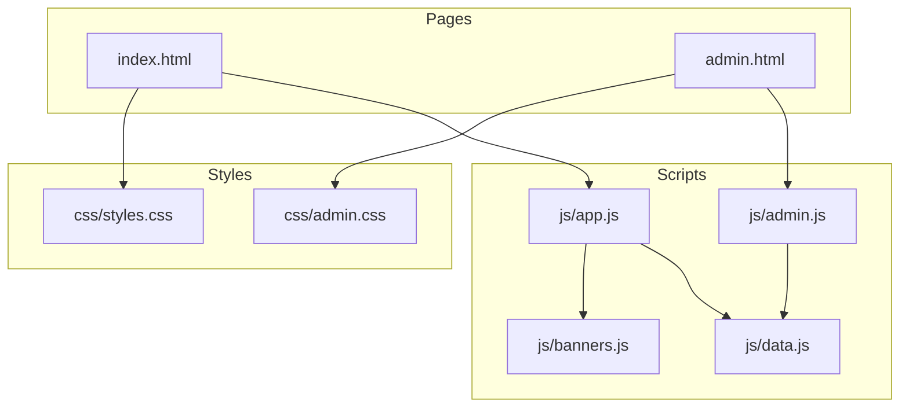
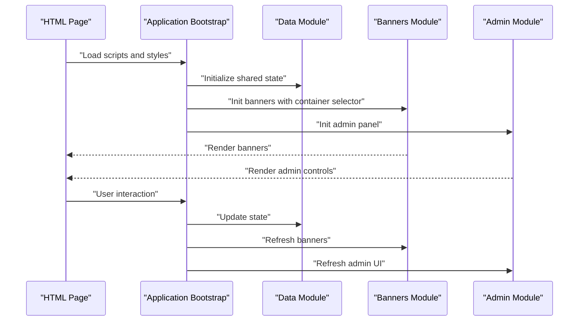
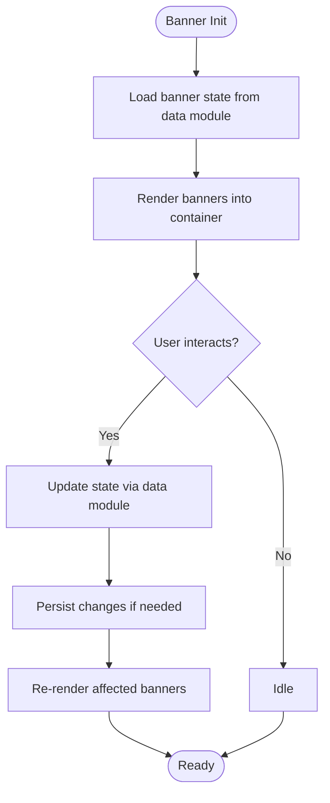
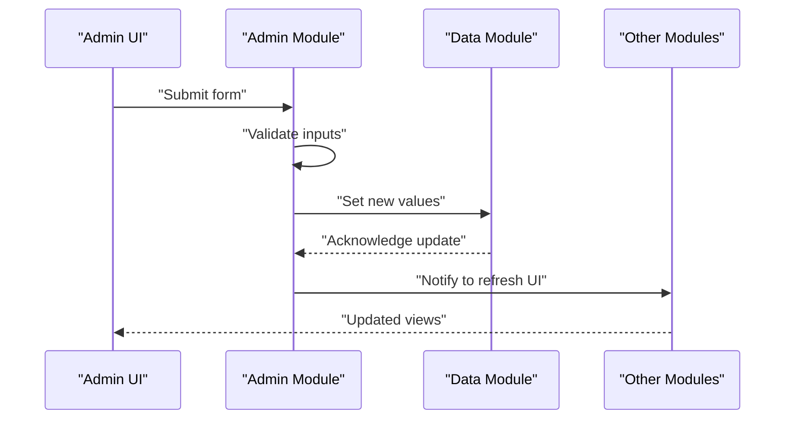
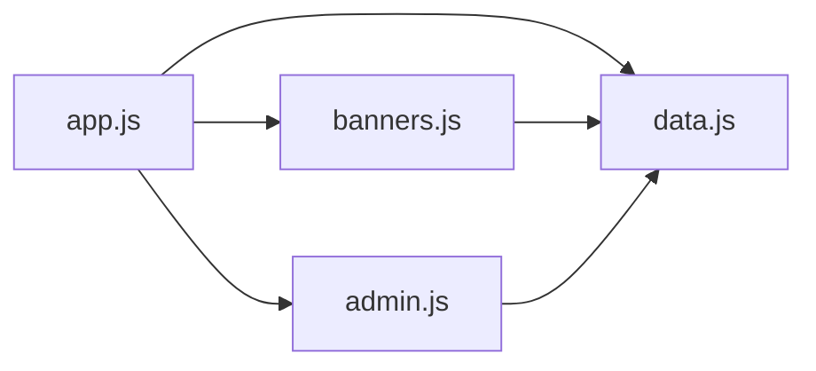

# Feature Extension and Module Development

<cite>
**Referenced Files in This Document**
- [index.html](file://index.html)
- [admin.html](file://admin.html)
- [app.js](file://js/app.js)
- [data.js](file://js/data.js)
- [banners.js](file://js/banners.js)
- [admin.js](file://js/admin.js)
- [styles.css](file://css/styles.css)
- [admin.css](file://css/admin.css)
</cite>

## Table of Contents
1. [Introduction](#introduction)
2. [Project Structure](#project-structure)
3. [Core Components](#core-components)
4. [Architecture Overview](#architecture-overview)
5. [Detailed Component Analysis](#detailed-component-analysis)
6. [Dependency Analysis](#dependency-analysis)
7. [Performance Considerations](#performance-considerations)
8. [Troubleshooting Guide](#troubleshooting-guide)
9. [Conclusion](#conclusion)
10. [Appendices](#appendices)

## Introduction
This document explains how to extend the KPR Crackers application with new features and modules. It focuses on the modular architecture pattern, separation of concerns, and step-by-step guidance for adding UI components, extending banner functionality, and implementing administrative features. You will learn how to create new JavaScript modules, integrate them into existing pages, handle events, manage data flow, and connect new modules to the application state.

## Project Structure
The project follows a simple feature-based layout:
- HTML entry points define page structure and include scripts and styles.
- JavaScript modules encapsulate logic by responsibility (application bootstrap, data, banners, admin).
- CSS files separate general styling from admin-specific styling.

**Diagram sources**
- [index.html](file://index.html)
- [admin.html](file://admin.html)
- [app.js](file://js/app.js)
- [data.js](file://js/data.js)
- [banners.js](file://js/banners.js)
- [admin.js](file://js/admin.js)
- [styles.css](file://css/styles.css)
- [admin.css](file://css/admin.css)

**Section sources**
- [index.html](file://index.html)
- [admin.html](file://admin.html)
- [app.js](file://js/app.js)
- [data.js](file://js/data.js)
- [banners.js](file://js/banners.js)
- [admin.js](file://js/admin.js)
- [styles.css](file://css/styles.css)
- [admin.css](file://css/admin.css)

## Core Components
- Application bootstrap and orchestration live in the main script that initializes modules and wires up UI interactions.
- Data module centralizes shared state and persistence helpers used across features.
- Banner module encapsulates banner rendering and lifecycle management.
- Admin module provides administrative controls and integrates with shared data.

Key responsibilities:
- Initialization order and dependency wiring
- Event delegation and component lifecycle hooks
- Centralized data access patterns
- Clear separation between view updates and business logic

**Section sources**
- [app.js](file://js/app.js)
- [data.js](file://js/data.js)
- [banners.js](file://js/banners.js)
- [admin.js](file://js/admin.js)

## Architecture Overview
The application uses a lightweight modular architecture:
- Pages import only what they need.
- Shared state is centralized in a dedicated module.
- Feature modules expose initialization functions and event handlers.
- UI updates are triggered by explicit calls after state changes.

**Diagram sources**
- [index.html](file://index.html)
- [admin.html](file://admin.html)
- [app.js](file://js/app.js)
- [data.js](file://js/data.js)
- [banners.js](file://js/banners.js)
- [admin.js](file://js/admin.js)

## Detailed Component Analysis

### Application Bootstrap (Initialization and Wiring)
Responsibilities:
- Ensure DOM readiness before initializing modules.
- Initialize shared data store.
- Start feature modules (banners, admin).
- Wire global event listeners or delegates.
- Provide a single place to register new modules.

Integration tips:
- Add new modules by calling their init function from the bootstrap.
- Pass necessary configuration (e.g., DOM selectors) to each module.
- Keep initialization order deterministic: data first, then features.

**Section sources**
- [app.js](file://js/app.js)

### Data Module (Shared State and Persistence)
Responsibilities:
- Define the canonical shape of application state.
- Provide getters/setters or methods to mutate state safely.
- Persist state to storage if applicable.
- Emit change notifications when state updates.

Guidelines for extension:
- Add new fields to the state object and update related setters.
- Introduce typed helpers for validation and defaults.
- Avoid direct mutation outside this module; use provided APIs.

**Section sources**
- [data.js](file://js/data.js)

### Banners Module (Feature Encapsulation)
Responsibilities:
- Manage banner list and rendering.
- Handle user actions like opening/closing banners.
- Update UI based on state changes.
- Expose an init function that binds to a container element.

Extending banners:
- Add new banner types by extending the render logic.
- Integrate with analytics or tracking via event dispatching.
- Use the data module to persist banner preferences.

**Section sources**
- [banners.js](file://js/banners.js)

### Admin Module (Administrative Features)
Responsibilities:
- Render administrative controls.
- Validate inputs and trigger state updates through the data module.
- Refresh dependent UI components after changes.
- Optionally guard routes or features based on permissions.

Adding admin features:
- Create form handlers that call data setters.
- Re-render affected sections after mutations.
- Keep admin-specific styles isolated in the admin stylesheet.

**Section sources**
- [admin.js](file://js/admin.js)

### Creating New Modules: Step-by-Step
Follow these steps to add a new feature module:

1. Create a new JavaScript file under js/ with a clear name (for example, js/newsletter.js).
2. Implement an init function that accepts a container selector or DOM node.
3. If your module needs shared state, read/write via the data module.
4. Register event listeners inside init and delegate where appropriate.
5. Export or attach the init function so the bootstrap can call it.
6. Include your script in the relevant HTML page(s).
7. Call your module’s init from the application bootstrap.

Example integration points:
- Importing modules: reference your new module in the bootstrap and call its init.
- Handling events: bind listeners in init and update state via the data module.
- Connecting to state: read current values and write back using provided setters.

**Section sources**
- [app.js](file://js/app.js)
- [data.js](file://js/data.js)
- [banners.js](file://js/banners.js)
- [admin.js](file://js/admin.js)

### Adding a New UI Component
Steps:
- Add markup placeholders in the target HTML page.
- Write CSS rules in the appropriate stylesheet (general or admin).
- Implement a small module that renders into the placeholder and handles interactions.
- Initialize the module from the bootstrap or directly from the page script.

Best practices:
- Keep component logic self-contained.
- Use event delegation for dynamic content.
- Update UI only after state changes.

**Section sources**
- [index.html](file://index.html)
- [admin.html](file://admin.html)
- [styles.css](file://css/styles.css)
- [admin.css](file://css/admin.css)
- [app.js](file://js/app.js)

### Extending Banner Functionality
Approach:
- Extend the banner data model in the data module if needed.
- Update the banner renderer to support new banner types or layouts.
- Add new user interactions (e.g., dismiss, track impressions) and persist preferences.
- Trigger re-renders when banner state changes.

Flow overview:

**Diagram sources**
- [banners.js](file://js/banners.js)
- [data.js](file://js/data.js)

**Section sources**
- [banners.js](file://js/banners.js)
- [data.js](file://js/data.js)

### Implementing Administrative Features
Approach:
- Add forms or controls in the admin page.
- Bind input handlers to validate and update shared state.
- After updates, refresh dependent UI elements.
- Optionally restrict access or show feedback messages.

Sequence overview:

**Diagram sources**
- [admin.js](file://js/admin.js)
- [data.js](file://js/data.js)

**Section sources**
- [admin.js](file://js/admin.js)
- [data.js](file://js/data.js)

### Connecting New Modules to Existing State
Patterns:
- Read-only access: query current values from the data module during init or render.
- Mutating access: call setter methods to update state and trigger downstream updates.
- Event-driven updates: emit custom events or callbacks when state changes.

Recommendations:
- Keep all state mutations in one place to avoid drift.
- Use defensive checks for missing keys or invalid values.
- Debounce frequent updates if performance becomes a concern.

**Section sources**
- [data.js](file://js/data.js)
- [app.js](file://js/app.js)

## Dependency Analysis
High-level dependencies:
- The bootstrap depends on data and feature modules.
- Feature modules depend on the data module for shared state.
- Admin and banners are independent features initialized by the bootstrap.

**Diagram sources**
- [app.js](file://js/app.js)
- [data.js](file://js/data.js)
- [banners.js](file://js/banners.js)
- [admin.js](file://js/admin.js)

**Section sources**
- [app.js](file://js/app.js)
- [data.js](file://js/data.js)
- [banners.js](file://js/banners.js)
- [admin.js](file://js/admin.js)

## Performance Considerations
- Minimize DOM queries by caching selectors and nodes.
- Use event delegation for lists and dynamic content.
- Batch state updates and re-renders where possible.
- Avoid heavy computations on the main thread; consider offloading or debouncing.
- Keep CSS scoped to specific components to reduce repaints.

[No sources needed since this section provides general guidance]

## Troubleshooting Guide
Common issues and resolutions:
- Module not initializing: ensure the bootstrap includes and calls your module’s init after DOM ready.
- State not updating: verify you are using the data module’s setters rather than mutating objects directly.
- UI not refreshing: confirm that dependent modules listen for state changes or are explicitly refreshed after updates.
- Styles not applied: check that the correct stylesheet is included and selectors match the rendered markup.

Debugging tips:
- Log state transitions at key points in the data module.
- Wrap UI updates in try/catch blocks to surface errors early.
- Use browser dev tools to inspect network requests and local storage if persistence is involved.

**Section sources**
- [app.js](file://js/app.js)
- [data.js](file://js/data.js)
- [banners.js](file://js/banners.js)
- [admin.js](file://js/admin.js)

## Conclusion
By following the established modular architecture and separation of concerns, you can extend the KPR Crackers application with confidence. Use the data module as the single source of truth, encapsulate features in dedicated modules, and wire everything together through the bootstrap. This approach keeps the codebase maintainable, testable, and easy to scale.

[No sources needed since this section summarizes without analyzing specific files]

## Appendices

### Quick Checklist for Adding a New Feature
- Create a new JS module with an init function.
- Use the data module for state access and mutations.
- Bind event listeners and delegate where appropriate.
- Include the module in the relevant HTML page.
- Initialize the module from the bootstrap.
- Add styles in the appropriate CSS file.
- Test UI updates and persistence behavior.

[No sources needed since this section provides general guidance]