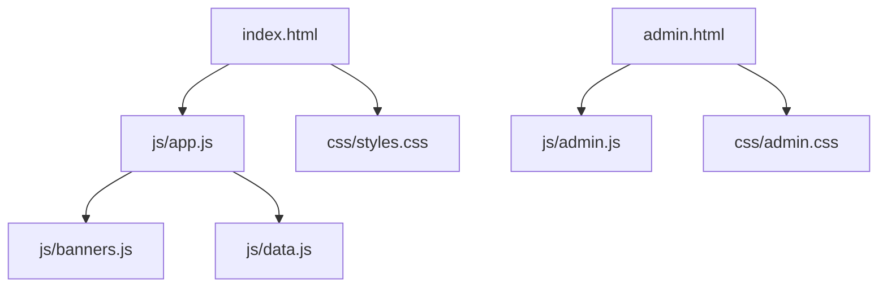
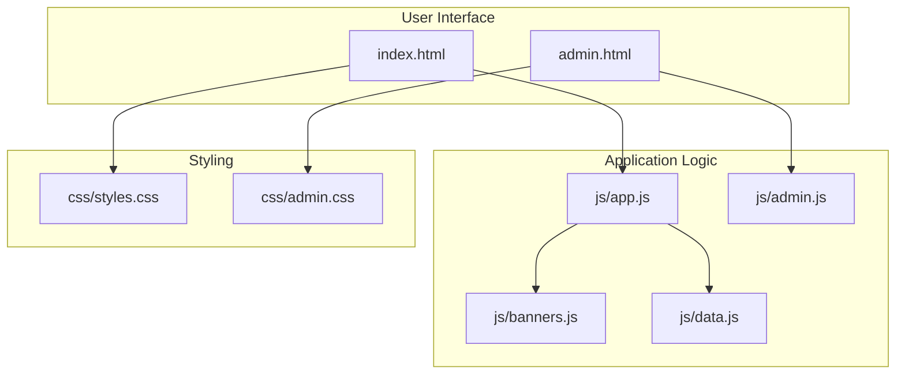
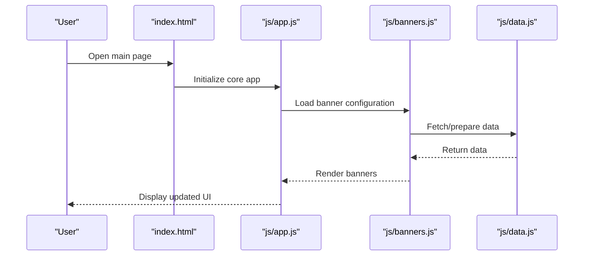
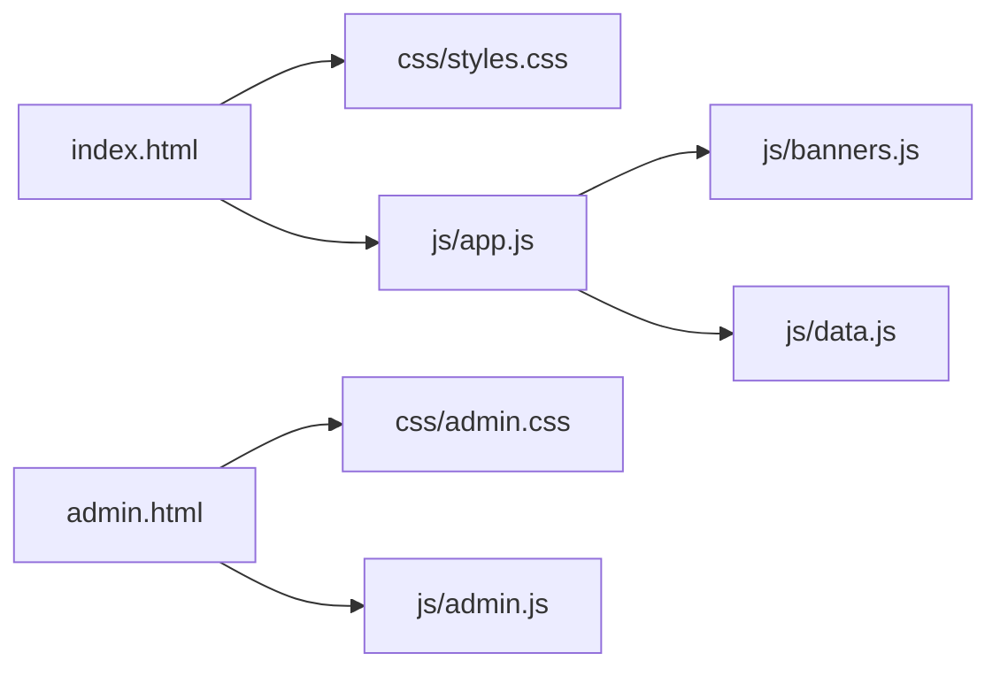

# Project Roadmap and Implementation Plan

<cite>
**Referenced Files in This Document**
- [TODO.md](file://TODO.md)
- [implementation_plan.md](file://implementation_plan.md)
- [index.html](file://index.html)
- [admin.html](file://admin.html)
- [js/app.js](file://js/app.js)
- [js/admin.js](file://js/admin.js)
- [js/banners.js](file://js/banners.js)
- [js/data.js](file://js/data.js)
- [css/styles.css](file://css/styles.css)
- [css/admin.css](file://css/admin.css)
</cite>

## Table of Contents
1. [Introduction](#introduction)
2. [Project Structure](#project-structure)
3. [Core Components](#core-components)
4. [Architecture Overview](#architecture-overview)
5. [Detailed Component Analysis](#detailed-component-analysis)
6. [Dependency Analysis](#dependency-analysis)
7. [Performance Considerations](#performance-considerations)
8. [Troubleshooting Guide](#troubleshooting-guide)
9. [Conclusion](#conclusion)
10. [Appendices](#appendices)

## Introduction
This document consolidates the project’s current status, planned features, and development priorities as captured in the repository’s planning artifacts. It explains technical specifications from the implementation plan, including system requirements, architectural decisions, and deployment strategy. It also outlines the roadmap for future enhancements, bug fixes, and feature additions, while highlighting known limitations, technical debt, and areas for improvement. The goal is to provide contributors with clear context on the project’s direction and how their work aligns with the overall development plan.

## Project Structure
The project follows a simple static-site structure with separate pages for end users and administrators, along with modular JavaScript and CSS assets:

- Pages
  - index.html: Main user-facing page
  - admin.html: Administrative interface
- Client-side logic
  - js/app.js: Core application behavior
  - js/admin.js: Admin-specific functionality
  - js/banners.js: Banner management logic
  - js/data.js: Data handling utilities or fixtures
- Styles
  - css/styles.css: Global styles
  - css/admin.css: Admin UI styles

**Diagram sources**
- [index.html](file://index.html)
- [admin.html](file://admin.html)
- [js/app.js](file://js/app.js)
- [js/admin.js](file://js/admin.js)
- [js/banners.js](file://js/banners.js)
- [js/data.js](file://js/data.js)
- [css/styles.css](file://css/styles.css)
- [css/admin.css](file://css/admin.css)

**Section sources**
- [index.html](file://index.html)
- [admin.html](file://admin.html)
- [js/app.js](file://js/app.js)
- [js/admin.js](file://js/admin.js)
- [js/banners.js](file://js/banners.js)
- [js/data.js](file://js/data.js)
- [css/styles.css](file://css/styles.css)
- [css/admin.css](file://css/admin.css)

## Core Components
- TODO.md: Captures current tasks, pending items, and immediate priorities. Use this file to track what needs to be done next and to coordinate contributions.
- implementation_plan.md: Defines system requirements, architectural decisions, and deployment strategy. Refer to it for technical specifications and long-term goals.

These two files together form the backbone of the project’s planning and execution. Contributors should review both before starting work to ensure alignment with current priorities and technical direction.

**Section sources**
- [TODO.md](file://TODO.md)
- [implementation_plan.md](file://implementation_plan.md)

## Architecture Overview
At a high level, the application is a client-side web app with two primary entry points:
- User experience via index.html
- Administration via admin.html

Client-side modules are organized by responsibility:
- app.js orchestrates core behaviors
- banners.js manages banner-related logic
- data.js provides data utilities or fixtures
- admin.js handles administrative workflows

Styles are split between global (styles.css) and admin-specific (admin.css) concerns.

**Diagram sources**
- [index.html](file://index.html)
- [admin.html](file://admin.html)
- [js/app.js](file://js/app.js)
- [js/admin.js](file://js/admin.js)
- [js/banners.js](file://js/banners.js)
- [js/data.js](file://js/data.js)
- [css/styles.css](file://css/styles.css)
- [css/admin.css](file://css/admin.css)

## Detailed Component Analysis

### Planning Artifacts
- TODO.md
  - Purpose: Track current tasks, bugs, and feature requests; define near-term priorities.
  - Usage: Review before contributing to understand what is most important right now.
  - Maintenance: Keep entries actionable, prioritized, and linked to relevant files when applicable.
- implementation_plan.md
  - Purpose: Define system requirements, architecture, and deployment strategy.
  - Usage: Reference for technical decisions, constraints, and long-term roadmap.
  - Maintenance: Update when requirements or strategies change to keep the team aligned.

**Section sources**
- [TODO.md](file://TODO.md)
- [implementation_plan.md](file://implementation_plan.md)

### Frontend Pages
- index.html
  - Entry point for end users.
  - Loads core scripts and global styles.
- admin.html
  - Administrative interface.
  - Loads admin scripts and admin-specific styles.

**Section sources**
- [index.html](file://index.html)
- [admin.html](file://admin.html)

### Application Scripts
- js/app.js
  - Central orchestration for main application behavior.
  - Likely coordinates banner rendering and data interactions.
- js/admin.js
  - Admin-only workflows and controls.
- js/banners.js
  - Banner lifecycle management (creation, updates, display).
- js/data.js
  - Data utilities, fixtures, or local data handling.

**Diagram sources**
- [index.html](file://index.html)
- [js/app.js](file://js/app.js)
- [js/banners.js](file://js/banners.js)
- [js/data.js](file://js/data.js)

**Section sources**
- [js/app.js](file://js/app.js)
- [js/admin.js](file://js/admin.js)
- [js/banners.js](file://js/banners.js)
- [js/data.js](file://js/data.js)

### Styling
- css/styles.css
  - Global styles applied across pages.
- css/admin.css
  - Styles specific to the admin interface.

**Section sources**
- [css/styles.css](file://css/styles.css)
- [css/admin.css](file://css/admin.css)

## Dependency Analysis
The following diagram shows how the HTML pages depend on scripts and styles, and how scripts depend on each other.

**Diagram sources**
- [index.html](file://index.html)
- [admin.html](file://admin.html)
- [js/app.js](file://js/app.js)
- [js/admin.js](file://js/admin.js)
- [js/banners.js](file://js/banners.js)
- [js/data.js](file://js/data.js)
- [css/styles.css](file://css/styles.css)
- [css/admin.css](file://css/admin.css)

**Section sources**
- [index.html](file://index.html)
- [admin.html](file://admin.html)
- [js/app.js](file://js/app.js)
- [js/admin.js](file://js/admin.js)
- [js/banners.js](file://js/banners.js)
- [js/data.js](file://js/data.js)
- [css/styles.css](file://css/styles.css)
- [css/admin.css](file://css/admin.css)

## Performance Considerations
- Minimize DOM operations by batching updates in app.js and banners.js.
- Defer non-critical script loading where appropriate to improve initial page load.
- Cache banner configurations and data locally if feasible to reduce repeated processing.
- Keep CSS scoped to avoid reflows and repaints during dynamic updates.
[No sources needed since this section provides general guidance]

## Troubleshooting Guide
- If banners do not render:
  - Verify that banners.js is loaded after data.js.
  - Check console errors related to data fetching or DOM manipulation.
- If admin features fail:
  - Ensure admin.html includes admin.js and admin.css.
  - Validate any admin-only inputs and permissions checks in admin.js.
- General debugging steps:
  - Inspect network requests for data retrieval issues.
  - Confirm correct script load order and absence of circular dependencies.
[No sources needed since this section provides general guidance]

## Conclusion
The project’s planning documents (TODO.md and implementation_plan.md) define the current priorities and technical direction. The codebase is structured around two primary pages with modular JavaScript and CSS assets. Contributors should align new work with the priorities in TODO.md and adhere to the technical specifications in implementation_plan.md. Focus on improving banner management, data handling, and admin workflows while maintaining clean separation of concerns and performance best practices.

## Appendices

### System Requirements
- Modern browser support for ES6+ features used in client-side scripts.
- Static hosting environment capable of serving HTML, CSS, and JS without server-side processing.

**Section sources**
- [implementation_plan.md](file://implementation_plan.md)

### Architectural Decisions
- Client-side only architecture with clear module boundaries.
- Separation of admin and user interfaces to simplify maintenance and security.
- Modular JavaScript to isolate responsibilities (app, banners, data, admin).

**Section sources**
- [implementation_plan.md](file://implementation_plan.md)

### Deployment Strategy
- Deploy static assets to a CDN or static host.
- Ensure cache headers are configured for optimal performance.
- Version assets to facilitate rollbacks and updates.

**Section sources**
- [implementation_plan.md](file://implementation_plan.md)

### Roadmap Highlights
- Near-term: Address items in TODO.md, stabilize banner rendering, and improve admin UX.
- Mid-term: Enhance data layer robustness, add error handling, and optimize performance.
- Long-term: Expand admin capabilities, introduce analytics, and refine accessibility.

**Section sources**
- [TODO.md](file://TODO.md)
- [implementation_plan.md](file://implementation_plan.md)

### Known Limitations and Technical Debt
- Potential lack of server-side validation and persistence.
- Limited error handling and logging in client-side flows.
- Opportunity to refactor shared logic into reusable utilities.

**Section sources**
- [TODO.md](file://TODO.md)
- [implementation_plan.md](file://implementation_plan.md)