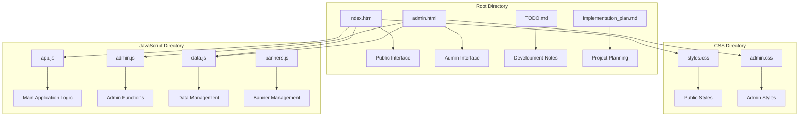
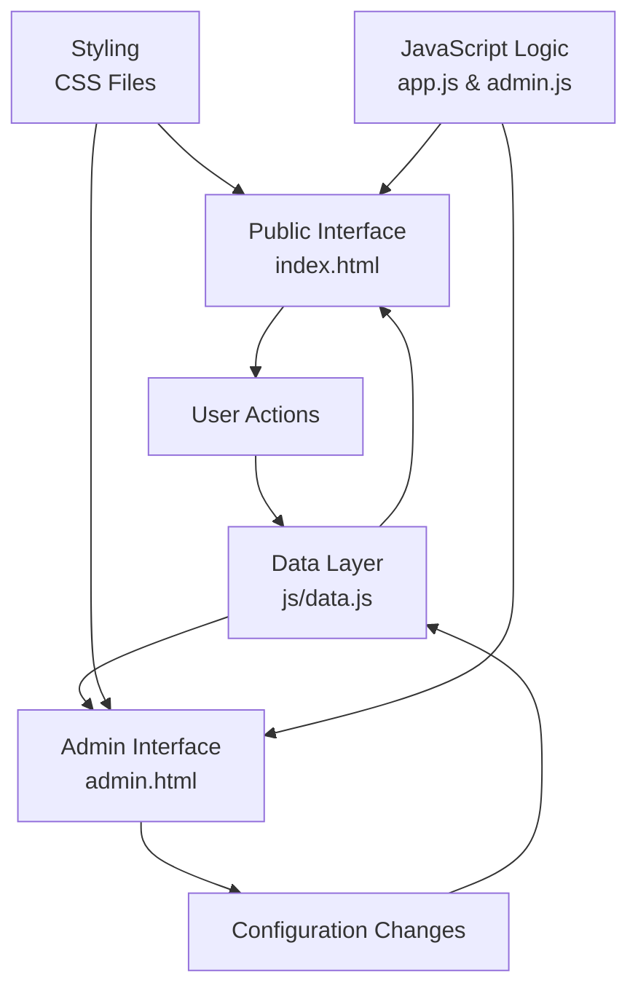

# Getting Started

<cite>
**Referenced Files in This Document**
- [index.html](file://index.html)
- [admin.html](file://admin.html)
- [js/app.js](file://js/app.js)
- [js/admin.js](file://js/admin.js)
- [js/data.js](file://js/data.js)
- [css/styles.css](file://css/styles.css)
- [css/admin.css](file://css/admin.css)
</cite>

## Table of Contents
1. [Introduction](#introduction)
2. [Quick Start Guide](#quick-start-guide)
3. [Project Structure Overview](#project-structure-overview)
4. [Public User Experience](#public-user-experience)
5. [Administrator Access](#administrator-access)
6. [Configuration and Setup](#configuration-and-setup)
7. [Troubleshooting Guide](#troubleshooting-guide)
8. [Browser Compatibility](#browser-compatibility)
9. [First-Time User Experience](#first-time-user-experience)
10. [Navigation Guide](#navigation-guide)

## Introduction

KPR Crackers is a web-based application designed to provide both public-facing content management and administrative capabilities through a simple HTML-based interface. The application follows a client-side architecture that requires no server setup, making it accessible to users with minimal technical expertise.

The application consists of two main interfaces:
- **Public Interface**: A user-friendly experience for general visitors accessing content through index.html
- **Administrative Interface**: A management dashboard for administrators to configure and control application behavior through admin.html

This getting started guide will walk you through setting up the application locally, understanding its structure, and using both public and administrative features effectively.

## Quick Start Guide

### Prerequisites
- A modern web browser (Chrome, Firefox, Safari, or Edge)
- No server installation required
- Basic file system access

### Installation Steps

1. **Download the Application Files**
   - Ensure all files from the project structure are downloaded to your local machine
   - Maintain the original folder structure for proper functionality

2. **Open the Public Interface**
   - Navigate to the `index.html` file in your file explorer
   - Double-click the file to open it in your default web browser
   - The public interface will load automatically

3. **Access the Administrative Interface**
   - Navigate to the `admin.html` file in your file explorer
   - Double-click the file to open it in your web browser
   - The administrative dashboard will load

4. **Verify Installation**
   - Check that both interfaces load without errors
   - Verify that styling appears correctly
   - Test basic navigation between sections

**Section sources**
- [index.html](file://index.html)
- [admin.html](file://admin.html)

## Project Structure Overview

The KPR Crackers application follows a clean, organized file structure that separates concerns and maintains clarity:

**Diagram sources**
- [index.html](file://index.html)
- [admin.html](file://admin.html)
- [js/app.js](file://js/app.js)
- [js/admin.js](file://js/admin.js)
- [js/data.js](file://js/data.js)
- [css/styles.css](file://css/styles.css)
- [css/admin.css](file://css/admin.css)

### File Organization Principles

The application uses a feature-based organization where related files are grouped by functionality:

- **HTML Files**: Main entry points for different user interfaces
- **CSS Files**: Styling separated by interface type (public vs admin)
- **JavaScript Files**: Logic separated by functional area
- **Documentation Files**: Development notes and planning documents

**Section sources**
- [index.html](file://index.html)
- [admin.html](file://admin.html)
- [js/app.js](file://js/app.js)
- [js/admin.js](file://js/admin.js)
- [js/data.js](file://js/data.js)
- [css/styles.css](file://css/styles.css)
- [css/admin.css](file://css/admin.css)

## Public User Experience

### Accessing the Public Interface

The public interface provides a streamlined experience for general visitors:

1. **Initial Load**
   - Open `index.html` in any modern web browser
   - The application loads client-side JavaScript and CSS resources
   - Content displays immediately without server communication

2. **User Navigation**
   - Browse available content through the main interface
   - Use built-in navigation controls to move between sections
   - Interact with dynamic elements powered by JavaScript

3. **Content Display**
   - View dynamically loaded content managed through the data layer
   - Experience responsive design across different screen sizes
   - Access interactive features without page reloads

### Key Features for Public Users

- **Responsive Design**: Optimized for desktop, tablet, and mobile devices
- **Dynamic Content**: Real-time updates without page refreshes
- **Intuitive Navigation**: Clear menu structure and user pathways
- **Fast Loading**: Client-side processing eliminates server latency

**Section sources**
- [index.html](file://index.html)
- [js/app.js](file://js/app.js)
- [css/styles.css](file://css/styles.css)

## Administrator Access

### Setting Up Administrative Access

Administrators have access to powerful management capabilities through the dedicated admin interface:

1. **Accessing Admin Panel**
   - Open `admin.html` in your web browser
   - The administrative dashboard loads with full management capabilities
   - All administrative functions are available immediately

2. **Management Capabilities**
   - Configure application settings and preferences
   - Manage content and data structures
   - Control banner advertisements and promotional content
   - Monitor application status and performance

3. **Data Management**
   - Add, edit, and delete content entries
   - Configure user preferences and display options
   - Manage application state and configuration

### Administrative Features

- **Content Management**: Full CRUD operations for application data
- **Configuration Control**: Dynamic adjustment of application behavior
- **Banner Management**: Control promotional content and advertisements
- **Real-time Updates**: Changes reflect immediately in the public interface

**Section sources**
- [admin.html](file://admin.html)
- [js/admin.js](file://js/admin.js)
- [css/admin.css](file://css/admin.css)

## Configuration and Setup

### Initial Configuration

The application uses a data-driven approach where configuration is managed through JavaScript files:

#### Data Layer Configuration
- **Primary Data Source**: `js/data.js` contains core application data
- **Banner Management**: `js/banners.js` handles promotional content
- **Application State**: Managed through client-side JavaScript objects

#### Style Customization
- **Public Interface**: Modify `css/styles.css` for public-facing appearance
- **Admin Interface**: Customize `css/admin.css` for administrative controls
- **Responsive Breakpoints**: Adjust media queries for different screen sizes

#### JavaScript Behavior
- **Core Logic**: `js/app.js` contains main application functionality
- **Admin Functions**: `js/admin.js` manages administrative operations
- **Event Handling**: User interactions processed through event listeners

### First-Time Setup Process

1. **Review Default Configuration**
   - Examine existing data structures in `js/data.js`
   - Review banner configurations in `js/banners.js`
   - Understand current application state management

2. **Customize Content**
   - Edit data entries in the appropriate JavaScript files
   - Update banner content and scheduling
   - Modify application preferences and defaults

3. **Test Changes**
   - Refresh browser pages to see updates
   - Verify both public and admin interfaces work correctly
   - Test responsive behavior across different devices

**Section sources**
- [js/data.js](file://js/data.js)
- [js/banners.js](file://js/banners.js)
- [js/app.js](file://js/app.js)
- [js/admin.js](file://js/admin.js)
- [css/styles.css](file://css/styles.css)
- [css/admin.css](file://css/admin.css)

## Troubleshooting Guide

### Common Setup Issues

#### Browser Compatibility Problems
- **Issue**: Pages don't load or appear broken
  - **Solution**: Use a modern browser (Chrome 90+, Firefox 88+, Safari 14+, Edge 90+)
  - **Check**: Enable JavaScript in browser settings
  - **Verify**: Clear browser cache and cookies

#### File Path Errors
- **Issue**: Resources not loading (CSS, JavaScript files)
  - **Solution**: Ensure correct relative paths in HTML files
  - **Check**: Verify all files maintain original directory structure
  - **Fix**: Update path references if files were moved

#### Local Storage Issues
- **Issue**: Settings not persisting between sessions
  - **Solution**: Check browser's local storage permissions
  - **Check**: Verify developer console for storage errors
  - **Reset**: Clear local storage if corrupted

#### Performance Problems
- **Issue**: Slow loading or unresponsive interface
  - **Solution**: Close other browser tabs to free memory
  - **Check**: Monitor browser performance tools
  - **Optimize**: Reduce large data sets in configuration files

### Debugging Techniques

#### Browser Developer Tools
- **Console Tab**: Check for JavaScript errors and warnings
- **Network Tab**: Verify resource loading and file paths
- **Elements Tab**: Inspect DOM structure and applied styles
- **Storage Tab**: View local storage contents and clear if needed

#### Common Error Messages
- **"Cannot read property of undefined"**: Check data initialization order
- **"File not found"**: Verify file paths and directory structure
- **"Permission denied"**: Check browser security settings for local files

**Section sources**
- [index.html](file://index.html)
- [admin.html](file://admin.html)
- [js/app.js](file://js/app.js)
- [js/admin.js](file://js/admin.js)

## Browser Compatibility

### Supported Browsers

The KPR Crackers application supports all modern web browsers with the following minimum versions:

| Browser | Minimum Version | Features Required |
|---------|----------------|-------------------|
| Chrome | 90+ | ES6+, Local Storage, Flexbox |
| Firefox | 88+ | ES6+, Local Storage, Grid Layout |
| Safari | 14+ | ES6+, Local Storage, Modern APIs |
| Edge | 90+ | ES6+, Local Storage, Modern Standards |

### Feature Requirements

The application relies on several modern web standards:

- **JavaScript ES6+**: Arrow functions, template literals, destructuring
- **Local Storage API**: Persistent client-side data storage
- **Flexbox/Grid Layout**: Responsive design capabilities
- **Modern CSS**: Custom properties, transitions, animations
- **Fetch API**: Asynchronous data handling (if used)

### Mobile Device Support

The application is fully responsive and tested on:
- **iOS Safari**: iOS 14+
- **Android Chrome**: Android 10+
- **Mobile Edge**: Windows Mobile 10+
- **Samsung Internet**: Version 14+

### Known Limitations

- **Internet Explorer**: Not supported due to lack of modern JavaScript features
- **Older Browsers**: May experience reduced functionality or layout issues
- **Strict Security Policies**: Some local file operations may be restricted

**Section sources**
- [index.html](file://index.html)
- [admin.html](file://admin.html)
- [css/styles.css](file://css/styles.css)
- [css/admin.css](file://css/admin.css)

## First-Time User Experience

### Public User Onboarding

When first-time public users visit the application:

1. **Initial Page Load**
   - Clean, intuitive interface appears immediately
   - No registration or login required
   - All content loads from client-side data sources

2. **Navigation Guidance**
   - Clear menu structure helps users find content quickly
   - Visual cues indicate interactive elements
   - Responsive design adapts to device size

3. **Content Discovery**
   - Featured content highlighted prominently
   - Search and filtering capabilities (if implemented)
   - Related content suggestions

### Administrator Onboarding

New administrators should follow this initial workflow:

1. **Dashboard Familiarization**
   - Explore the administrative interface layout
   - Review available management tools and options
   - Understand data organization and structure

2. **Basic Configuration**
   - Review current application settings
   - Make initial content updates as needed
   - Test changes in the public interface

3. **Advanced Features**
   - Explore banner management capabilities
   - Configure user preferences and display options
   - Set up automated tasks if available

### Best Practices for New Users

- **Start Simple**: Begin with basic configuration before advanced features
- **Test Thoroughly**: Always verify changes in both public and admin interfaces
- **Backup Configuration**: Keep copies of important data files
- **Document Changes**: Track modifications for future reference

**Section sources**
- [index.html](file://index.html)
- [admin.html](file://admin.html)
- [js/app.js](file://js/app.js)
- [js/admin.js](file://js/admin.js)

## Navigation Guide

### Public Interface Navigation

The public interface provides straightforward navigation patterns:

#### Main Navigation Elements
- **Header Menu**: Primary navigation links and branding
- **Content Sections**: Organized areas for different content types
- **Interactive Controls**: Buttons, forms, and dynamic elements
- **Footer Information**: Additional links and contact details

#### User Flow Patterns
- **Linear Navigation**: Step-by-step processes for guided experiences
- **Hierarchical Navigation**: Category-based content organization
- **Search-Based Navigation**: Direct access to specific content
- **Bookmark-Friendly URLs**: Deep linking to specific sections

### Administrative Interface Navigation

The administrative interface offers comprehensive management capabilities:

#### Admin Dashboard Layout
- **Control Panel**: Central hub for all administrative functions
- **Data Management**: Tools for content creation and editing
- **Configuration Options**: System-wide settings and preferences
- **Monitoring Tools**: Status indicators and diagnostic information

#### Administrative Workflows
- **Content Creation**: Step-by-step guides for adding new content
- **Bulk Operations**: Efficient management of multiple items
- **Import/Export**: Data migration and backup capabilities
- **Audit Trails**: Change history and activity logging

### Cross-Interface Navigation

Understanding how public and administrative interfaces relate:

**Diagram sources**
- [index.html](file://index.html)
- [admin.html](file://admin.html)
- [js/data.js](file://js/data.js)
- [js/app.js](file://js/app.js)
- [js/admin.js](file://js/admin.js)
- [css/styles.css](file://css/styles.css)
- [css/admin.css](file://css/admin.css)

### Keyboard Shortcuts and Accessibility

- **Tab Navigation**: Full keyboard accessibility throughout both interfaces
- **Skip Links**: Quick navigation to main content areas
- **Screen Reader Support**: Proper ARIA labels and semantic markup
- **High Contrast Mode**: Compatible with system accessibility settings

**Section sources**
- [index.html](file://index.html)
- [admin.html](file://admin.html)
- [js/app.js](file://js/app.js)
- [js/admin.js](file://js/admin.js)

## Conclusion

The KPR Crackers application provides a robust, client-side solution for content management and administration without requiring complex server infrastructure. By following this getting started guide, you can quickly set up the application, understand its structure, and begin using both public and administrative features effectively.

Key takeaways:
- **Simple Setup**: No server installation required; just open HTML files in a browser
- **Dual Interface**: Separate public and administrative experiences for different user needs
- **Client-Side Architecture**: Fast, responsive operation with local data management
- **Easy Customization**: Well-organized file structure makes modifications straightforward
- **Cross-Platform Compatibility**: Works across modern browsers and devices

For ongoing development and maintenance, refer to the TODO.md and implementation_plan.md files included in the project root for additional guidance and planned features.