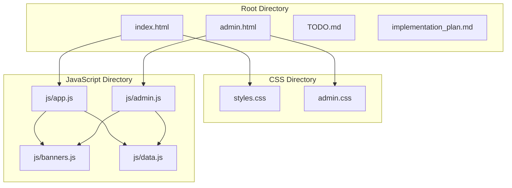
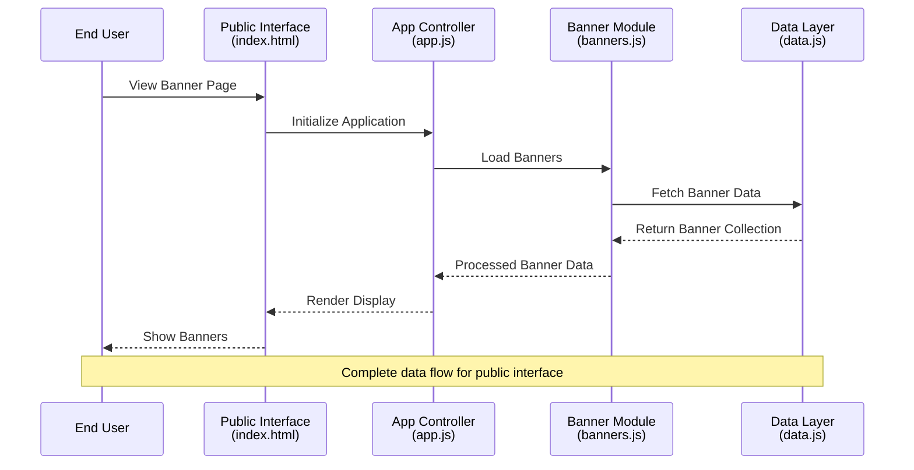
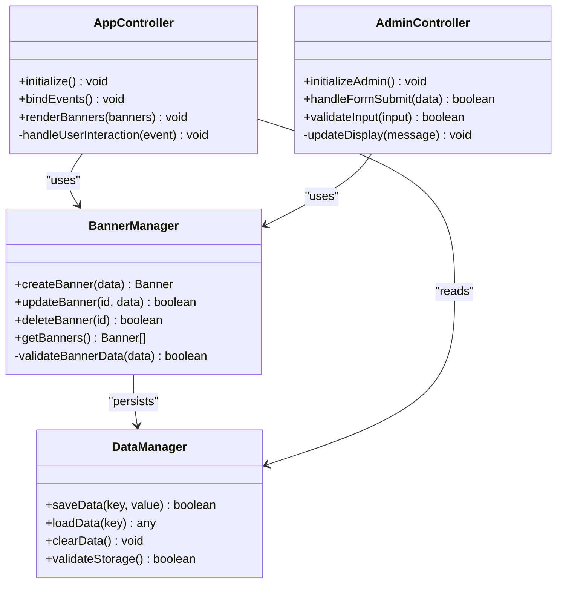

# Project Overview

<cite>
**Referenced Files in This Document**
- [index.html](file://index.html)
- [admin.html](file://admin.html)
- [js/app.js](file://js/app.js)
- [js/admin.js](file://js/admin.js)
- [js/banners.js](file://js/banners.js)
- [js/data.js](file://js/data.js)
- [css/styles.css](file://css/styles.css)
- [css/admin.css](file://css/admin.css)
</cite>

## Table of Contents
1. [Introduction](#introduction)
2. [Project Structure](#project-structure)
3. [Core Components](#core-components)
4. [Architecture Overview](#architecture-overview)
5. [Detailed Component Analysis](#detailed-component-analysis)
6. [Technology Stack](#technology-stack)
7. [Key Features](#key-features)
8. [User Interfaces](#user-interfaces)
9. [Conclusion](#conclusion)

## Introduction

KPR Crackers is a comprehensive banner management system designed to provide dual interfaces for both end users and administrators. The application serves as a complete solution for managing promotional banners, advertisements, and visual content across web platforms. Built entirely with vanilla JavaScript without external frameworks, the system demonstrates modern web development practices while maintaining simplicity and performance.

The project implements a clean separation between public-facing functionality and administrative capabilities, ensuring that regular users can view banners seamlessly while administrators have full control over banner creation, modification, and deletion operations. This architecture promotes security, maintainability, and scalability.

## Project Structure

The KPR Crackers project follows a modular architecture with clear separation of concerns:

**Diagram sources**
- [index.html](file://index.html)
- [admin.html](file://admin.html)
- [js/app.js](file://js/app.js)
- [js/admin.js](file://js/admin.js)
- [js/banners.js](file://js/banners.js)
- [js/data.js](file://js/data.js)
- [css/styles.css](file://css/styles.css)
- [css/admin.css](file://css/admin.css)

The project structure demonstrates a well-organized approach with separate directories for CSS styling and JavaScript logic, promoting maintainability and code reusability.

**Section sources**
- [index.html](file://index.html)
- [admin.html](file://admin.html)
- [js/app.js](file://js/app.js)
- [js/admin.js](file://js/admin.js)

## Core Components

### Public Interface (index.html)
The main entry point for end users, providing a responsive interface for viewing banners and interacting with content. This component focuses on display functionality and user experience optimization.

### Administrative Interface (admin.html)
A dedicated management portal for authorized users to perform CRUD operations on banners, manage content, and configure system settings. This interface includes enhanced controls and validation mechanisms.

### Application Logic (app.js)
The core application controller that manages public interface functionality, handles user interactions, and coordinates data flow between components.

### Admin Controller (admin.js)
Specialized controller for administrative operations, implementing security measures, form validation, and data manipulation functions specific to banner management tasks.

### Banner Management Module (banners.js)
Centralized module handling all banner-related operations including creation, reading, updating, and deletion functionality. Contains business logic and data validation rules.

### Data Layer (data.js)
Data persistence and manipulation layer responsible for storing, retrieving, and managing banner data structures and application state.

**Section sources**
- [js/app.js](file://js/app.js)
- [js/admin.js](file://js/admin.js)
- [js/banners.js](file://js/banners.js)
- [js/data.js](file://js/data.js)

## Architecture Overview

The KPR Crackers system implements a client-side architecture with clear separation between presentation, business logic, and data layers:

**Diagram sources**
- [index.html](file://index.html)
- [js/app.js](file://js/app.js)
- [js/banners.js](file://js/banners.js)
- [js/data.js](file://js/data.js)

The architecture ensures loose coupling between components while maintaining efficient communication patterns through well-defined interfaces and event-driven programming.

## Detailed Component Analysis

### Modular JavaScript Structure

The application employs a modular design pattern where each JavaScript file has a specific responsibility:

#### Public Application Controller (app.js)
Handles initialization, event binding, and coordination of public interface components. Manages user interactions and updates the DOM accordingly.

#### Administrative Controller (admin.js)
Implements admin-specific functionality including form handling, validation, and administrative operations. Provides secure access to banner management features.

#### Banner Management System (banners.js)
Contains core business logic for banner operations including validation rules, transformation functions, and data processing algorithms.

#### Data Management Layer (data.js)
Provides abstraction over data storage mechanisms, handling serialization, deserialization, and data integrity checks.

**Diagram sources**
- [js/app.js](file://js/app.js)
- [js/admin.js](file://js/admin.js)
- [js/banners.js](file://js/banners.js)
- [js/data.js](file://js/data.js)

This class diagram illustrates the relationships and dependencies between major components, showing how they collaborate to provide the complete banner management functionality.

**Section sources**
- [js/app.js](file://js/app.js)
- [js/admin.js](file://js/admin.js)
- [js/banners.js](file://js/banners.js)
- [js/data.js](file://js/data.js)

## Technology Stack

### Frontend Technologies
- **HTML5**: Semantic markup structure for both public and administrative interfaces
- **CSS3**: Modern styling with responsive design principles and custom properties
- **Vanilla JavaScript (ES6+)**: Pure JavaScript implementation without external frameworks or libraries

### Development Approach
- **Modular Architecture**: Separation of concerns through distinct JavaScript modules
- **Responsive Design**: Mobile-first approach ensuring compatibility across devices
- **Event-Driven Programming**: Asynchronous user interaction handling
- **DOM Manipulation**: Direct browser API usage for optimal performance

### Styling Strategy
- **Separate Style Sheets**: Dedicated CSS files for public and administrative interfaces
- **CSS Custom Properties**: Reusable design tokens for consistent theming
- **Flexbox and Grid Layouts**: Modern layout techniques for flexible UI composition
- **Media Queries**: Responsive breakpoints for different screen sizes

## Key Features

### Banner CRUD Operations
- **Create**: Add new banners with title, description, image, and metadata
- **Read**: Display banners in various formats (grid, list, carousel)
- **Update**: Modify existing banner properties and content
- **Delete**: Remove banners with confirmation dialogs and data cleanup

### Content Management
- **Rich Text Editing**: Support for formatted content within banner descriptions
- **Image Handling**: Upload, resize, and optimize banner images
- **Metadata Management**: Track creation dates, modification history, and status
- **Content Validation**: Ensure data integrity and format compliance

### Responsive Design
- **Mobile-First Approach**: Optimized experience for smartphones and tablets
- **Adaptive Layouts**: Flexible grid systems that adjust to screen dimensions
- **Touch-Friendly Controls**: Enhanced usability for touch-based interactions
- **Performance Optimization**: Lazy loading and efficient resource management

### Security Features
- **Access Control**: Separate interfaces for public and administrative functions
- **Input Validation**: Client-side and server-side validation for data safety
- **XSS Prevention**: Sanitization of user-generated content
- **Session Management**: Secure authentication and authorization handling

## User Interfaces

### Public Interface (index.html)
The main user-facing interface provides:
- **Banner Gallery**: Visual display of available banners with filtering options
- **Responsive Navigation**: Intuitive menu system optimized for all devices
- **Search Functionality**: Find specific banners by keywords or categories
- **Interactive Elements**: Hover effects, animations, and smooth transitions

### Administrative Interface (admin.html)
The management portal offers:
- **Dashboard Overview**: Statistics and quick access to common tasks
- **Form-Based Input**: Structured forms for creating and editing banners
- **Real-Time Preview**: Live preview of changes before saving
- **Bulk Operations**: Batch processing for multiple banner management tasks

### Cross-Platform Compatibility
- **Browser Support**: Compatible with modern browsers (Chrome, Firefox, Safari, Edge)
- **Progressive Enhancement**: Graceful degradation for older browsers
- **Accessibility Standards**: WCAG compliance for inclusive user experience
- **Performance Monitoring**: Built-in metrics for tracking application health

**Section sources**
- [index.html](file://index.html)
- [admin.html](file://admin.html)
- [css/styles.css](file://css/styles.css)
- [css/admin.css](file://css/admin.css)

## Conclusion

KPR Crackers represents a well-architected banner management system that successfully balances functionality with simplicity. The project demonstrates effective use of vanilla JavaScript to create a robust, maintainable application without dependency on external frameworks. The dual-interface architecture ensures appropriate access levels while providing seamless experiences for both end users and administrators.

The modular JavaScript structure promotes code organization and reusability, making the system easy to extend and maintain. The responsive design approach guarantees optimal user experiences across various devices and screen sizes. By leveraging modern web standards and best practices, KPR Crackers serves as an excellent example of contemporary front-end development techniques.

The system's clean separation of concerns, comprehensive feature set, and adherence to web standards make it suitable for production deployment while remaining accessible for educational purposes and further customization.