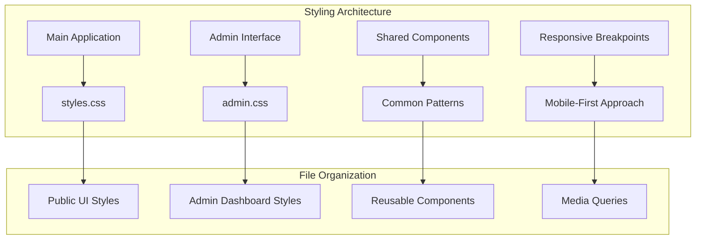
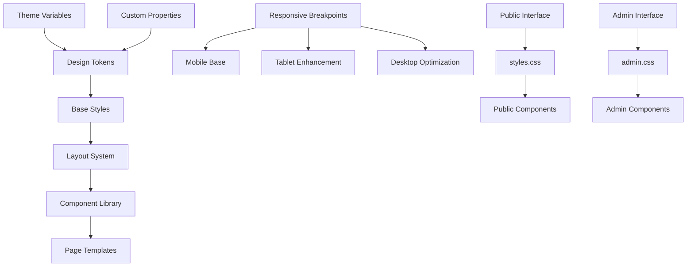

# Styling and Design

<cite>
**Referenced Files in This Document**
- [styles.css](file://css/styles.css)
- [admin.css](file://css/admin.css)
- [index.html](file://index.html)
- [admin.html](file://admin.html)
</cite>

## Table of Contents
1. [Introduction](#introduction)
2. [Project Structure](#project-structure)
3. [Core Components](#core-components)
4. [Architecture Overview](#architecture-overview)
5. [Detailed Component Analysis](#detailed-component-analysis)
6. [Responsive Design System](#responsive-design-system)
7. [Color Scheme and Typography](#color-scheme-and-typography)
8. [Layout Patterns and Grid System](#layout-patterns-and-grid-system)
9. [CSS Organization Principles](#css-organization-principles)
10. [Customization Guidelines](#customization-guidelines)
11. [Performance Considerations](#performance-considerations)
12. [Troubleshooting Guide](#troubleshooting-guide)
13. [Conclusion](#conclusion)

## Introduction

The KPR Crackers application employs a comprehensive CSS architecture designed to support both public-facing interfaces and administrative functionality. The styling system is built around a mobile-first responsive approach, ensuring optimal user experience across all device sizes while maintaining visual consistency throughout the application.

This document provides detailed guidance on the CSS architecture, design patterns, customization options, and best practices for extending the design system. The styling framework supports both the main application interface and administrative dashboard through separate, well-organized stylesheets that maintain clear separation of concerns.

## Project Structure

The styling architecture follows a modular approach with dedicated stylesheets for different interface types:

**Diagram sources**
- [styles.css](file://css/styles.css)
- [admin.css](file://css/admin.css)
- [index.html](file://index.html)
- [admin.html](file://admin.html)

The project maintains a clean separation between public and administrative styling, allowing for independent theming and maintenance while sharing common design principles and patterns.

**Section sources**
- [styles.css](file://css/styles.css)
- [admin.css](file://css/admin.css)
- [index.html](file://index.html)
- [admin.html](file://admin.html)

## Core Components

### CSS Architecture Foundation

The styling system is built on several foundational principles:

#### Mobile-First Responsive Design
The application uses a mobile-first approach where base styles target mobile devices, with progressive enhancement for larger screens through media queries.

#### Component-Based Styling
Each UI component has its own scoped styles, promoting reusability and maintainability across the application.

#### Consistent Spacing System
A unified spacing scale ensures visual harmony and predictable layouts throughout the interface.

#### Color Token System
Centralized color definitions provide consistent theming capabilities and easy customization.

### Key Styling Modules

The CSS architecture includes several core modules that work together to create a cohesive design system:

- **Base Styles**: Reset rules, typography foundations, and global variables
- **Layout Components**: Grid systems, flexbox utilities, and positioning helpers
- **UI Elements**: Buttons, forms, cards, and interactive components
- **Navigation**: Header, sidebar, and menu styling
- **Content Components**: Tables, lists, and data presentation elements
- **Utility Classes**: Helper classes for common styling tasks

**Section sources**
- [styles.css](file://css/styles.css)
- [admin.css](file://css/admin.css)

## Architecture Overview

The styling architecture follows a layered approach that separates concerns while maintaining flexibility:

**Diagram sources**
- [styles.css](file://css/styles.css)
- [admin.css](file://css/admin.css)

The architecture supports both shared design principles and interface-specific customizations, enabling consistent branding while accommodating different user workflows.

## Detailed Component Analysis

### Public Interface Styling (styles.css)

The public interface stylesheet focuses on creating an engaging user experience for customers browsing and purchasing crackers. Key features include:

#### Hero Section and Branding
- Full-width hero banners with overlay text
- Responsive image handling with object-fit properties
- Gradient overlays for text readability
- Animated entrance effects for key elements

#### Product Display System
- Card-based product layout with hover effects
- Image galleries with thumbnail navigation
- Pricing display with discount indicators
- Add-to-cart functionality styling

#### Shopping Cart Integration
- Slide-out cart panel with item management
- Quantity adjustment controls
- Real-time price calculations display
- Checkout flow styling

#### Mobile Navigation
- Hamburger menu with smooth transitions
- Touch-friendly tap targets
- Swipe gestures for cart interaction
- Bottom navigation for mobile users

### Administrative Interface Styling (admin.css)

The admin stylesheet provides a professional dashboard experience focused on productivity and data management:

#### Dashboard Layout
- Sidebar navigation with collapsible sections
- Data visualization components
- Quick action panels
- Status indicators and notifications

#### Data Management Interfaces
- Advanced table layouts with sorting and filtering
- Form builders with validation feedback
- Bulk operation controls
- Export and import functionality styling

#### User Management Tools
- Role-based access control interfaces
- Activity monitoring dashboards
- Analytics and reporting components
- Settings and configuration panels

**Section sources**
- [styles.css](file://css/styles.css)
- [admin.css](file://css/admin.css)

## Responsive Design System

### Breakpoint Strategy

The application implements a comprehensive breakpoint system following modern responsive design principles:

| Breakpoint | Device Target | Min Width | Max Width | Primary Use Case |
|------------|---------------|-----------|-----------|------------------|
| xs | Small phones | 0px | 575px | Basic mobile functionality |
| sm | Large phones | 576px | 767px | Enhanced mobile experience |
| md | Tablets | 768px | 991px | Tablet optimization |
| lg | Desktops | 992px | 1199px | Desktop full features |
| xl | Large desktops | 1200px | 1399px | Wide screen optimization |
| xxl | Ultra-wide | 1400px | ∞ | Maximum resolution support |

### Mobile-First Implementation

The responsive system follows a mobile-first approach where:

- Base styles target mobile devices (smallest viewport)
- Media queries progressively enhance for larger screens
- Touch interactions are prioritized over hover states
- Content hierarchy adapts to screen size constraints

### Adaptive Layout Patterns

#### Fluid Grid System
- CSS Grid-based layout with auto-fit and minmax functions
- Flexible column arrangements that adapt to content
- Container queries for component-level responsiveness
- Aspect ratio preservation for images and media

#### Flexible Typography
- Relative units (rem, em) for scalable text
- Viewport-relative units for dynamic sizing
- Line height adjustments for readability
- Font scaling based on container width

#### Adaptive Images
- Responsive image loading with srcset attributes
- Object-fit properties for consistent cropping
- Lazy loading implementation for performance
- Placeholder loading states

**Section sources**
- [styles.css](file://css/styles.css)
- [admin.css](file://css/admin.css)

## Color Scheme and Typography

### Color Palette Architecture

The application uses a sophisticated color system built around semantic color tokens:

#### Primary Colors
- **Brand Primary**: Main brand color used for primary actions and highlights
- **Secondary Accent**: Supporting color for secondary actions and emphasis
- **Success State**: Green tones for positive feedback and confirmation
- **Warning State**: Amber/orange tones for cautionary messages
- **Error State**: Red tones for error conditions and destructive actions

#### Neutral Colors
- **Surface Colors**: Background colors for different elevation levels
- **Text Colors**: Hierarchical text colors for readability
- **Border Colors**: Subtle borders for definition without visual clutter
- **Overlay Colors**: Semi-transparent layers for modals and tooltips

#### Semantic Variants
Each color includes light and dark variants for theme support, with automatic contrast checking for accessibility compliance.

### Typography System

The typography system establishes clear visual hierarchy and readability:

#### Font Stack
- **Primary Font**: Sans-serif font family for body text and UI elements
- **Display Font**: Serif or distinctive font for headings and branding
- **Monospace Font**: For code snippets and technical data
- **Fallback Fonts**: Web-safe alternatives for cross-platform compatibility

#### Type Scale
- **Heading Levels**: H1-H6 with proportional sizing
- **Body Text**: Multiple sizes for different content importance
- **Caption Text**: Small text for metadata and helper content
- **Button Text**: Optimized sizing for interactive elements

#### Line Height and Spacing
- **Line Height**: Proportional to font size for optimal readability
- **Letter Spacing**: Adjusted for different font weights and sizes
- **Paragraph Spacing**: Consistent vertical rhythm throughout content

### Accessibility Considerations

- **Contrast Ratios**: WCAG AA compliant color combinations
- **Focus Indicators**: Visible focus states for keyboard navigation
- **Screen Reader Support**: Proper ARIA labels and semantic markup
- **Reduced Motion**: Respects user preferences for motion reduction

**Section sources**
- [styles.css](file://css/styles.css)
- [admin.css](file://css/admin.css)

## Layout Patterns and Grid System

### CSS Grid Implementation

The layout system leverages CSS Grid for complex two-dimensional layouts:

#### Grid Container Patterns
- **Auto-fit Grids**: Automatically adjust columns based on available space
- **Fixed Column Grids**: Precise control over grid structure
- **Nested Grids**: Complex layouts with multiple grid hierarchies
- **Masonry-style Layouts**: Pinterest-like adaptive layouts

#### Flexbox Utilities
- **Alignment Helpers**: Center, justify, and align utilities
- **Spacing Utilities**: Margin and padding shorthand classes
- **Sizing Utilities**: Width and height helper classes
- **Order Utilities**: Control flex item ordering

### Component Layout Patterns

#### Card Components
- **Basic Cards**: Simple content containers with optional headers
- **Interactive Cards**: Hover effects and click handlers
- **Card Grids**: Responsive card layouts with equal heights
- **Card Overlays**: Image overlays with text content

#### Form Layouts
- **Inline Forms**: Compact form layouts for toolbars and filters
- **Stacked Forms**: Traditional vertical form layouts
- **Grid Forms**: Multi-column form layouts for complex inputs
- **Floating Labels**: Modern input label patterns

#### Navigation Patterns
- **Horizontal Navigation**: Top navigation bars for desktop
- **Vertical Navigation**: Sidebar navigation for admin interfaces
- **Tabbed Navigation**: Tab-based content organization
- **Breadcrumb Navigation**: Hierarchical page navigation

### Spacing System

The spacing system uses a consistent scale based on a base unit:

| Spacing Token | Value | Usage |
|---------------|-------|-------|
| `space-xs` | 0.25rem | Tight spacing for icons and small elements |
| `space-sm` | 0.5rem | Compact spacing for related elements |
| `space-md` | 1rem | Standard spacing for most layouts |
| `space-lg` | 1.5rem | Generous spacing for section separation |
| `space-xl` | 2rem | Large spacing for major layout divisions |
| `space-2xl` | 3rem | Extra large spacing for hero sections |

**Section sources**
- [styles.css](file://css/styles.css)
- [admin.css](file://css/admin.css)

## CSS Organization Principles

### File Structure

The CSS files follow a logical organization pattern:

#### styles.css Structure
1. **CSS Custom Properties**: Global variables and design tokens
2. **Reset and Normalize**: Cross-browser consistency
3. **Typography**: Font imports and base text styles
4. **Layout**: Grid system and utility classes
5. **Components**: Reusable UI components
6. **Pages**: Page-specific styling
7. **Utilities**: Helper classes and mixins
8. **Responsive**: Media queries and breakpoints
9. **Animations**: Transitions and keyframe animations

#### admin.css Structure
1. **Admin-specific Variables**: Override or extend base variables
2. **Dashboard Layout**: Admin-specific layout patterns
3. **Data Tables**: Advanced table styling and interactions
4. **Forms**: Admin form components and validation
5. **Charts and Graphs**: Data visualization styling
6. **User Management**: Profile and account management UI
7. **Settings Panels**: Configuration interface styling
8. **Reports**: Report generation and display

### Naming Conventions

The project follows BEM (Block Element Modifier) methodology with some adaptations:

#### Block Naming
- **Descriptive Names**: Clear, meaningful block names
- **Lowercase**: All lowercase with hyphens for word separation
- **Contextual**: Names reflect the component's purpose

#### Element Naming
- **Hierarchical**: Element names indicate their relationship to blocks
- **Semantic**: Names describe the element's function
- **Consistent**: Uniform naming across similar elements

#### Modifier Naming
- **State-based**: Modifiers indicate component state changes
- **Size-based**: Size modifiers for responsive variations
- **Theme-based**: Theme-specific appearance changes

### Code Organization Best Practices

#### Modular Architecture
- **Single Responsibility**: Each class has one clear purpose
- **Reusability**: Components designed for reuse across pages
- **Maintainability**: Clear separation of concerns

#### Performance Optimization
- **Minification**: Production-ready optimized CSS
- **Critical CSS**: Above-the-fold styles prioritized
- **Lazy Loading**: Non-critical styles loaded on demand

#### Documentation Standards
- **Comments**: Inline comments explaining complex logic
- **JSDoc-style Comments**: Function and class documentation
- **Usage Examples**: Code examples for complex components

**Section sources**
- [styles.css](file://css/styles.css)
- [admin.css](file://css/admin.css)

## Customization Guidelines

### Theme Customization

The design system supports extensive customization through CSS custom properties:

#### Creating Custom Themes
1. **Override Variables**: Create new CSS custom property values
2. **Extend Palette**: Add new colors to the existing palette
3. **Modify Spacing**: Adjust spacing scales for different brands
4. **Custom Typography**: Replace fonts and type scales

#### Theme Switching Implementation
- **CSS-in-JS**: Dynamic theme switching with JavaScript
- **Data Attributes**: Theme selection via HTML attributes
- **URL Parameters**: Theme persistence through URL parameters
- **Local Storage**: User preference persistence

### Component Customization

#### Extending Existing Components
- **Modifier Classes**: Add new variants without modifying base styles
- **CSS Custom Properties**: Override specific component properties
- **Shadow DOM**: Isolated component styling for web components
- **CSS Layers**: Layer-specific overrides for advanced use cases

#### Creating New Components
- **Follow Patterns**: Use existing component patterns as templates
- **Maintain Consistency**: Adhere to established naming conventions
- **Include Variants**: Provide common variant implementations
- **Document Usage**: Include usage examples and API documentation

### Responsive Customization

#### Breakpoint Modification
- **Add Breakpoints**: Extend the breakpoint system for specific needs
- **Remove Breakpoints**: Simplify breakpoints for targeted deployments
- **Conditional Logic**: Implement feature-based responsive behavior

#### Mobile-Specific Customizations
- **Touch Interactions**: Optimize touch targets and gestures
- **Performance**: Reduce animations and effects for mobile
- **Accessibility**: Ensure mobile accessibility compliance

### Build Process Integration

#### CSS Processing Pipeline
- **PostCSS Plugins**: Autoprefixer, CSSNano, and other processors
- **Sass/Less Compilation**: Preprocessor integration for advanced features
- **Asset Optimization**: Image optimization and font subsetting
- **Bundle Splitting**: Separate critical and non-critical styles

**Section sources**
- [styles.css](file://css/styles.css)
- [admin.css](file://css/admin.css)

## Performance Considerations

### CSS Performance Optimization

#### Critical CSS Extraction
- **Above-the-fold Styles**: Prioritize essential rendering styles
- **Deferred Loading**: Load non-critical styles asynchronously
- **Inline Critical Styles**: Embed essential styles in HTML head

#### Asset Optimization
- **CSS Minification**: Remove whitespace and comments
- **Property Shortening**: Use CSS shorthand properties
- **Selector Optimization**: Avoid overly specific selectors

#### Browser Caching Strategies
- **Cache Headers**: Configure appropriate cache policies
- **Versioning**: File versioning for cache busting
- **CDN Integration**: Serve static assets from CDN

### Memory and Rendering Performance

#### Efficient Selectors
- **Avoid Deep Nesting**: Keep selector specificity low
- **Use Class Selectors**: Prefer classes over element selectors
- **Optimize Animations**: Use transform and opacity for GPU acceleration

#### Layout Performance
- **Avoid Layout Thrashing**: Batch DOM reads and writes
- **Use will-change**: Hint at upcoming style changes
- **Optimize Repaints**: Minimize forced synchronous layouts

### Mobile Performance

#### Touch Responsiveness
- **Fast Click**: Eliminate 300ms click delay
- **Smooth Scrolling**: Enable hardware-accelerated scrolling
- **Optimized Images**: Use appropriate image formats and sizes

#### Network Efficiency
- **HTTP/2 Multiplexing**: Leverage HTTP/2 for parallel requests
- **Compression**: Enable gzip or Brotli compression
- **Resource Hints**: Use preload and prefetch directives

**Section sources**
- [styles.css](file://css/styles.css)
- [admin.css](file://css/admin.css)

## Troubleshooting Guide

### Common Styling Issues

#### Responsive Design Problems
- **Breakpoint Conflicts**: Check for overlapping media query ranges
- **Container Query Issues**: Verify parent container dimensions
- **Flexbox/Grid Conflicts**: Ensure proper fallbacks for older browsers

#### Cross-Browser Compatibility
- **Feature Detection**: Use modernizr or similar tools
- **Vendor Prefixes**: Ensure autoprefixer is configured correctly
- **Fallback Values**: Provide graceful degradation paths

#### Performance Issues
- **Large CSS Files**: Analyze bundle size and split strategically
- **Expensive Selectors**: Profile selector performance
- **Animation Jank**: Monitor frame rates and optimize animations

### Debugging Techniques

#### Browser Developer Tools
- **Computed Styles**: Inspect final computed values
- **Layout Panel**: Visualize box model and layout issues
- **Performance Profiler**: Identify rendering bottlenecks

#### CSS Debugging Tools
- **Specificity Calculator**: Understand selector precedence
- **CSS Analyzer**: Find unused styles and conflicts
- **Visual Regression Testing**: Catch unintended style changes

### Maintenance Best Practices

#### Code Review Checklist
- **Naming Consistency**: Verify adherence to naming conventions
- **Responsiveness**: Test across multiple viewport sizes
- **Accessibility**: Validate against WCAG guidelines
- **Performance**: Audit for performance regressions

#### Version Control Practices
- **Atomic Commits**: Make small, focused commits
- **Clear Messages**: Write descriptive commit messages
- **Branch Strategy**: Use feature branches for development

**Section sources**
- [styles.css](file://css/styles.css)
- [admin.css](file://css/admin.css)

## Conclusion

The KPR Crackers styling and design system provides a robust foundation for building consistent, accessible, and performant web applications. Through careful organization of CSS architecture, comprehensive responsive design patterns, and flexible customization options, the system supports both the public-facing customer experience and the administrative dashboard functionality.

Key strengths of the design system include its mobile-first approach, component-based architecture, and extensive customization capabilities. The separation of concerns between public and administrative interfaces allows for independent evolution while maintaining visual consistency.

For future development, consider implementing additional features such as dark mode support, internationalization-ready typography, and enhanced animation libraries. The modular architecture makes it straightforward to extend the system while maintaining backward compatibility and performance standards.

By following the guidelines and patterns documented in this guide, developers can effectively contribute to the design system while ensuring consistency and quality across the entire KPR Crackers application.